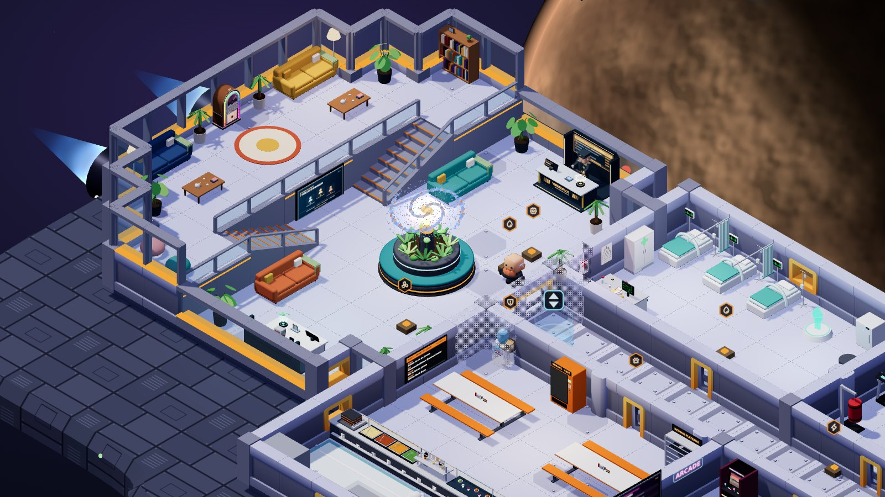
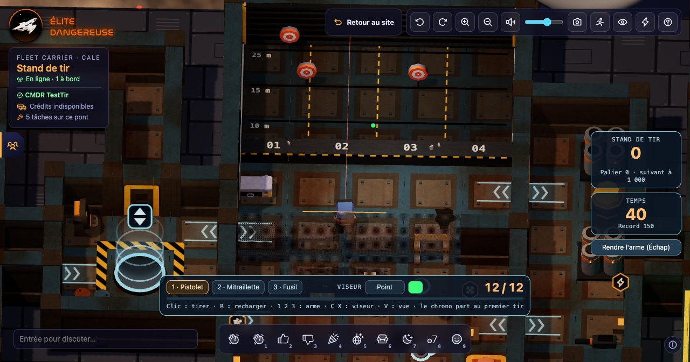
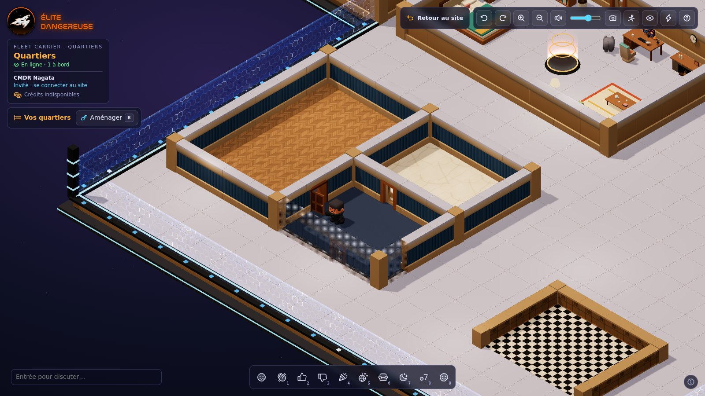
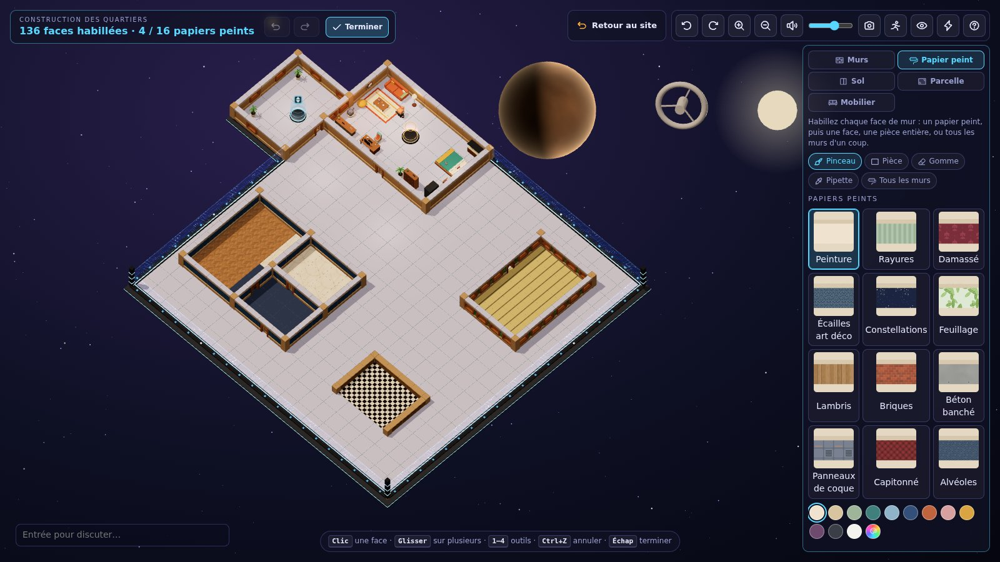
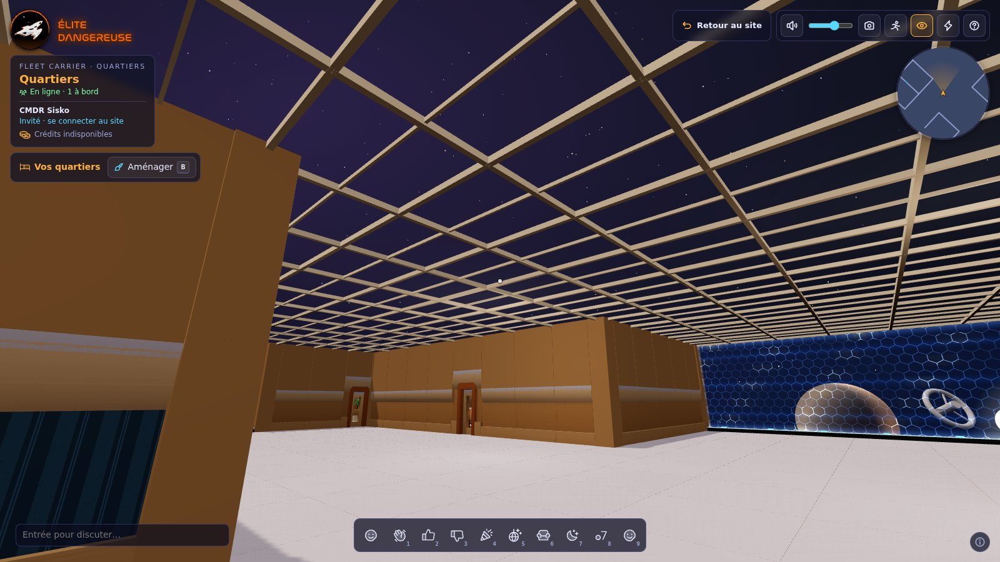
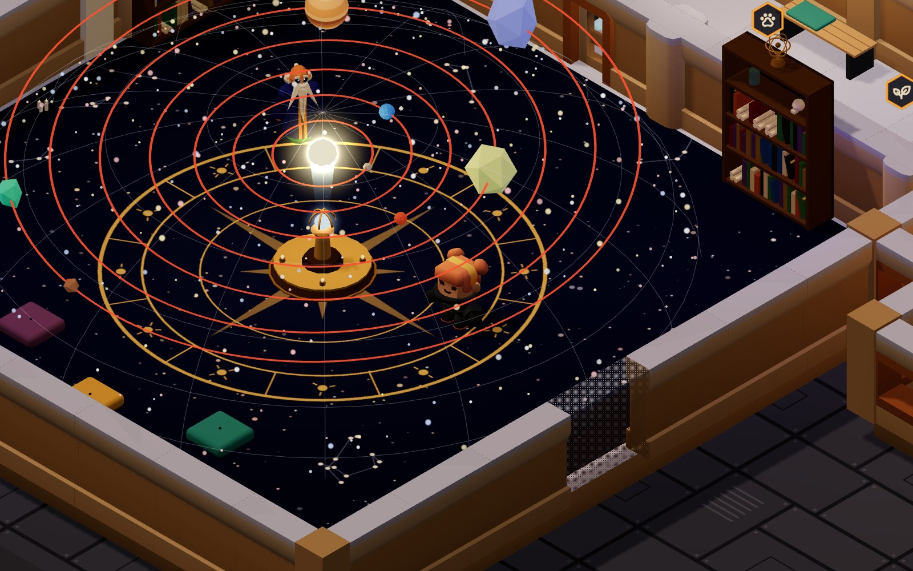

<h1 align="center">Mini Interior</h1>

<p align="center">
  <strong>Un vaisseau spatial isométrique et multijoueur, jouable directement dans le navigateur.</strong><br>
</p>

<p align="center">
  
  
  
  
  
</p>

<p align="center">
  
</p>

---

## Sommaire

- [En bref](#en-bref)
- [Le vaisseau](#le-vaisseau)
- [Holo-Me (garde-robe)](#holo-me-garde-robe)
- [Quartiers personnalisables](#quartiers-personnalisables)
- [Mobilier fait main](#mobilier-fait-main)
- [S'installer, jouer, danser](#sinstaller-jouer-danser)
- [Bornes d'arcade](#bornes-darcade)
- [Zone thargoïde : récupération de cargaison](#zone-thargoïde--récupération-de-cargaison)
- [Jukebox](#jukebox)
- [Mode photo](#mode-photo)
- [Crédits](#crédits)
- [Tâches de bord](#tâches-de-bord)
- [La salle commune](#la-salle-commune)
- [Le mess](#le-mess)
- [L'infirmerie](#linfirmerie)
- [Le hangar](#le-hangar)
- [Le Zorb](#le-zorb)
- [La serre](#la-serre)
- [Le jardinage](#le-jardinage)
- [Le planétarium](#le-planétarium)
- [La zone sportive](#la-zone-sportive)
- [Le stand de tir](#le-stand-de-tir)
- [La base au sol](#la-base-au-sol)
- [Lancer en local](#lancer-en-local)
- [Commandes](#commandes)
- [Langues](#langues)
- [Comptes Élite Dangereuse](#comptes-élite-dangereuse)
- [Sons](#sons)
- [Choix techniques](#choix-techniques)
- [Architecture](#architecture)
- [Assets](#assets-tous-en-cc0-ou-dans-le-domaine-public)
- [Limites connues / pistes](#limites-connues--pistes)

## En bref

Mini Interior est un POC : un vaisseau sur trois ponts, vu de dessus en isométrique. On y promène un personnage, on y croise les autres joueurs connectés et Comète, le chat du bord.

- **Trois ponts, trois ambiances** : des quartiers chaleureux, un pont principal aux couleurs d'Elite, une cale rouillée à l'éclairage sodium.
- **Multijoueur** : chaque onglet est un membre d'équipage, avec positions, emotes et chat en bulles, synchronisés par un petit relais socket.io.
- **Comptes Élite Dangereuse** : un CMDR connecté à [elitedangereuse.fr](https://elitedangereuse.fr) arrive sous son nom, avec un badge « vérifié ».
- **Holo-Me** : humain, combinaison spatiale, alien, robot ou créature, avec sa coiffure, son expression et les couleurs de sa combinaison, et chaque changement s'applique en direct.
- **Quartiers personnalisables** : chaque joueur a sa propre instance des quartiers du commandant. Un CMDR connecté les aménage (366 meubles, objets et compagnons : salle de bain, cuisine, lits, plantes, affiches de films et pin-up, télé cathodique et consoles de jeu, armurerie, bornes d'arcade, piste de danse, tasse de Hutton Orbital…), choisit le papier peint et le sol, et y invite qui il veut.
- **On s'installe** : s'asseoir sur les chaises, les canapés et les fauteuils, se coucher dans les lits (même la couchette du haut), prendre les commandes au poste de pilotage (et lancer un saut FSD, que tout le bord vit ensemble), pédaler, courir, frapper le sac, mixer, jouer à la pince à peluches, danser en rythme. Les autres voient la pose.
- **Un vaisseau d'un seul tenant** : les ponts reposent sur une coque (tôles, feux de navigation, tuyères), et le système où l'on se trouve (étoile, planètes, station, trou noir…) se voit par les verrières du poste de pilotage et, en vue isométrique, par-dessus les bords de la coque : chaque astre a sa direction dans le ciel, si bien qu'en tournant la caméra d'un quart de tour on en découvre d'autres. Des appareils (les « craft » du Space Kit de Kenney) croisent le long du bord, toujours nez devant (`src/traffic.ts`).
- **Arcade** : cinq bornes se jouent pour de vrai, Cargaison (un Tetris de conteneurs), Viper (un Snake), Astéroïdes, Thargoid Invaders et Ruelle Fighter II (combat solo ou duel en ligne), avec le tableau des meilleurs scores gardé par le site.
- **Zone thargoïde** : un jeu d'horreur en équipe (un à quatre). Depuis le lobby de la cale (où Odile, la contrôleuse, veille derrière ses vitres blindées), on part récupérer des colis dans une baie de stockage infestée, plongée dans le noir, où rôdent des Thargoïdes : zones éclairées qu'on voit de loin (et où l'on est vu de loin), passerelle d'où l'on voit par-dessus les conteneurs, verre brisé qui crisse, flaques qui collent, une ruche qui s'agite à chaque colis livré ; casiers pour se cacher, fusées pour les attirer ailleurs, moniteur de surveillance cathodique pour suivre son équipe après s'être fait prendre, note de mission, crédits et classement des victoires.
- **Jukebox** : neuf morceaux libres de droits et quatre albums de Ben Carter Jr, que tout le pont (ou toute la cabine) entend ensemble ; la piste de danse suit leur tempo quand il est établi, sinon celui de la soirée.
- **Mode photo** : la scène sans l'interface, jusqu'en 4K, à télécharger.
- **Crédits** : comme dans Elite, le CR débloque les meubles des quartiers et les apparences du Holo-Me. Un meuble débloqué peut être posé autant de fois que souhaité. On gagne des crédits à bord : un revenu passif, lent, les tâches et les records aux bornes d'arcade. Le site tient les comptes.
- **Tâches de bord** : ordures, flaques, plantes à arroser, pannes, fuites, brèches dans la coque… douze sortes de petites tâches apparaissent un peu partout, les mêmes pour tous, et chacun peut les régler : une tâche réglée ne disparaît que pour celui qui l'a réglée.
- **Des dizaines de meubles animés** : hologrammes, bras robotisé qui soude, aquarium, cheminée, pince à peluches…
- **Son spatialisé** : pas, réacteur, bips des consoles, mélodies d'arcade, ronronnements, jukebox.

<p align="center">
  
  <br><em>Deux membres d'équipage dans le salon panoramique : chat en bulle, emote « danse », et Comète qui fait la sieste près du bureau.</em>
</p>

## Le vaisseau

Trois ponts, trois ambiances. Chaque pont repeint à sa façon la même palette du kit (coque et mobilier, cf. `themes` dans `src/assets.ts`), et a son propre éclairage (ciel, soleil, lumières qui vacillent) et son propre bruit de pas. Le pont principal est de loin le plus grand (~330 tuiles), sa coursive file vers le poste de pilotage, à la proue. La cale et le pont supérieur sont plus petits (~180 et ~170 tuiles), autour de l'ascenseur. Les plans sont dans `shared/ship-layouts.js` (partagés avec le relais).

Les ponts reposent sur une **coque** (`src/hull.ts`) : un seul corps de vaisseau, dont la silhouette épouse les trois ponts à la fois, lissée et biseautée. Le pont affiché se pose sur son dos, un cran plus haut, et elle ne cache jamais rien. Tôles rivetées, trappes et grilles, feux de navigation qui clignotent (rouge à bâbord, vert à tribord, blanc à la poupe et à la proue, fixes en mode léger) ; les tuyères sortent de sa poupe.

Les futurs espaces communautaires sont déjà là, **en travaux** : LJPC et La Voie au nord de la coursive du pont principal, le Mini-CQC au sud, à côté de l'arcade, et le cinéma derrière le salon panoramique. On les voit, meublés d'échafaudages, de panneaux « Bientôt », de cônes et de bâches, mais leur porte reste verrouillée (voyant rouge) ; l'examiner dit ce qui s'y prépare (cf. `CLOSED_ROOMS`). Le sas de la zone thargoïde, au fond de la soute, est devenu le lobby de la [récupération de cargaison](#zone-thargoïde--récupération-de-cargaison).

La réserve de huit lumières du moteur de rendu suit le joueur : un pont peut en avoir davantage, les plus proches s'allument.

On se réveille dans ses quartiers, sur le pont des quartiers, à deux pas du Holo-Me. Dans le sélecteur de l’ascenseur, **Vous êtes ici** indique le pont actuel.

| Pont | Ambiance | Pièces |
|---|---|---|
| **Quartiers** · chacun chez soi | *cozy*, dans une bulle ouverte sur l'espace | le palier de l'ascenseur, et derrière sa porte la **parcelle** de chaque joueur, [bâtie et meublée par lui](#quartiers-personnalisables) (au départ : ses quartiers d'origine, avec grand lit, cheminée holographique, canapé, aquarium, bureau, bibliothèque, casier à combinaisons, **Holo-Me**) |
| **Pont supérieur** · la vie à bord | *cozy* : crème et bois miel, tissus, plantes, lumière chaude, pas feutrés | **planétarium** de Bugenhagen, à la place des anciens quartiers du commandant (cf. [Le planétarium](#le-planétarium)), cabines d'équipage (vidées, elles aussi attendent leur emploi), **toilettes** (trois cabines dont la porte se referme sur l'occupant : on ne le voit plus du dehors, et lui ne voit plus personne), grande **serre hydroponique** tout en verre, prolongée au sud par le **jardin exotique** et son étang où l'on pêche, et Capucine, la jardinière (cf. [La serre](#la-serre)), salon d'écoute (fauteuils et poufs tournés vers la vitre du studio), studio de Radio Dangereuse (trois micros, néon « ON AIR »), **foyer** (le couloir du cinéma, après le salon d'écoute : tapis rouge, films à l'affiche, porte double capitonnée de rouge), cinéma, et au sud du foyer la **zone sportive** : un hall, le **terrain de basket** et le **terrain de foot** (cf. [La zone sportive](#la-zone-sportive)), coursive |
| **Pont principal** | la station d'origine, mobilier aux couleurs d'Elite | **poste de pilotage** à la proue, sous verrières (siège du pilote et HOTAS face au tableau de bord, postes du navigateur et du copilote, fauteuil du commandant, scanner, panneaux holographiques, carte galactique), salles de LJPC, de La Voie et du Mini-CQC (en travaux), **salle commune** à la poupe, le hall du vaisseau façon station Coriolis (cf. [La salle commune](#la-salle-commune)), **infirmerie** de Betty, l'infirmière (trois lits en box, scanner corporel, poste de soins, quarantaine ; cf. [L'infirmerie](#linfirmerie)), **salle de sport**, grand **salon d'arcade** (deux rangées de bornes, dont cinq jouables : Cargaison, Viper, Astéroïdes, Thargoid Invaders, Ruelle Fighter II ; un flipper, une pince à peluches, les tables de dames, de Puissance 4 et d'échecs, un coin salon sur des tapis colorés), **mess**, un self avec sa cuisine et son chef (cf. [Le mess](#le-mess)), coursive |
| **Cale** | *brute* : acier noirci et rouillé, jaune de chantier, lumière sodium, néons qui grésillent | **lobby de la zone thargoïde** (terminal de mission, poste de sécurité vitré d'Odile, la contrôleuse, alcôve de la porte blindée et son portique de décontamination, mur des caméras de surveillance, table de briefing au plan holographique, vestiaire, classement), et derrière lui le **hangar** : un Krait Mk II sur son pad, face au bouclier bleu qui ouvre le hangar sur l'espace, et Nico, le mécano (cf. [Le hangar](#le-hangar)), **atelier** (établis, poste de soudure, établi d'ingénieur, ferraille), **stand de tir**, à la place de l'ancienne baie de réparation (pas de tir, couloir des cibles, armes au mur, cf. [Le stand de tir](#le-stand-de-tir)), **raffinerie** (fusion, tapis roulant de minerai, cristaux, drones collecteurs, laser minier), soute, palier de l'ascenseur ; au fond de la soute, **Chez Jacques**, le bar clandestin, plus soigné que le reste (arrière-bar chargé de bouteilles sous son enseigne au néon, comptoir capitonné et tabourets, tables de bistro, banquette, son propre jukebox) où sert **Jacques**, un robot barman à béret et nœud papillon qui essuie les verres, secoue le shaker et fait des clins d'œil ; au-dessus de la salle des machines, au bout d'un **couloir de service** qui part du palier, **le Zorb**, la boîte de nuit des aliens (cf. [Le Zorb](#le-zorb)) |

### Pont supérieur · les quartiers

<p align="center">
  
</p>

### Pont principal

<p align="center">
  
</p>

<table>
  <tr>
    <td width="50%"><br><sub><b>Poste de pilotage</b> (avant l'agrandissement) : siège et HOTAS, scanner, carte galactique holographique.</sub></td>
    <td width="50%"><br><sub><b>Salon d'arcade</b> : quatre bornes jouables (Cargaison, Viper, Astéroïdes, Ruelle Fighter II) et une pince à peluches, à côté du mess et de son jukebox.</sub></td>
  </tr>
  <tr>
    <td width="50%"><br><sub><b>Salle commune</b> : le hall et son îlot, les comptoirs Weekly et Chasse galactique, la mezzanine (jukebox, salons) sous ses baies.</sub></td>
    <td width="50%"><br><sub><b>Infirmerie et salle de sport</b> : lit médical, scanner corporel, tapis de course, sac de frappe.</sub></td>
  </tr>
</table>

### Cale

<p align="center">
  
</p>

<table>
  <tr>
    <td width="50%"><br><sub><b>Stand de tir</b> : le pas de tir, le laser de visée, les cibles dans leur couloir.</sub></td>
    <td width="50%"><br><sub><b>Atelier</b> : établis, poste de soudure, établi d'ingénieur, ferraille.</sub></td>
  </tr>
</table>

## Holo-Me (garde-robe)

<p align="center">
  
</p>

Dans les quartiers du commandant (pont supérieur), monte sur la plateforme orange du Holo-Me et appuie sur `E`. La caméra se rapproche, le personnage tourne sur lui-même (le bouton **Arrêter la rotation / Reprendre la rotation** permet de figer l’aperçu) et chaque choix s'applique en direct. **Valider** enregistre l'apparence et l'envoie aux autres joueurs. **Annuler** ou `Échap` revient à l'apparence d'avant.

| Espèce | Choix |
|---|---|
| Humain | sexe, 5 modèles (femme) ou 6 (homme) |
| Combinaison | les modèles humains en combinaison spatiale, 4 combinaisons d'après Elite Dangerous: Odyssey : **Vol** (sombre, liserés orange, sans casque), **Maverick** (orange, casque à visière dorée), **Dominator** (noire, visière rouge), **Artemis** (blanche, bulle de verre) |
| Alien | sexe, 5 ou 6 modèles, 3 teintes (Zorblien, Cryonien, Nébulien) : les humains avec une rotation de teinte et des antennes |
| Robot | Unité R-7, Unité V-3, Mannequin T-0 |
| Créature | Orque de Kepler, Troll des soutes, Zombie en costume |

Un nouveau joueur arrive dans une combinaison tirée au hasard. Les combinaisons recolorent le corps du modèle par « carte de dégradé » (la peau devient des gants), et le casque, le col et le sac dorsal sont accrochés aux os de la tête et du torse : ils suivent les animations. La femme « a » des Mini Characters (avec des béquilles) est retirée du catalogue. Une apparence enregistrée qui l'utilisait passe au premier modèle disponible.

L'onglet **Coiffure et couleurs** (humains, combinaisons, aliens) règle le style du personnage, gratuit sur tout ce qu'on porte :

| Réglage | Choix |
|---|---|
| Coiffure | celle du modèle, les 11 têtes des autres Mini Characters (couettes, petit chignon, nœud haut, longs et lisses, longs et ondulés, courts à lunettes, chauve et barbu, casquette de police, en pointes, banane à lunettes, frange) et 4 coupes faites main : crâne rasé, crête, gros chignon, queue de cheval |
| Cheveux (humains, combinaisons) | ceux du modèle, noirs, bruns, roux, blonds, platine, gris, bleus, roses. Les aliens gardent la teinte de leur espèce |
| Expression | neutre (le visage du modèle), souriant, sérieux, surpris, malicieux. Les emotes en jouent une le temps du geste : grand sourire (joie, danse), clin d'œil (salut, o7), sourire (oui), moue (non), yeux fermés (dodo) |
| Combinaison | la couleur d'origine ou 12 teintes (noir, graphite, blanc, rouge, orange, jaune, vert, kaki, bleu, marine, violet, rose), et les liserés : d'origine, orange, rouge, cyan, vert, or, blanc |

Une coupe est la tête d'un autre modèle, recalée sur l'os de la tête et repeinte à la peau du porteur ; sans couleur choisie, elle garde les cheveux du porteur. Une couleur de cheveux envoie les UV des cheveux vers des cases libres de la palette, peintes de quatre nuances. Une expression cache les traits du modèle (ils passent à la couleur de la peau) et en dessine d'autres devant le visage, comme pour Betty. Sous le casque fermé des combinaisons Maverick et Dominator, coiffure et visage ne se voient pas ; la bulle d'Artemis les montre. Le code est dans `src/holo-style.ts`.

Le style s'écrit à la fin de l'apparence, cinq champs séparés par des tirets (coiffure, cheveux, expression, combinaison, liserés ; vide : comme le modèle) : `human.female.b.mo-pk-sm--`, `suit.male.c.flight.--se-nv-yl`. Les apparences enregistrées avant restent valides. Le relais n'accepte que les valeurs connues (`shared/look-style.js`, partagé avec le jeu). La galerie `/gallery.html?holo` montre les coupes sur un modèle (`&base=human.male.f`), ou des apparences au choix (`&looks=…`, `&style=--sm--` : ce style sur toutes, `&play=joie` : une emote en boucle).

Les robots ont des pas plus lourds. Pour ajouter une espèce ou un modèle, il suffit de compléter `RACES` dans `src/looks.ts` : les modèles sont remis à la même taille automatiquement, et une animation manquante est remplacée par une animation voisine.

**Comète** vit dans les quartiers (pont supérieur), près de son panier au coin du feu. Il vient se frotter aux jambes du joueur, fait sa toilette, pique des sprints, miaule, ronronne quand on le caresse (`E`) et danse quand on danse à côté de lui. S'il se retrouve coincé contre un meuble, il renonce à son trajet et repart ailleurs.

Dans ses quartiers, un CMDR peut **adopter d'autres compagnons** (catégorie « Animaux » du catalogue) : les 22 autres animaux des Cube Pets, du chien Jameson au perroquet Felicity (qui répète « o7 ! »), en passant par le panda Bambou ou l'éléphant Cutter. On pose le panier de l'animal (un coussin, un perchoir, une ruche, une banquise, un bac à sable… selon l'espèce) ; l'animal vit à côté, comme Comète : il se promène sans quitter les quartiers, vient voir le joueur, va manger aux gamelles, danse, et se laisse caresser (`E`), chacun avec son cri (synthétisé) et sa bulle. Chaque animal a six robes (nature, nuit, neige, or, cosmique, menthe) : seules les cases de la palette qui font le pelage sont repeintes ; les yeux et le museau, de petits volumes à l'avant de la tête, gardent leurs couleurs (`src/pets.ts`). Deux animaux au plus par quartiers, Comète compris : Comète est en tête de la liste des animaux, offert : le choisir pose son panier (un seul), et retirer ce panier le fait partir, ce qui libère sa place pour l'animal de son choix. Les invités voient les compagnons de leur hôte.

## Quartiers personnalisables

<p align="center">
  
</p>

Chaque joueur a ses quartiers sur le **pont des quartiers**, au-dessus du pont supérieur : une [parcelle](#la-parcelle) à lui, qu'il bâtit (murs, portes, papier peint, sol) et meuble comme il veut. Le pont est **instancié** : on n'y voit que ceux qui se trouvent dans les mêmes quartiers que soi. Sur les autres ponts, rien ne change : on croise tout l'équipage.

Un CMDR connecté au site les **aménage** : dans ses quartiers, `B` ou « Aménager » ouvre le mode aménagement. La caméra passe en vue plongeante sur la cabine, les murs côté caméra s'estompent, le catalogue s'ouvre à droite. Les objets payants se débloquent une fois, en crédits, puis peuvent être posés librement ; le mobilier d'origine est offert (cf. [Crédits](#crédits)).

| Action | Souris / clavier |
|---|---|
| Poser un objet | une carte du catalogue, puis un clic dans la cabine (ou glisser la carte jusqu'à sa place) ; `Maj`+clic pour en poser plusieurs |
| Déplacer | glisser l'objet (ce qui est posé dessus le suit) ; les flèches l'ajustent d'un vingtième de tuile (`Maj` : d'un quart) |
| Tourner | `R` / `Maj+R`, ou les boutons de la barre d'outils |
| Changer de variante | la barre d'outils de l'objet choisi : tissu, palette, affiche, planète du globe… |
| Retirer | `Suppr`, ou la corbeille (avec ce qui est posé dessus) |
| Annuler, rétablir | `Ctrl+Z`, `Ctrl+Y` (ou `Ctrl+Maj+Z`) |
| Bâtir (murs, portes, papier peint, sol, taille) | « Construction », en haut du catalogue : cf. [la parcelle](#la-parcelle) |
| Terminer | `Échap`, « Terminer », ou `B` |

Le catalogue compte **366 objets** en vingt et une catégories : le mobilier du vaisseau (lits, canapés, bureau, aquarium, cheminée, carte galactique…), et de quoi décorer : des affiches de voyage aux couleurs d'Elite (Colonia, Jameson Memorial, Hutton Orbital, Sagittarius A*, Beagle Point, les Gardiens…), des tableaux, une horloge qui donne l'heure de l'appareil, l'écran de GalNet, des néons (« o7 » et d'autres mots, en six couleurs ; planète à anneaux, Comète…), une étagère, des plantes (dont un spécimen exobiologique lumineux), des luminaires (guirlande, bandeau LED, lampadaire arc, lampe en papier, suspensions, boule plasma), et des petits objets à poser sur les meubles : tasse de Hutton Orbital, lampe à lave, lampe de bureau, globe, bougies, peluche de Comète, trophée Elite, capteur thargoïde, relique des Gardiens… L'**arcade** a ses bornes (six jeux, dont « Le Labyrinthe de Comète », « SRV Rally » et « Cargaison »), une borne cocktail, trois flippers, une borne de course « Canyon Run » et une pince à peluches, la **soirée** sa piste de danse et sa boule à facettes (cf. plus bas). Les **aventures** du site ont leurs souvenirs (`src/furniture/adventures.ts`) : l'hologramme de Jacob Scarlett, le coffre de La Buse, la capsule de l'Odysseus, le Guide de survie, la maquette du FNS Damocles, le portrait de la duchesse d'Adenates, le sapin de la Quête de Noël, la bannière de la Voie, la boîte noire du Thetis et l'enseigne de TAXI Corp. ; ils s'achètent en crédits comme le reste. Les **animaux** : Comète (offert) et 22 compagnons à adopter (cf. plus bas) et de quoi s'en occuper (gamelles, arbre à chat, niche, jouets, griffoir, bocal à poisson). La galerie `/gallery.html?catalogue` les montre tous (`&variantes` : toutes leurs variantes, `&cats=bath,kitchen` : quelques catégories).

S'y ajoutent de quoi vivre à bord comme à la maison. Le [Furniture Kit](https://kenney.nl/assets/furniture-kit) de Kenney (`src/furniture/kenney.ts`, `src/cabin/catalog-home.ts`) fournit une **salle de bain** (toilettes, baignoire où l'on s'allonge, douches, lavabos, meuble vasque, miroir, lave-linge et sèche-linge), une **cuisine** (réfrigérateurs, cuisinières, évier, meubles bas et hauts, hotte, micro-ondes, machine à café, grille-pain, tabourets, tables), et des canapés, fauteuils, lits, bureaux, étagères, lampes, un ventilateur de plafond qui tourne, des tapis ; les tissus se choisissent comme ceux du vaisseau, le bois en onze essences et laques (le bois du bord par défaut, celui de tout le mobilier du kit qui n'en propose pas), l'électroménager en neuf couleurs, l'émail des sanitaires, le métal des lampes et des tables en verre, le pelage du nounours ; les lits, tabourets et chaises choisissent aussi la couleur de leur cadre, les tables à nappe celle de la nappe. Le **mobilier des pièces du vaisseau** entre aussi au catalogue (`src/cabin/catalog-ship.ts`) : la salle de bain des anciennes douches du pont supérieur, le mess de Marcel, l'atelier de la cale, l'infirmerie de Betty, le bar de Jacques, le studio de Radio Dangereuse, les fauteuils du cinéma, les tables de jeu du salon, le labo du L.J.P.C., le sanctuaire de la Voie, un FSD et un SRV Scarab. Et du mobilier fait main pour l'occasion : **écrans et consoles** (`src/furniture/retro.ts` : une télé cathodique, posée ou sur pieds, qui zappe toute seule entre la mire, GalNet, un Pong et les aventures de Comète ; six consoles de salon et leur manette ; une console portable ; un micro-ordinateur 8 bits où tourne le Cobra en fil de fer d'Elite 1984 ; un PC de joueur ; des cassettes vidéo), l'**armurerie** décorative (`src/furniture/armory.ts` : sabres laser croisés, trophées d'armes chevalier, viking ou pirate, katanas, armes d'Odyssey au râtelier, pistolet sous cloche, armure de chevalier), les **affiches** (`src/furniture/posters.ts` : Terminator, Star Wars, Retour vers le futur, Alien, Blade Runner, 2001, SOS Fantômes, Matrix, E.T., Les Dents de la mer, revus au canvas, et six pin-up rétro version Elite) et quelques objets de **salle de bain** (`src/furniture/bath.ts` : canard en plastique, gobelet, dérouleur, tapis moelleux).

Les **règles de pose** (`src/cabin/rules.ts`) : un objet tient sur la parcelle, d'un seul côté d'un mur (jamais à cheval sur un mur ou une porte), ou sur un pan de mur libre (ni porte, ni hublot, ni pilier) ; il ne traverse pas un autre objet, mais un tapis passe sous les meubles, un petit objet se pose sur le dessus d'un meuble (bureau, table basse, commode, étagère…), et une affiche peut dépasser un peu derrière le dossier d'un canapé. Devant la porte, le passage reste libre (une suspension, au-dessus des têtes, peut y pendre), et le Holo-Me reste accessible depuis la porte : il se déplace, mais ne se retire pas. 64 objets au plus (128, puis 160 sur une parcelle agrandie). L'objet en main se soulève, vert s'il peut aller là, rouge sinon avec la raison ; poussé contre un mur, il glisse le long ; tout près d'un mur, il s'y colle.

Les **revêtements** se posent en mode construction (onglets « Papier peint » et « Sol ») : douze revêtements de murs (peinture, rayures, damassé, écailles art déco, constellations, feuillage, lambris, briques, béton banché, panneaux de coque, capitonné, alvéoles) et onze de sol (parquet, point de Hongrie, moquette, carrelage, damier, marbre, terrazzo, tomettes, tôle larmée, béton ciré, tatamis), chacun dans les teintes de son nuancier ou dans n'importe quelle autre. Les motifs sont dessinés par le jeu (`src/cabin/finishes.ts`), sans image à télécharger : même motif, même couleur, même image chez l'hôte et chez ses invités. Le papier peint se pose sur le panneau en retrait des murs du kit, entre ses bandeaux, à côté des hublots et de la porte, et s'estompe avec son mur ; le revêtement de sol passe sous les tapis. La galerie `/gallery.html?revetements` les montre tous.

Les **murs** se tracent en mode construction (onglet « Murs »), gratuitement : trois pans (plein, demi-mur, à hublot) et huit portes, coulissante (celle du vaisseau), en bois (elle pivote), de saloon (deux battants), de sas (en deux moitiés, bandes de danger et hublot), japonaise (papier de riz, coulissante), vitrée, rideau de perles (les fils s'écartent au passage) et arche. Les portes s'ouvrent quand quelqu'un approche, comme celles du pont ; on accroche affiches et étagères aux murs. Le plan du pont les connaît (`shared/housing-home.js`, partagé avec le relais pour la ligne de vue) ; ils se construisent dans `src/cabin/partitions.ts`.

<p align="center">
  
</p>

Pour les **soirées**, la catégorie « Soirée » bat au même tempo (120 BPM, ou celui du morceau que joue le jukebox) : une piste de danse lumineuse (ses dalles s'allument en vagues, en damier, en anneaux ; « Danser » y fait danser le personnage, et elle éclaire la pièce au rythme de la musique), une boule à facettes dont les reflets balaient le sol et les murs, des platines, un jukebox, des enceintes, un projecteur laser et une lyre. Le jukebox joue ses morceaux (cf. [Jukebox](#jukebox)) ; les platines, quelques mesures de disco, lancées sur un temps de la piste et à son tempo.

Les quartiers sont **enregistrés sur le site** (cf. [Comptes Élite Dangereuse](#comptes-élite-dangereuse)) un peu après chaque changement, et suivent le CMDR d'un appareil à l'autre ; si le site ne répond pas, ils restent dans le navigateur et partent à la prochaine visite. Un invité du site a les quartiers d'origine : il ne les aménage pas, mais peut être invité.

<p align="center">
  
</p>

Tout se passe dans l'**annuaire des joueurs**, le combiné de bord à gauche de l'écran (`Tab`, cf. [plus bas](#annuaire-des-joueurs)). Un CMDR **invite** un membre d'équipage connecté : « Inviter chez moi » sur sa ligne de l'annuaire, ou `/inviter CMDR Nom`. L'invitation vaut une minute ; si l'invité la rejoint, où qu'il soit à bord, il arrive sur le palier de l'ascenseur, devant la parcelle de son hôte, et voit chacun de ses changements en direct. Des quartiers **ouverts** (le bouton de la barre, ou de l'annuaire) se visitent sans invitation, même en l'absence de leur CMDR ; les fermer laisse les visiteurs finir leur visite. Chez un CMDR à bord dont les quartiers sont fermés, on **sonne** : s'il ouvre, on entre. On rentre chez soi avec « Rentrer chez moi » (dans la barre ou l'annuaire), en changeant de pont, quand l'hôte nous raccompagne (depuis l'annuaire), ou quand il quitte le vaisseau.

### Annuaire des joueurs

Un **combiné de bord** flotte à gauche de l'écran ; réduit, c'est une languette sous le bloc du vaisseau, avec le nombre de joueurs à bord et une pastille pour ce qui n'est pas lu (`Tab` l'ouvre et le range).

- **Qui est là, et où.** Les joueurs à bord d'abord, avec le pont et la pièce où ils se trouvent (la petite coupe du vaisseau allume leur pont), puis ceux qui ne le sont pas : tous les CMDR qui ont déjà lancé le jeu, du plus récemment vu au plus ancien. Une porte verte signale des quartiers ouverts.
- **Visiter.** Des quartiers ouverts se visitent d'un clic, même si leur CMDR est hors ligne : le relais demande l'aménagement au site et ouvre une instance à part, où se retrouvent ceux qui viennent les voir.
- **Sonner.** Chez un CMDR à bord dont les quartiers sont fermés. Il reçoit la sonnette en haut à gauche ; s'il ouvre, on entre aussitôt.
- **Chuchoter.** Un message privé (280 caractères) pour un seul joueur, **qu'il soit à bord ou non**, dans une conversation du combiné. À bord, il le reçoit aussitôt (et dans le chat, en violet) ; hors ligne, il le trouve à son retour. Entre CMDR connectés au site, le site garde la conversation : on la retrouve d'une session à l'autre, avec « lu » ou « pas encore lu » sous ses propres messages, et chacun peut effacer un message. Avec un invité, on ne chuchote qu'à bord, le temps de la session. `/w CMDR Nom message` chuchote à un joueur à bord depuis le chat.
- **Messages.** L'onglet liste les conversations, une par joueur, la plus récente en haut.
- **Recevoir.** Inviter chez soi, raccompagner un visiteur, ouvrir ou fermer ses quartiers.

Côté site, l'annuaire et les chuchotements passent par `outils/mini-shipinteriors-crew.php` (table `mini_shipinteriors_message`) ; sans le site, le combiné ne montre que les joueurs à bord.

### La parcelle

<p align="center">
  
</p>

Le cahier des charges de cette refonte des quartiers, ses décisions et son découpage en tâches sont dans [docs/housing-v2.md](docs/housing-v2.md).

- **Un étage à soi.** Les quartiers ont leur pont, au-dessus du pont supérieur, que dessert l'ascenseur. On arrive sur un palier, au bord de sa **parcelle** : un plancher de 8 × 8 tuiles dans une bulle ouverte sur l'espace, bordée par le champ de force du hangar. Vue d'en haut, elle repose sur un corps de vaisseau arrondi, dans les tôles de la coque des autres ponts. En vue subjective (`V`), un dôme de verre la couvre : les étoiles au-dessus, les murs et le champ de force montent jusqu'à sa base. Une pièce fermée (des murs ou des portes tout autour, sans champ de force ; un demi-mur ne ferme rien) a un plafond et ses plafonniers, comme le reste du vaisseau. Au pont supérieur, la place qu'ils occupaient est devenue le [planétarium](#le-planétarium).
- **Construire.** `B`, puis « Construction » : vue plongeante sur la parcelle, et quatre onglets. **Murs** : on trace sur les lignes du quadrillage (une ligne, ou le pourtour d'une pièce d'un coin à l'autre), avec trois pans (plein, demi-mur, à hublot) et les huit portes des cloisons, arche comprise ; un mur posé au bord de la parcelle prend la place du champ de force, qui se referme sur les côtés restés libres. **Papier peint** : sur une face, sur toute une pièce ou sur tous les murs d'un coup, avec pipette et gomme. **Sol** : un revêtement par tuile, au pinceau ou en remplissant une pièce ; une tuile nue garde la dalle du vaisseau. **Parcelle** : sa taille et ses agrandissements. « Mobilier » revient au catalogue : les objets se posent comme avant, et s'accrochent aux murs qu'on a construits. Murs et revêtements sont gratuits.
- **Plans tout faits** (outil « Plans » de l'onglet Murs) : studio, deux pièces, suite, véranda (hublots et arche) et coin salon (demi-murs), posés d'un clic et tournés d'un quart de tour avec `R` ; un plan se pose en entier, ou pas du tout.
- **Déplacer d'un bloc** (outil « Déplacer » de l'onglet Murs) : on choisit un bloc, en tirant un rectangle, en cliquant dans une pièce fermée ou avec « Toute la construction », puis on le fait glisser, ou on le pousse case par case avec les flèches. Ses murs, son papier peint, son sol et ses meubles (posés, accrochés, ou posés sur un meuble du bloc) suivent d'un seul tenant. Aperçu vert ou rouge : le bloc ne sort pas de la parcelle, ne pose pas de mur sur le palier ni de porte sur le vide, et ne traverse ni un mur ni un meuble restés en place. Pratique pour recentrer sa construction après un agrandissement.
- **Règles.** Un mur ne traverse pas un meuble ; retirer un mur décroche ce qui y était accroché (`Ctrl+Z` le raccroche) ; une partie de la parcelle qu'on ne peut plus rejoindre depuis le palier est signalée (« ajoutez une porte »). 512 murs au plus, 16 papiers peints et 16 revêtements de sol différents, 64 objets (96, 128, puis 160 sur une parcelle agrandie).
- **Agrandir.** 12 × 12 pour 100 000 CR, 15 × 15 pour 250 000 CR, puis 20 × 20 pour 500 000 CR (`plot` dans `economy.json`, les prix des trois anciennes extensions), dans l'onglet « Parcelle ». La parcelle grandit vers l'est et le sud : rien ne bouge.
- **Ouverts ou sur invitation.** Le bouton de la barre des quartiers : des quartiers ouverts se visitent sans invitation, depuis l'annuaire des joueurs, même en l'absence de leur CMDR. Les fermer pendant une visite laisse les visiteurs finir la leur.
- **Les anciens quartiers** (ceux du pont supérieur, avec leurs extensions payantes et leurs cloisons) sont devenus, à la première visite, une construction de la parcelle : leurs murs, leurs portes, leur papier peint, leur sol et leurs objets (`shared/housing-migrate.js`). Les extensions déjà achetées offrent la parcelle où elles tiennent avec les quartiers, quelle que soit leur forme : 12 × 12 avec celle du milieu, 15 × 15 avec celle de gauche ou de droite, 20 × 20 avec les deux. Seuls, les quartiers (8 × 5) tiennent dans la parcelle de départ, tournés d'un demi-tour contre le bord nord : leur porte donne au sud, sur la bande où arrive l'ascenseur.

<p align="center">
  
</p>

<p align="center">
  
  <br><em>En vue subjective, la verrière de la bulle : les murs bâtis et le champ de force montent jusqu'à elle.</em>
</p>

À la manette, le stick gauche déplace un curseur (`L3` : plus vite), `A` maintenu trace, `X` annule, `B` abandonne le trait ou ferme, `LB` / `RB` changent d'outil, `Y` passe au type de mur, au motif ou au plan suivant, `R3` tourne le plan et `Start` change d'onglet ; le stick droit et les gâchettes règlent la caméra. Sur écran tactile, on trace au doigt comme à la souris. Les chiffres `1` à `6` choisissent l'outil au clavier.

La parcelle est gardée par le site (champ `home` de l'aménagement, cf. `src/cabin/storage.ts`), qui vend aussi ses agrandissements ; la bâtir et la meubler est réservé aux CMDR connectés. La galerie `/gallery.html?parcelle` montre les onze murs et portes, des revêtements, et trois plans tout faits.

## Mobilier fait main

<p align="center">
  
  <br><em>La galerie de debug <code>/gallery.html?mobilier</code> : tous les meubles construits à la main, animés.</em>
</p>

Les meubles qui ne sont pas dans le kit sont construits en primitives Three.js dans `src/furniture/`, rangés par zone : `elite.ts` (clins d'œil à Elite Dangerous, et le Holo-Me), `workshop.ts` (la cale), `bar.ts` (Chez Jacques, le bar de la cale, et Jacques le robot barman), `club.ts` (le Zorb, la boîte de nuit des aliens : videur, danseurs, enseigne, cordon), `leisure.ts` (infirmerie, sport), `medical.ts` (l'infirmerie agrandie : rideaux, perfusions, poste de soins, négatoscope…), `arcade.ts` (les bornes et leurs jeux), `cozy.ts` (les quartiers), `decor.ts` (la décoration des cabines : affiches, cadres, plantes, petits objets), `lights.ts` (les luminaires des cabines), `party.ts` (la soirée : piste de danse, boule à facettes, platines…), `retro.ts` (télé cathodique, consoles, micro 8 bits), `armory.ts` (l'armurerie décorative), `posters.ts` (affiches de films, pin-up), `bath.ts` (petits objets de salle de bain), `kenney.ts` (les modèles du Furniture Kit, remis à l'échelle et repeints), `garden.ts` (la serre : bacs potagers, pommier, bassin, treille…), `nature.ts` (les plantes du Nature Kit, assemblées en palmiers en pot, bambous, massifs), `tasks.ts` (le décor des [tâches de bord](#tâches-de-bord) : ordures, flaques, brèches…). On les place dans `src/levels.ts` comme les modèles du kit : `{ model: 'fireplace', x, z, rot }`, et dans les quartiers depuis le catalogue du mode aménagement (`src/cabin/catalog.ts`, qui dit comment chacun se pose et ce qu'on peut en changer). Le nom du modèle est vérifié à la compilation.

- `label` passe un texte libre au meuble : le titre d'un panneau holographique (`'Titre|ligne|ligne'`), le jeu d'une borne (`cargo`, `viper`, `asteroids`, `invaders`, `fight`, `elite`, `comete`, `srv`), la couleur d'un tissu (`teal`, `terracotta`, `mustard`…), la palette et la taille d'un tapis (`warm:2.2x1.5`).
- `interact` accepte une liste de phrases : une au hasard à chaque interaction. `action` change le verbe de l'invite (« Jouer », « Se doucher », « Frapper »…).
- Certains meubles s'animent (hologrammes, flammes, poissons, étincelles, bras robotisé, tapis roulant) et ont un son d'ambiance (bornes d'arcade, soudure, grondement de la raffinerie).

La galerie de debug les montre tous, animés : `/gallery.html?mobilier` (avec `&only=arcade,fireplace`, `&label=…`).

Côté performances, chaque meuble est fusionné en deux maillages au plus (couleurs portées par les sommets), puis avec le reste du pont. Un meuble interactif se clique grâce à un volume invisible, qui ne coûte aucun appel de dessin. Les pièces mobiles répétées (contacts du scanner, poissons, étincelles…) sont instanciées. Les consoles racontent le lore d'Elite : Jameson Memorial, Hutton Orbital, Felicity Farseer, les étoiles KGBFOAM…

## S'installer, jouer, danser

<p align="center">
  
  <br><em>Au mess : deux CMDR attablés (chacun voit l'autre assis), le jukebox qui joue le morceau choisi par l'un d'eux.</em>
</p>

Les meubles ont des places (`src/seats.ts`). `E`, ou un clic sur le meuble, y emmène le personnage, qui s'y installe en douceur : il recule sur l'assise, monte sur le lit. Le moindre pas, `E` ou un clic ailleurs le relève. Les autres joueurs voient la pose et sa hauteur ; une place prise n'est pas proposée.

| Meuble | Ce qu'on y fait |
|---|---|
| Chaises, fauteuils, canapés (trois places), pouf, banc (des deux côtés), toilettes | s'asseoir ; aux fauteuils du studio, on prend le micro et le néon « ON AIR » s'allume pour tout le bord. Assis sur des toilettes du pont supérieur pendant un saut FSD (ou en s'y asseyant pendant la traversée), on est aspiré dans la cuvette et l'on retombe dans la cale (`src/toilet-flush.ts`) ; les autres entendent la chasse, même à travers la porte de la cabine |
| Grand lit (deux places), lits superposés (en haut aussi), lits médicaux, banc de musculation | s'allonger, et dormir (de petits « Zzz ») |
| Siège du pilote | prendre les commandes ; au poste de pilotage, `Espace` lance un **saut FSD** vers une destination d'Elite (Shinrarta Dezhra, Sol, Colonia, Alpha Centauri, Lave, Sagittarius A*, Maia, Beagle Point) : charge du réacteur, compte à rebours, étoiles en traînées, secousse, éclair. Le relais choisit la destination et tout le bord part avec le pilote (un saut à la fois) ; le système d'arrivée se dessine hors du vaisseau, autour de la coque et par les verrières (étoiles, planètes et lunes dont la surface est calculée par un shader, en phase selon l'angle avec leur étoile, anneaux, Coriolis ou Orbis, disque d'accrétion, nébuleuses ; cf. `src/systems.ts`) |
| Vélo, tapis de course, sac de frappe | pédaler, courir, frapper (le sac encaisse chaque coup) |
| Bornes d'arcade, borne cocktail (à deux), flipper, borne de course | jouer (cf. [Bornes d'arcade](#bornes-darcade)) |
| Pince à peluches (il y en a une au salon d'arcade) | la caméra passe derrière le joueur ; les flèches déplacent la pince, `Espace` la lâche. Bien visée, elle attrape la Comète assise sur le Thargoïde… qui peut encore glisser en remontant. Les peluches gagnées sont comptées |
| Platines, piste de danse | mixer, danser |

Une chaise poussée contre la table s'aborde par le côté, un lit contre un mur par l'autre bord (`src/seating.ts`). Le meuble où l'on est installé ne s'estompe pas quand il passe devant le personnage. La danse change de pas tous les deux temps, sur le tempo de la soirée (`src/tempo.ts`) : 120 BPM, ou celui du morceau que joue le jukebox. La piste, la boule à facettes et les lumières battent sur le même tempo.

<p align="center">
  
</p>

La galerie de debug montre chaque meuble avec un personnage à chacune de ses places : `/gallery.html?poses` (`&side` : de profil, `&cam=x,y,z` : d'où l'on regarde, `&pose=lie` : une pose seule, avec une règle graduée).

## Bornes d'arcade

<p align="center">
  
</p>

Cinq bornes se jouent (`src/arcade/`). Devant l'une d'elles, `E` ou un clic ouvre la borne en grand : fronton au néon, écran cathodique, pupitre. `Espace` lance la partie, `P` la met en pause, `E` ou `Échap` fait quitter la borne. L'écran titre fait tourner une démonstration, jouée par le pilote automatique du jeu, et alterne avec le tableau des meilleurs scores. Les bornes du vaisseau jouent aussi leur démonstration, record affiché (« HI 012340 »).

| Jeu | Commandes | En bref |
|---|---|---|
| **Cargaison** (un Tetris) | `←` `→` déplacer, `↑` tourner, `X` tourner à gauche, `↓` descendre, `Espace` lâcher, `Maj` réserve | des conteneurs de fret s'empilent dans la soute. Sept formes tirées par sacs de sept, rotation SRS et ses décalages contre les parois, réserve, trois suivants, fantôme, verrouillage différé, un niveau tous les dix lignes |
| **Viper** (un Snake) | flèches | le Viper remorque les conteneurs qu'il ramasse, au bout de son rayon tracteur ; Brandy de Lave doré en bonus, mines à partir du niveau 3 |
| **Astéroïdes** | `←` `→` tourner, `↑` poussée, `Espace` tirer, `↓` saut FSD d'urgence | en vecteurs lumineux : les roches se brisent, des Thargoïdes traversent en tirant (le petit vise juste), une vie tous les 10 000 points, un saut raté une fois sur douze, et le battement de cœur qui s'accélère |
| **Thargoid Invaders** | `←` `→` déplacer, `Espace` tirer (maintenu : tir auto) | cinq rangées de Thargoïdes (Interceptors 30 points, Scouts 20, Thargons 10) marchent vers le sol et accélèrent à mesure qu'elles se vident ; quatre stations Coriolis servent d'abris et s'effritent sous les tirs, des deux côtés ; bombes caustiques en zigzag et éclairs rapides ; un Interceptor géant traverse le haut de l'écran (50 à 300 points selon le nombre de tirs faits) ; une vie à 1 500 points puis tous les 10 000 ; chaque vague part plus bas |
| **Ruelle Fighter II** | `Z Q S D` (AZERTY) / `W A S D` (QWERTY) ou flèches ; `F` attaque rapide, `G` attaque lourde, `H` spécial ; reculer pour la garde, bas + recul pour la garde basse | combat 2D, six combattants aux styles distincts, quatre stages au décor animé ; solo contre l’IA ou duel entre deux joueurs connectés ; deux manches gagnantes, 60 secondes par manche |

**Ruelle Fighter II : sélection et ambiance.** Une introduction animée ouvre la borne, suivie du choix du personnage (`←` / `→`, boutons nommés ou croix tactile). `Espace` / A passe l’introduction et confirme le choix. Avant le premier round, les portraits apparaissent sur un écran versus ; cette animation est synchronisée par le relais en ligne. Les six combattants utilisent les sprites de **Fantasy Martial Characters 2**, par **LuizMelo** (CC0), importés depuis le pack fourni par le propriétaire du site. Chacun a huit animations : repos, course, saut, chute, deux attaques, impact et KO. Les frames d’attaque sont calées sur les impacts de la simulation ; les portraits de sélection et du versus utilisent les mêmes sprites. La garde est signalée par un arc lumineux et la posture basse adapte le sprite de repos, car le pack ne fournit pas ces poses. Le décor original représente une rue commerçante au crépuscule : « Chez KO », le « Dojo du Coin », néons, guirlandes, spectateurs et reflets sur les pavés. Le titre **Ruelle Fighter II — Championnat du Coin** parodie les bornes de versus des années 1990.

| Combattant | Forces | Faiblesses |
|---|---|---|
| Reno | Arsenal équilibré, bon point de départ | Aucune spécialité dominante |
| Violette | Vitesse et attaques rapides | Fragile, frappe légère |
| Big Ben | Frappe lourde et défense | Lent, récupération longue |
| Onyx | Vitesse, sauts hauts et allonge | Fragile, spécial coûteux |
| Maestro | Spécial puissant, énergie rapide | Faible au corps à corps |
| Lame | Défense et longue portée | Attaques lentes, mobilité réduite |

Ces profils changent la vitesse, les dégâts, la défense, la récupération, l’allonge, les sauts et le spécial dans la simulation commune au navigateur et au serveur. En solo, l’ordinateur utilise l’un des cinq autres personnages. En ligne, chacun choisit le sien avant de rejoindre ; les choix persistent au fil des manches et des revanches. Pour changer de personnage, revenez à la sélection avec le bouton de mode Solo ou 2 joueurs en ligne.

**Stages et musiques.** Au début de chaque match, un stage est tiré au sort en solo ou par le serveur en ligne. Les deux adversaires reçoivent le même identifiant de stage ; il reste fixe pendant les manches, et une revanche déclenche un nouveau tirage (qui peut retomber sur le même lieu). L’écran versus annonce le lieu. Chaque stage a sa **composition chiptune originale**, synthétisée localement sans samples externes :

| Stage | Décor animé | Musique |
|---|---|---|
| Dojo du Coin / Corner Dojo | Rue au crépuscule, public, néon et vapeur | Thème original en ré mineur, 144 BPM |
| Toits sous la pluie / Rainy Rooftops | Ville nocturne, train et pluie | Mélodie syncopée et pulsations nerveuses, 158 BPM |
| Port du Soleil / Sunset Harbor | Cargo, grues, reflets et mouettes | Thème lumineux aux accords majeurs, 126 BPM |
| Temple des Cimes / Mountain Temple | Sommets enneigés, lanternes et pétales | Mélodie espacée et arpèges ouverts, 112 BPM |

Le thème du Dojo accompagne l’introduction et la sélection ; la musique du stage commence au versus, avec un fondu entre les pistes. Le volume baisse à la sélection et à la fin du match, se tait en pause sans changer de piste, et la lecture s’arrête à la fermeture. Le volume général et `M` contrôlent aussi les musiques.

**Langues.** La borne suit la langue du site : français ou anglais, y compris les commandes, les profils, les messages en ligne, les annonces de combat et les inscriptions des stages. Le titre de la borne et les noms des personnages restent identiques dans les deux langues.

<p align="center"></p>

<p align="center"></p>

**Duel en ligne.** Les deux joueurs s’installent à Ruelle Fighter II dans le salon d’arcade du pont principal (ou dans les mêmes quartiers), choisissent « 2 joueurs en ligne », puis « Combat ! ». Le premier attend le second. À l’écran titre, `1` sélectionne le solo et `2` le duel en ligne. Chacun utilise les mêmes commandes sur son ordinateur, ou les boutons tactiles A (rapide), B (lourde), C (spécial). Le relais simule les coups et transmet l’état du match à 30 Hz ; une perte de connexion libère la place et annule le duel. En fin de match, chacun doit demander la revanche pour qu’elle démarre. La pause est réservée au solo. Les duels n’ont pas de classement ni de récompense en crédits.

Sur mobile, une manette tactile s'affiche sous la borne. La borne est chargée à la première partie (~28 ko), et le vaisseau reste figé derrière elle. Les autres jeux (Elite, le Labyrinthe de Comète, SRV Rally) ne font que leur démonstration ; dans le catalogue du mode aménagement, les jeux jouables viennent en tête, marqués « jouable ».

**Crédits.** Les trois jeux à score ont huit paliers : un record personnel paie, une fois, chaque palier qu'il franchit (de 1 000 CR le premier à 40 000 CR le dernier), et prendre le record du vaisseau à un autre CMDR rapporte 10 000 CR de plus. L'écran titre annonce le prochain palier et ce qu'il rapporte ; l'écran de fin, ce que la partie a rapporté.

**Meilleurs scores.** Un CMDR connecté inscrit son score en fin de partie : le site garde le meilleur de chacun, par jeu (cf. [Fonctionnement](#fonctionnement)), et l'écran de fin montre son rang parmi les dix meilleurs. Un invité garde son record dans le navigateur. Les jeux tournent dans le navigateur : le site écarte seulement les scores impossibles (au-delà du plafond du jeu, plus de points que n'en permet le niveau atteint, ou plus de points par seconde que n'en donne Astéroïdes).

## Zone thargoïde : récupération de cargaison

Un jeu d'horreur, en solo ou jusqu'à quatre : une baie de stockage infestée, plongée dans le noir, où il faut retrouver des colis et les rapporter au sas d'extraction sans se faire attraper.

**Le lobby.** Au fond de la soute (la cale), l'ancien sas en travaux est devenu le lobby de la zone : le **terminal de mission** au milieu ; au nord, l'alcôve de la **porte blindée** de la zone (gyrophare, bandes de danger, zone de dépôt, et le **portique de décontamination** qui balaie ce qui revient de la baie) ; au nord-ouest, derrière des vitres blindées et une porte toujours verrouillée, le **poste de sécurité** ; à l'ouest, le **tableau des victoires** (`E` ouvre le classement), le **mur des caméras de surveillance** et le vestiaire ; au sud, la **table de briefing**, dont l'hologramme est le vrai plan de la baie (cloisons, conteneurs, zones éclairées, nid, passerelle, sas qui clignote, et un écho rouge qui rôde), un banc et la caisse de fusées. Au terminal (`E`), on crée son équipe ou l'on en rejoint une (quatre au plus) ; le chef choisit le **nombre de colis** (1 à 6) et le **nombre d'ennemis** (1 à 6), avec la menace et la récompense affichées ; chacun se déclare **prêt**, et la mission part trois secondes après le dernier. Changer un réglage remet tout le monde en attente ; sortir du lobby, c'est quitter l'équipe. Chaque équipe a sa propre instance : ses colis, ses ennemis, sa partie.

**Odile, la contrôleuse de la zone** (`src/salvage/controller.ts`), tient le poste de sécurité : uniforme bleu nuit à galons orange, casque-micro, lunettes, badge et tablette, devant le mur des caméras de la baie. Elle y jette un œil, se retourne vers qui s'approche de l'interphone, et parle (`E` à l'interphone) : le briefing (comment se passe une mission), les règles de la baie et ses pièges, sa vie au poste et des nouvelles de Gaspard, son collègue barricadé dans la baie ; surtout, elle suit votre mission : l'équipe qui se forme (et ses réglages), l'équipe encore dans la baie (colis livrés, coéquipiers debout), le capturé qu'elle envoie aux caméras, le résultat et la note de la dernière mission. De temps en temps, elle lâche un mot dans le micro du lobby (une bulle au-dessus d'elle).

**La baie.** Un plan fixe de 36 × 26 tuiles (`BAY` dans `shared/salvage.js`), trois bandes séparées par des cloisons percées de passages larges, et la **grande allée**, trois tuiles de large, qui la traverse d'ouest en est ; au milieu du bord sud, le **sas d'extraction** (zone sûre : les ennemis n'y entrent pas). Chaque coin a son allure, et son nom dans le cartouche :
- au nord, le **hall de fret** (rangées de conteneurs) et sa **passerelle** surélevée, les **bureaux** de la baie (salle de pause, local radio, open space jonché de papiers) et la **serre hydroponique**, sous ses rampes violettes : bacs de culture (on voit par-dessus), plantes fanées, cuve nutritive, terreau renversé ;
- dans la grande allée, au **carrefour du guichet**, sous deux projecteurs ambrés, le **guichet de sécurité** : on n'y entre pas, mais derrière sa vitre blindée, sous son gyrophare, **Gaspard**, le technicien, s'est barricadé ; on lui parle au comptoir (`E`). Affolé, bavard, il détend un peu l'atmosphère, glisse quelques conseils, et, sur ses écrans, repère le colis au sol le plus proche (« au nord-est, à 9 tuiles ») ; ses répliques suivent la mission (un Thargoïde tout près, un colis sur le dos, des colis livrés, la ruche qui s'agite) ;
- au milieu, la **salle des machines** (générateurs, vapeur, établi), l'**aire de stockage** (conteneurs, bâches) et **le nid**, le coin le plus noir : des **spires de la ruche** (racines étalées, brins de résine torsadés à motif d'hexagones, corolle entrouverte sur un cœur qui bat ; hautes, elles arrêtent tout, même le regard d'en haut), une biomasse sombre parcourue de veines lumineuses, des spores qui flottent, des cristaux, des ossements, et des **flaques caustiques** vivantes (reflets, bulles, brume) ;
- au sud, les **ateliers**, le **quai de chargement** (aires de chargement peintes, flèches « EXTRACTION » vers le sas, quatre projecteurs) et la **zone effondrée**, jonchée de **verre brisé**, avec l'infirmerie de fortune.

Les petites pièces n'ont qu'une lampe de fortune qui vacille. On apprend le plan d'une mission à l'autre (et sur la table de briefing) ; la graine de chaque mission y place les colis, les fusées, les ennemis et le décor. Trente-neuf casiers sont répartis contre les parois et les conteneurs. Les murs, sols, piliers et portes viennent du Modular Space Kit, à l'échelle d'une tuile ; les conteneurs, des wagons du Train Kit ; les fûts, générateurs, ossements et cristaux thargoïdes, du Space Kit ; la passerelle, les bacs, les excroissances, le verre et les flaques sont faits main (`src/salvage/kit.ts`). Les joueurs apparaissent au hasard, loin des ennemis.

- **Vision réduite** : on ne voit qu'autour de soi (5,2 tuiles), et en ligne de vue : ni à travers un mur, ni derrière un conteneur. Le reste est noir, quel que soit le zoom (qui reste libre). La lampe frontale suit le joueur ; les lampes de secours rougeoient, le sas brille en vert.
- **Zones éclairées** : la serre, le carrefour du guichet et le quai de chargement ont encore des projecteurs qui marchent (`BAY_LIT`). Une zone éclairée se voit de loin, jusqu'à 8,5 tuiles, toujours en ligne de vue : on y repère un colis, ou un Thargoïde qui la traverse. Mais qui s'y tient se voit de loin aussi : un ennemi y repère un joueur à 6,5 tuiles au lieu de 4,2 (toujours dans son cône). Le quai, juste avant le sas, est le dernier sprint à découvert. Leurs projecteurs passent avant les lampes de secours dans la réserve de lumières.
- **La passerelle** du hall de fret, surélevée d'un demi-mètre, ne se rejoint que par ses deux escaliers (des garde-corps partout ailleurs, pour les joueurs comme pour les ennemis). De là-haut, on voit par-dessus les conteneurs et les piles de caisses ; en retour, qui est en bas voit qui est en haut. Le bruit, lui, passe par-dessus les garde-corps.
- **Les sols** : un pas sur du **verre brisé** crisse, même en marchant (les ennemis l'entendent à 3,5 tuiles) ; une **flaque caustique** colle aux semelles (on y avance à 68 %).
- **Son** : pas de musique, seulement les pas, avec l'écho des parois de métal, les griffes des ennemis sur le métal et leur chant grave et métallique (des indices de leur proximité), un crissement qui monte quand l'un d'eux vous repère, le cœur qui s'emballe quand l'un d'eux est tout près, le verre qui crisse sous les pas, et le **détecteur de cargaison**, qui bipe plus vite à l'approche d'un colis.
- **Colis** : `E` pour le ramasser, un seul à la fois. Il pèse : son porteur marche et court plus lentement (× 0,62), et plus vite à bout de souffle. Une flèche verte au sol montre la direction du sas. Entrer dans le sas avec un colis le livre ; la barre de mission compte « 2 / 5 colis rapportés ».
- **La ruche s'agite** : chaque colis livré fait remonter le monte-charge, un boucan qui s'entend devant le sas (les ennemis à portée viennent voir) ; et la ruche gronde : les ennemis patrouillent et enquêtent plus vite, rôdent plus souvent du côté des joueurs et entendent de plus loin, jusqu'à la furie quand il ne reste qu'un colis (`RULES.hive` ; la poursuite, elle, ne change pas). Un voyant de la barre de mission le rappelle. Le colis le plus facile se garde pour la fin.
- **Course, bruit, endurance** : marcher est silencieux, courir (`Maj`, ou le sprint auto) fait du bruit, que les ennemis entendent à 6 tuiles de chemin (7 avec un colis) ; des ondes au sol montrent ce bruit. La course vide l'endurance (plus vite en portant), la marche et l'arrêt la rendent ; épuisé, on marche jusqu'à en avoir retrouvé 25 %. La barre s'affiche au-dessus du personnage.
- **Casiers** : `E` pour s'y cacher (sans colis, un par casier), 30 secondes au plus (compte à rebours affiché), puis on en est éjecté ; `E` pour en sortir. Caché, on voit dehors entre les lamelles de la porte (4,2 tuiles), en vue isométrique : on voit venir l'ennemi. Le casier protège : seul un poursuivant à moins de deux tuiles quand on s'y glisse vient le fouiller et vous en tire ; plus loin, il perd votre trace et ne fouille pas ce casier de sitôt. Un ennemi qui passe tout contre un casier occupé le fouille parfois. Entrer et sortir fait un peu de bruit ; on n'y retourne pas tout de suite.
- **Fusées d'appel** : des fusées rouges traînent dans les couloirs (deux au plus sur soi). `F` en lance une là où l'on vise (souris, à 6,5 tuiles au plus et en vue), sinon droit devant (dans le sens du regard en vue subjective), ou, face à une paroi, là où la vue porte : pendant 15 secondes, les ennemis à portée (12 tuiles de chemin) y courent et ignorent les joueurs. Une seule brûle à la fois ; toute l'équipe la voit et l'entend.
- **Ennemis** : des Thargoïdes humanoïdes, plus grands que les joueurs (modèle procédural, `src/salvage/thargoid.ts`) : carapace noire à reflets verts, tête en bouton de fleur qui s'ouvre sur un cœur lumineux quand ils chassent, bras en lames terminés par trois griffes, pattes digitigrades ; veines et cœur luisent en vert, et battent plus vite en poursuite. Ils patrouillent (en rôdant parfois du côté des joueurs), viennent voir un bruit, poursuivent qui ils voient (cône de vue de 4,2 tuiles, et tout autour de très près), perdent une cible hors de vue au bout de 2,5 secondes, fouillent les casiers. En poursuite, ils vont plus vite qu'un joueur qui marche, moins vite qu'un joueur qui court, même chargé (à peine) : on les sème en courant, tant que l'endurance tient (7 s à vide, 5 s avec un colis).
- **Capture** : au contact, l'ennemi frappe, le joueur tombe (voile rouge, rugissement) et lâche son colis là où il est, qu'un coéquipier peut reprendre. Il revient au lobby et suit son équipe sur le **moniteur de surveillance** : les **caméras alliées** (la baie vue par un coéquipier encore en course, avec sa vue réduite) puis les **dix caméras de la baie** (`BAY_CAMERAS` : quai, grande allée, carrefour, hall de fret, serre, machines, stockage, nid, zone effondrée), montées haut, qui voient par-dessus les conteneurs. `←` `→` pour changer de caméra, `Échap` pour quitter ; le mur des caméras du lobby rouvre le moniteur tant que la mission dure. De là, on guide son équipe par le chat. L'image est celle d'un vieux tube cathodique (`src/salvage/fog.ts`) : écran bombé aux coins noirs, lignes de balayage, couleurs qui bavent, phosphore vert, grain, bande claire qui défile, vignette ; des parasites (et leur grésillement) quand on change de caméra, quand le signal arrive, et quand le coéquipier filmé se fait prendre. L'habillage ajoute les coins de visée, « ● REC » qui clignote, la date de la baie (en 3312) et le temps de mission.
- **Vue subjective** (`V`) : elle marche aussi dans la baie, avec la même vue réduite (et la passerelle) ; les caméras restent en vue isométrique.
- **Chat et emotes** : dans la baie, on ne parle qu'à son équipe (un capturé resté au lobby lui parle aussi).
- **Déconnexion** : une coupure (réseau, onglet rechargé ou fermé) fait lâcher le colis ; l'équipe est prévenue et la place attend une minute. Le navigateur garde un ticket de la mission : à la reconnexion, on reprend au sas d'extraction, ou, capturé, devant les caméras. Si la mission s'est finie entre-temps, on en apprend le résultat.
- **Fin** : victoire quand tous les colis sont rapportés, défaite quand plus personne n'est en course (capturé, parti, ou déconnecté depuis plus d'une minute). « Abandonner » (deux clics) lâche le colis et ramène au lobby. L'écran de fin donne le résultat, la durée, la récompense, et la **note de la mission**, tamponnée : **S** sans capture et sous le temps de référence (une minute, plus 50 s par tournée de colis), **A** avec au plus une capture sous une fois et demie ce temps, **B** pour toute autre victoire, **C** pour une défaite qui a rapporté au moins la moitié des colis, **D** sinon (`salvageGrade`) ; puis les chiffres de chacun (colis livrés, fois repéré, fusées lancées, casiers, capturé) et « Retour au lobby » ; l'équipe y reste formée pour repartir. La note ne change pas la récompense.

**Récompense et classement.** Une victoire paie chaque CMDR de l'équipe, capturés compris : 1 500 CR par colis, majorés de 50 % par ennemi au-delà du premier (`salvage` dans `economy.json` ; par exemple 6 800 CR pour 3 colis et 2 ennemis, 31 500 CR pour 6 et 6). Une défaite ne paie rien. Le tableau du lobby classe les CMDR par victoires ; à égalité, le plus de colis rapportés, puis la première victoire. Un invité joue avec son équipe, sans crédits.

**Qui fait quoi.** Le relais fait autorité (`server/salvage.js`) : il forme les équipes, tire la graine, fait vivre les ennemis dix fois par seconde (patrouille, ouïe, vue, zones éclairées, poursuite, fouille, fusée, agitation de la ruche), arbitre les ramassages, les casiers, les fusées, les dépôts, le verre qui crisse et les captures, tient les chiffres de chacun et la note, et ignore une position impossible (hors du sol, ou plus rapide qu'une course). Le site ne reçoit que le résultat habituel (sans la note ni les chiffres). Les clients construisent la même baie depuis la graine et n'envoient que leur position et leurs actions ; dans la baie, le relais ne transmet les positions qu'à l'équipe. À la victoire, il présente au site le cookie de chaque membre CMDR et sa clé (`MSI_RELAY_SECRET`) : le site paie et compte la victoire, une fois par partie et par CMDR (cf. [Fonctionnement](#fonctionnement)). Le mode léger ne change ni la vue, ni le bruit, ni les règles.

| Mission | Clavier et souris | Manette |
|---|---|---|
| Ramasser, se cacher, sortir du casier | `E` ou clic | A / Croix |
| Courir (bruyant) | `Maj`, ou le sprint auto | L3 |
| Lancer une fusée | `F` (vers la souris) ou la pastille « Fusées » | X / Carré (droit devant) ; en tactile, le bouton rouge à flamme, au-dessus des autres (droit devant, avec le compte des fusées) |
| Moniteur des caméras (capturé) | `←` `→`, `Échap` | LB / RB, A / Croix |
| Parler à Gaspard, à Odile | `E` au comptoir du guichet, à l'interphone du poste de sécurité | A / Croix |

## Jukebox

<p align="center">
  
</p>

Le jukebox propose neuf morceaux libres de droits et quatre albums : celui de la salle commune, au pont principal (à l'étage, sur sa mezzanine), celui de Chez Jacques, à la cale, et celui qu'on pose dans ses quartiers. On choisit au clavier (`↑` `↓`, `Entrée`) ou à la souris ; un morceau fini, le suivant enchaîne. Le son est spatialisé, et ne s'entend que sur le pont du jukebox. Le relais garde le morceau en cours, et depuis quand il joue, pour le pont principal, pour la cale et pour chaque instance des quartiers : ceux qui arrivent l'entendent au même endroit que les autres (chacun rattrape le temps de chargement du morceau), et la liste enchaîne à la même heure chez tous. Après une coupure, on retrouve le morceau du relais, ou son silence ; un hôte reconnecté lui rend celui de ses quartiers.

| Morceau | Artiste | Style | Licence |
|---|---|---|---|
| Le Beau Danube bleu (J. Strauss II) | U.S. Marine Band | la valse de l'ordinateur d'amarrage | domaine public |
| Funky Disco Beats to Boogie/Woogie to | Fupi | disco funk, 110 BPM | CC0 |
| Day Dreams | HoliznaCC0 | synthwave, 130 BPM | CC0 |
| Chills | HoliznaCC0 | lo-fi, 96 BPM | CC0 |
| Ganymede | congusbongus | spacesynth, 118 BPM | CC0 |
| Interstellar Fleet 1 | Zane Little Music | chiptune, 130 BPM | CC0 |
| Two Left Socks | congusbongus | bossa lounge, 135 BPM | CC0 |
| All The Fight Left! | HoliznaCC0 | synthwave cinématique | CC0 |
| Synesthesia | Zane Little Music | synthé pétillant et étrange | CC0 |

Les albums de Ben Carter Jr, créations de l'équipe, ont chacun leur pochette. On ouvre un album pour choisir le titre de départ ; ses titres s'enchaînent dans l'ordre (ou dans l'ordre aléatoire partagé), puis la liste passe au morceau suivant du catalogue.

| Album | Style | Titres | Durée |
|---|---|---|---|
| Dangerous Spaces | ambient | Infinite Drift · Orbit of Glass · And beyond · H.O.P.E. | 18:43 |
| The End of Everything | ambient | Abyssal Silence · Alone · No Safety · The End | 18:27 |
| Starlight Memories | synthwave | Liftoff · Zero Gravity · Unknown Worlds · Infinite | 14:48 |
| Journey Through the Night (夜の旅) | lo-fi hip-hop | 雨の夜 — Ame no Yoru · ネオンの街 — Neon no Machi · 静かな寺 — Shizuka na Tera · 夜明けの電車 — Yoake no Densha | 12:16 |

Starlight Memories et Journey Through the Night ont été composés avec Suno, sous un abonnement payant qui en laisse la propriété à leur auteur.

Les MP3 (environ 24 Mo pour les morceaux libres, normalisés autour de -16 LUFS, et 90 Mo pour les albums) ne sont chargés qu'à la demande. Leurs sources, la preuve de chaque licence et les montages sont dans `public/assets/music/CREDITS.txt`. Les platines, elles, gardent leurs quelques mesures de disco synthétisées.

## Mode photo

<p align="center">
  
</p>

`P`, ou l'appareil photo de la barre du haut, efface l'interface. On cadre à la caméra libre (plus près et plus loin qu'en jeu), on prend la pose avec les emotes, puis `Espace` déclenche. La photo ne garde que la scène, rendue jusqu'en 4K (12 mégapixels au plus) sur le fond du jeu. L'aperçu propose de la télécharger (JPEG) ou de la copier, et les douze dernières de la séance restent dans la pellicule.

| Option | Touche |
|---|---|
| Noms des CMDR (dessinés dans la photo, badge vérifié compris) | `N` |
| Cacher son personnage | `C` |
| Figer l'instant (personnages, meubles, étoiles ; la caméra bouge toujours) | `F` |
| Grille des tiers, pour cadrer (jamais dans la photo) | `G` |
| Sortir | `Échap` ou `P` |

## Crédits

Le vaisseau a sa monnaie, le crédit (CR), comme dans Elite Dangerous. Un CMDR connecté au site a un compte : 30 000 CR de prime de bienvenue, puis ce qu'il gagne à bord. Son solde s'affiche sous son nom, en haut à gauche, et chaque gain s'en envole (au-dessus de sa tête aussi, pour une tâche ou un record). Un invité n'a pas de compte : il peut régler les tâches, mais il n'est pas payé.

| Gagner | Combien |
|---|---|
| Être à bord | 100 CR par minute : le revenu passif, versé chaque minute tant que la fenêtre est visible et qu'on a joué dans le dernier quart d'heure |
| [Tâches de bord](#tâches-de-bord) | de 300 à 1 500 CR la tâche, toujours la même somme pour une même tâche |
| Records aux bornes d'arcade | chaque palier de score franchi par un record personnel paie une fois (huit paliers par jeu, de 1 000 à 40 000 CR) ; prendre le record du vaisseau à un autre CMDR rapporte 10 000 CR de plus |

| Dépenser | Prix |
|---|---|
| Meubles et objets des quartiers | déblocage unique, de 1 500 CR (la tasse de Hutton Orbital) à 80 000 CR (la borne de course) ; ensuite, pose libre. Le mobilier d'origine des quartiers est offert |
| Apparences du Holo-Me | de 30 000 CR (la combinaison Maverick) à 200 000 CR (la Sentinelle des Gardiens) ; les humains et la combinaison de vol sont offerts |

Dans le mode aménagement, chaque carte montre « Débloqué » pour un objet acheté, ou son prix de déblocage, grisé si le solde ne suffit pas. Le mobilier d'origine reste offert en quantité limitée. Une carte payante ouvre le déblocage sous le catalogue ; l'objet passe alors en main et peut ensuite être posé autant de fois que souhaité. Les exemplaires déjà achetés sont convertis en déblocages permanents. La cabine conserve une limite de 64 objets posés. Au Holo-Me, tout s'essaie : une apparence qu'on n'a pas porte un cadenas et son prix, et « Acheter et porter » remplace « Valider ». Une apparence payante portée sans être achetée (choisie avant les crédits) redevient la combinaison de vol ; `/perso` ne tire que parmi celles qu'on a.

Tous les chiffres sont dans `src/economy/economy.json` : prix, tâches et leurs emplacements, paliers des bornes, revenu passif, prime de bienvenue. Le site les relit pour tenir les comptes (cf. [Fonctionnement](#fonctionnement)) : le prix affiché est celui qui est débité.

## Tâches de bord

Des incidents apparaissent aux quatre coins du vaisseau, hors des quartiers : un hexagone orange flotte au-dessus de chacun, visible à travers les murs, et le bloc du vaisseau, en haut à gauche, compte ceux du pont. `E` ou un clic, et le personnage s'y met : quelques secondes de geste, avec sa jauge au-dessus de la tâche, que le moindre pas interrompt. Réglée, la tâche disparaît pour soi seul : les autres la voient toujours, et peuvent la régler aussi.

| Tâche | Où | Crédits | Geste |
|---|---|---|---|
| Ramasser des ordures | coursives, cabines d'équipage, salle de sport, salon d'arcade, atelier, palier de la cale | 400 CR | 1,5 s |
| Éponger une flaque (huile, liquide de refroidissement, eau) | salle des machines, infirmerie, toilettes, atelier, raffinerie | 500 CR | 2 s |
| Arroser une plante | serre, coursive, salon panoramique | 450 CR | 2 s |
| Balayer les poils de Comète | coursives, salon panoramique | 300 CR | 1,2 s |
| Débarrasser la vaisselle | table basse du salon panoramique | 450 CR | 1,8 s |
| Ranger des conteneurs renversés | soute | 700 CR | 2,5 s |
| Ranger des drones collecteurs | raffinerie | 700 CR | 2,2 s |
| Recalibrer une console | salle des machines, poste de pilotage | 800 CR | 2,5 s |
| Changer le filtre du support vital | salle des machines | 900 CR | 2,5 s |
| Resserrer une vanne qui fuit | raffinerie, salle des machines, cabines d'équipage | 900 CR | 2,5 s |
| Réparer un panneau électrique | atelier, soute, coursive, toilettes | 1 100 CR | 3 s |
| Colmater une brèche dans la coque | salle des machines, poste de pilotage | 1 500 CR | 3,5 s |

Leur calendrier ne dépend que de l'heure (`src/economy/schedule.ts`) : tous les joueurs voient les mêmes tâches aux mêmes endroits, sans que le relais ni le site aient à les annoncer. Chacun des 35 emplacements découpe le temps en apparitions de 8 à 30 minutes selon la tâche, décalées d'un emplacement à l'autre ; chaque apparition a une tâche avec la probabilité de sa sorte (de 30 à 50 %), tirée d'un hachage de l'emplacement et du numéro d'apparition. Une quinzaine de tâches attendent ainsi à bord à tout moment. Le site refait le même calcul (même hachage, testé des deux côtés) : il sait si une tâche qu'on lui dit réglée était bien là, et ne la paie qu'une fois par apparition et par CMDR. L'heure du site, donnée à chaque réponse, cale celle du jeu.

Les emplacements sont notés à la main dans `economy.json`, mais le jeu vérifie chaque place avant d'y poser une tâche (`src/economy/placement.ts`) : au sol, dans une pièce ouverte (ni en travaux, ni dans les quartiers), à l'écart des murs, des meubles, des comptoirs, des portes et des affiches ; au mur, sur un pan lisse (ni porte, ni hublot, ni pilier) que rien ne masque ; sur un meuble (la vaisselle), seulement s'il est toujours là. Une place prise fait glisser la tâche à la plus proche qui convient, dans la même pièce, la même chez tous ; en dev, la console le signale, pour corriger `economy.json`.

## La salle commune

À la poupe du pont principal, la salle commune est le hall du vaisseau, pensé comme le concourse d'une station Coriolis. On y entre par la porte double de la coursive, face à la façade de la **mezzanine** : son tableau d'honneur, et de part et d'autre, deux volées d'escalier qui montent vers le nord et vers le sud.

- **Le hall** : au milieu, l'îlot (fougères et buissons fleuris dans une jardinière ronde, une banquette tout autour où l'on s'assoit, et au-dessus des têtes, en lévitation sur son projecteur, le monument du vaisseau : le blason d'Elite Dangerous en métal, « MINI SHIP INTERIORS » à la place d'« ELITE DANGEROUS ») ; deux canapés tournés vers lui ; au nord et au sud, face à face, les comptoirs de l'officier de liaison (Weekly) et de la scientifique du LJPC (Chasse galactique, cf. [Comptes Élite Dangereuse](#comptes-élite-dangereuse)) ; des plantes aux coins et autour des portes. Les murs extérieurs sont des verrières.
- **La mezzanine**, à 0,8 au-dessus du hall, sur les trois tuiles de la poupe : le jukebox au milieu (cf. [Jukebox](#jukebox)), deux salons de part et d'autre, une bibliothèque, et derrière, de grandes baies vitrées sur l'espace.

L'étage est une couche du même pont, pas un pont à part : ses tuiles et ses escaliers sont marqués dans `MEZZANINES` (`shared/ship-layouts.js`) ; le sol monte le long des marches (`shared/mezzanine.js`), et les garde-corps sont des murs du plan, qui arrêtent le pas et la vue (d'en bas, on n'atteint pas le jukebox à travers le plancher). Le dessous de la mezzanine est plein. Plancher, façade, marches, garde-corps et baies sont fusionnés avec le reste du pont (`src/mezzanine.ts`) : l'étage ne coûte que quelques appels de dessin, et le verre un seul.

## Le mess

Au sud de la coursive, le mess est un self de 7 × 7 tuiles. Dans la salle, deux tables de cantine à bancs (six places chacune), la fontaine à eau, le distributeur, le retour plateaux et le tableau du menu du jour. Le comptoir traverse la pièce d'ouest en est : plateaux et couverts, bain-marie, passe du chef sous ses lampes chauffantes, vitrine réfrigérée, pain et boissons. Derrière, la cuisine : frigo, plan de travail, fourneau sous sa hotte, plonge et garde-manger. On y entre par le passage à l'est du comptoir.

**Le menu du jour** (entrée, plat, dessert, boisson, tirés des marchandises rares d'Elite : lapin de Ceti, escargots d'Irukama, café CD-75…) ne dépend que de la date : tout le bord mange la même chose, et il change à minuit (`src/menu.ts`).

**Marcel, le chef**, fait la tournée de sa cuisine (frigo, plan de travail, fourneau, passe, plonge, garde-manger) et, de temps en temps, un tour de salle. Il coupe, remue et lave, avec les bruits qui vont avec, et crie « Service ! » à la passe. Comme le sergent Rourke, il est le même pour tout le bord : sa tournée suit une horloge que tient le relais (`shared/chef.js`). Quand on lui parle, il s'arrête et répond : son métier, le menu, le système où se trouve le vaisseau, les plats qu'on a cuisinés avec lui.

**Cuisiner avec Marcel.** Au rail des bons, sur la passe, on prend une commande : une recette au hasard parmi six, pour une table. Marcel vient au bout de la ligne du self, côté cuisine, et y attend, pour tout le bord, tant que la commande dure : la passe reste libre pour dresser. Le bon s'affiche sous le bloc du vaisseau ; chaque étape a son poste (frigo, garde-manger, plan de travail, fourneau, plonge, puis la passe pour dresser), marqué d'un hexagone cyan. On y va, `E`, quelques secondes de geste avec la même jauge que les tâches de bord, et Marcel commente. Le mess n'a pas de tâches de bord : on y vient pour cuisiner et manger. L'assiette dressée part en salle. Sortir du mess, ou rester trop longtemps sans rien faire, abandonne la commande. Les commandes ne rapportent pas de crédits : le nombre de plats envoyés est gardé dans le navigateur, et Marcel en parle.

**Manger.** Au début du self, on prend un plateau garni du menu du jour (entrée, plat, dessert, gobelet, fourchette et couteau), et Marcel souhaite bon appétit. On le porte à deux mains jusqu'à une table de cantine ; assis, il se pose devant soi, et `Espace` (« Manger ») lance le repas : une douzaine de secondes avec la jauge des tâches de bord, la fourchette dans la main droite, qui va du plateau à la bouche à chaque bouchée (tintement sur l'assiette, mastication). L'entrée, le plat, le dessert puis la boisson se vident l'un après l'autre ; à la fin, il ne reste sur le plateau que l'assiette vide et les couverts posés dessus. Se lever interrompt le repas, qui reprend où il en était. On rapporte ensuite le plateau au retour plateaux ; qui sort du mess avec son plateau à la main, Marcel le lui crie. Le plateau, le geste et les répliques de Marcel qui vont avec ne se voient que chez soi.

## L'infirmerie

Au nord de la coursive, entre la salle commune et la salle de sport, l'infirmerie fait 7 × 4 tuiles. Le long du mur nord, trois lits médicaux en box (rideaux tirés contre le mur, pied à perfusion à la tête de chacun), le scanner corporel, le réfrigérateur à vaccins et le négatoscope. Au mur ouest, la pharmacie, l'échelle d'acuité visuelle (dernière ligne : « o7 o7 ») et une affiche de prévention ; au sud-ouest, le poste de soins, face aux lits. Près de la porte, la salle d'attente et la toise ; à l'est, la quarantaine, le défibrillateur, le lavabo chirurgical et le fauteuil roulant. L'allée du milieu reste libre.

**Betty, l'infirmière** : blonde platine, yeux bleus, rouge à lèvres « Rouge Achenar », blouse blanche décolletée, coiffe à croix rouge et stéthoscope. Elle fait la tournée de l'infirmerie (son poste de soins, la pharmacie, le pied des lits, le scanner, le frigo, la quarantaine, le lavabo, la salle d'attente), avec ses gestes et ses bruits. Comme Marcel et le sergent Rourke, elle est la même pour tout le bord : sa tournée suit une horloge que tient le relais (`shared/nurse.js`), et ses trajets contournent les meubles. Quand on lui parle, elle s'arrête et répond : son métier, sa vie à bord, le système, nos visites.

**Consultation.** Allongé sur un lit de l'infirmerie, `Espace` appelle Betty. Elle vient au chevet, pour tout le bord (une consultation à la fois : si elle est déjà prise, elle le dit), ausculte, rend un diagnostic façon Elite (syndrome de la supercroisière, carence en café CD-75, tendinite du salut…), puis soigne : on repart avec un pansement rose en croix sur le dessus de la tête, que tout le bord voit une dizaine de minutes (le relais le garde, jusqu'au départ du joueur). Se relever avant la fin interrompt la consultation, sans pansement. Les consultations ne rapportent pas de crédits : leur nombre est gardé dans le navigateur, et Betty en parle.

## Le hangar

Au bout du lobby de la zone thargoïde, une porte double mène au hangar de la cale (12 × 11 tuiles, collé au lobby, sous la proue). Sur un sol d'acier brossé argenté, au milieu, sur son pad d'appontage peint au sol et gardé par quatre gyrophares rouges, un **Krait Mk II** de Faulcon DeLacy (`src/furniture/hangar.ts`) : delta blanc très plat coiffé d'un fuselage central massif (flancs sombres, grande trappe dorsale claire), deux gros blocs moteurs à 2 × 2 tuyères rectangulaires, bouts d'ailes sombres et leurs longues antennes, nez en coin et verrière du cockpit à l'avant, train sorti, feux de navigation et gyrophare. Son nez pointe vers l'est, où le hangar s'ouvre sur l'espace : à la place du mur, un **bouclier** (`src/shield.ts`), un champ de force bleu tendu entre deux pylônes et un seuil lumineux, parcouru de vagues et d'hexagones, avec des étoiles derrière et, de temps en temps, un vaisseau qui passe. On n'y passe pas plus qu'à travers un mur. Vu de l'extérieur, il s'efface à moitié pour laisser voir le hangar ; en vue subjective, il monte jusqu'au plafond. Autour du Krait : l'escabeau d'embarquement, l'atelier de Nico (établi, panneau à outils, étagère à pièces, poste de soudure, tuyère de rechange sur son berceau), le chariot à outils, la station de ravitaillement dont le tuyau court jusque sous l'aile, les cales du train, le pupitre du hangar (état du Krait, et le Krait en fil de fer qui tourne au-dessus).

**Aux commandes.** On monte à pied les marches de l'escabeau (solide : on ne le traverse plus), on avance sur le nez du Krait et on se glisse dans le cockpit, sous la verrière ; en se levant, on redescend par le même chemin. On s'y assoit, que tout le bord voit ; les tuyères du Krait s'éveillent. `Espace` met les réacteurs en route : pleine poussée, grondement, la vue qui tremble dans la cale, et Nico qui panique, pour tout le bord (il lâche tout, court au pied de l'escabeau, fait « non » des bras et supplie qu'on coupe ; Boulon s'affole, l'œil au rouge). Se lever les coupe ; sinon ils s'arrêtent d'eux-mêmes au bout de 8 secondes. `Espace` encore, réacteurs allumés : on décolle (cf. [La base au sol](#la-base-au-sol)). Nico souffle un moment, puis reprend sa tournée.

**Nico, le mécano** : vingt ans, combinaison orange, lunettes de soudeur relevées sur le front, ceinture à outils, et une passion pour le Krait qu'il appelle « la Princesse ». **Boulon**, son petit drone de maintenance, flotte autour de lui, éclaire ses soudures et scanne le train. Nico fait le tour du Krait (établi, train, étagère, soudure, pupitre, nez, bouclier, ravitaillement, propulseurs) avec ses gestes et ses bruits. Comme Marcel et Betty, il est le même pour tout le bord : sa tournée suit une horloge que tient le relais (`shared/mechanic.js`), et ses trajets font le tour du Krait par l'allée. Quand on lui parle, il s'arrête et répond : le Krait, Boulon, sa vie à bord, le système, nos révisions ; et il proteste quand quelqu'un monte au cockpit.

**Réviser le Krait avec Nico.** Au pupitre du hangar, on demande une révision (révision des propulseurs, plein avant vol ou inspection de coque). Nico vient se poster devant le nez du Krait, pour tout le bord, et la fiche de travail s'affiche sous le bloc du vaisseau ; chaque étape a son poste (étagère à pièces, tuyère de rechange, poste de soudure, chariot à outils, ravitaillement, cales du train, aile du Krait, pupitre), marqué d'un hexagone cyan. On y va, `E`, quelques secondes de geste, et Nico commente. Sortir du hangar, ou rester trop longtemps sans rien faire, abandonne la révision. Les révisions ne rapportent pas encore de crédits : leur nombre est gardé dans le navigateur, et Nico en parle.

## Le Zorb

Une blague cachée dans la cale : une boîte de nuit réservée aux aliens. Au nord du palier de l'ascenseur, une porte donne sur un **couloir de service** qui passe au-dessus de l'atelier et mène, au-dessus de la salle des machines, à la porte du **Zorb** (pièce `n`, 4 × 3 tuiles, `CLUB_ROOM` dans `shared/ship-layouts.js`). Devant elle, sous l'enseigne au néon et derrière le cordon de velours, le **videur** : un Zorblien en costume noir et lunettes noires, deux fois large comme la porte, qui refuse les humains.

**Entrer.** Il faut *porter* une apparence d'alien du [Holo-Me](#holo-me-garde-robe) (une des trois teintes, payantes) : l'avoir achetée ne suffit pas, c'est le déguisement qui trompe le videur. Pour tous les autres, la porte reste verrouillée, la salle est cachée sous son couvercle (comme le labo du L.J.P.C. et le sanctuaire de la Voie), on n'y voit ni les danseurs ni les joueurs qui s'y trouvent, et le videur comme la porte répètent qu'on n'entre pas. Le relais applique la même règle (`isAlienLook` sur l'apparence qu'il connaît du joueur) : il refuse la position d'un non-alien dans la salle, et les actions à travers la porte. Qui reprend une apparence humaine dans la salle est raccompagné dans le couloir.

**Dedans.** Une piste de danse lumineuse sous une boule à facettes, les platines de DJ Glorp contre le mur nord, deux enceintes et leurs lasers, et cinq habitués des trois espèces qui dansent au tempo. Le videur, le DJ et les habitués sont des personnages du Holo-Me, avec ses apparences d'alien (`ClubCrowd` dans `src/club.ts` les pose sur leurs emplacements de `src/levels.ts`, dont le `label` donne l'apparence) : ils dansent avec l'emote « danse » des joueurs, le videur est le même modèle en plus large. On peut leur parler, et danser soi-même : `E` sur la piste (« Danser »). On ne prend pas les platines, DJ Glorp s'en occupe.

**La musique** (`src/club.ts`) : un seul morceau, « Sewer Nightclub » de section31 (CC0), en boucle, que personne ne choisit. Dans la salle, on l'entend en plein, la piste, les lumières et les danseurs battent sur son tempo, et le jukebox du bar se tait. Du couloir et des pièces voisines (salle des machines, atelier, palier), elle passe étouffée (un passe-bas à 380 Hz), de plus en plus faible à mesure qu'on s'éloigne de la porte ; plus loin, et sur les autres ponts, on ne l'entend pas. Elle ne passe pas par le relais : la boucle part de l'horloge de l'appareil, tous les joueurs l'entendent donc au même endroit du morceau, à l'écart de leurs horloges près.

## La serre

À l'ouest de la coursive du pont supérieur, la serre (106 tuiles, aux coins cassés) : au nord, la serre hydroponique, face à la coursive ; au sud, sans mur entre les deux, le jardin exotique et son étang, le long du planétarium (cf. plus bas). C'est une vraie serre : tous ses murs extérieurs sont vitrés (`greenhouse` dans `levels.ts`, cf. `greenhouseFrame` dans `src/deck.ts`), sur une allège de brique, avec des montants et des traverses blancs, un verre à peine vert et des poteaux blancs ; de la coursive, une cloison vitrée laisse voir les plantes ; le sol est en tomettes ; en vue subjective, le plafond est une verrière à chevrons blancs, avec les étoiles au-dessus. Son mobilier est dans `src/furniture/garden.ts` : la grainothèque aux tiroirs de couleur, deux bacs hydroponiques sous LED roses, la cuve de nutriments et les caisses de récolte le long de la verrière nord ; une treille de vigne chargée de grappes contre la vitre ouest ; au sud-ouest, une pelouse avec le pommier de Lave nain aux fruits lumineux, le bassin où tournent trois carpes koï (Faulcon, DeLacy et Gutamaya) sous leur grenouille fontaine, le récupérateur d'eau et ses arrosoirs ; au milieu, quatre bacs potagers (tomates tuteurées, salades et carottes, herbes, massif de fleurs), des papillons et des drones pollinisateurs ; au sud, l'établi de rempotage, le compost, un massif de cactus et un carré de citrouilles ; à l'entrée, une arche de rosiers et des pas japonais jusqu'au bassin. La verdure vient du [Nature Kit](https://kenney.nl/assets/nature-kit) de Kenney (`src/furniture/nature.ts`) : palmiers en pot (dont un qui penche au-dessus du bassin), bosquet de bambous, buissons, fougères, herbes hautes, touffes de fleurs sauvages, champignons au pied du pommier, paniers suspendus d'où retombe la mousse. Ces meubles et ces plantes sont aussi au catalogue des quartiers (catégorie Plantes).

**Capucine, la jardinière** (`src/gardener.ts`) : chapeau de paille fleuri, salopette verte, gants vert pomme, un petit arrosoir à la ceinture. Née sur un monde agricole de la Fédération, elle parle aux plantes, donne un nom à chaque pied de tomate et voue une rivalité silencieuse à la tomate de la base Bradbury. Elle fait la tournée de la serre (grainothèque, bacs, arbre, bassin, compost, cuve…) avec ses gestes et ses bruits (arroser, tailler, cueillir, bêcher) ; ses trajets contournent les bacs. Comme Marcel, Betty et Nico, elle est la même pour tout le bord : sa tournée suit une horloge que tient le relais (`shared/gardener.js`). Quand on lui parle, elle s'arrête et répond : ses plantes, ses carpes, Marcel qui lui vole du basilic, le système, nos fiches de culture.

**Une fiche de culture avec Capucine** (`src/greenhouse.ts`). À la grainothèque, on prend une fiche (semis de tomates, récolte pour le mess, soin des cultures ou tournée des fleurs). Capucine vient se poster sur les pas japonais, pour tout le bord, et la fiche s'affiche sous le bloc du vaisseau ; chaque étape a son poste (grainothèque, établi, récupérateur d'eau, bacs potagers, pommier, caisses de récolte, cuve, bacs hydroponiques, compost, bassin, vigne), marqué d'un hexagone vert. On y va, `E`, quelques secondes de geste, et Capucine commente. Sortir de la serre, ou rester trop longtemps sans rien faire, abandonne la fiche. Une fiche finie est payée par le site (`garden` dans `src/economy/economy.json` : 700 CR, au plus une toutes les 75 s et dix par jour) ; leur nombre est gardé dans le navigateur, et Capucine en parle.

**Le jardin exotique** (`src/furniture/fishing.ts`, `shared/fishing.js`). Au sud de la serre, sans mur : la rangée de l'établi, du compost, des cactus et des citrouilles fait la limite, et l'on passe sous une arche, à l'ouest. Une plage de sable, des palmiers en pleine terre, des bambous, des plantes d'exobiologie, un transat sous son parasol (on s'y allonge), quatre torches, une treille sur le mur du planétarium, et le **grand étang** (sa cascade, ses flamants roses) (4,6 × 3, coins arrondis ; une rangée de tuiles reste libre tout autour, le décor qui arrête le passage va contre les murs) où ont déménagé les carpes de Capucine, qui descend les nourrir. L'étang vit (`src/furniture/pond-life.ts`) : son eau est un shader qui ondule, scintille, projette des caustiques sur le fond et s'éclaircit d'écume contre la margelle ; tout ce qui la touche y laisse des rides (24 à la fois, calculées dans le shader) : les carpes qui viennent gober, le pied de la cascade, trois grenouilles qui sautent de nénuphar en pierre, coassent (le sac vocal gonfle) et plongent parfois pour nager les yeux hors de l'eau, trois libellules en vol stationnaire puis en saccades, qui trempent la queue, cinq gerris qui patinent par à-coups, des pétales et des feuilles qui dérivent. Les bêtes suivent des emplois du temps tirés au sort et lus à l'instant donné, sans dépendre de la cadence ; en mode graphique léger, tout se fige. Le bassin aux carpes de la serre a la même eau. Rien dans l'étang ni sur le ponton ne dépasse 0,6 de haut : au-delà, le pont trame un meuble qui cache le joueur, et l'étang entier s'estompait. En vue subjective, les cloisons vitrées de la serre prennent le verre dessiné des verrières (`firstPersonGlass` dans `src/deck.ts`) : unies et presque transparentes, elles avaient l'air de baies vides.

**La pêche** (`src/fishing/`). Sur le ponton, `E` : le personnage sort sa canne. On clique dans l'étang pour lancer (ou Espace, ou le bouton d'action de la manette, le stick déplaçant la visée), puis on regarde le bouchon. Le poisson tâte d'abord l'appât : le bouchon frémit et s'enfonce à peine, c'est une **feinte**. Quand il plonge pour de bon, il faut ferrer (clic, Espace) avant qu'il ne remonte : trop tôt, sur une feinte, le poisson s'enfuit ; trop tard, il a mangé l'appât. La prise sort de l'eau, et sa fiche s'affiche : portrait, rareté, taille, description. Quarante et une espèces (`FISH` dans `shared/fishing.js`), en quatre raretés : commun, rare, épique, légendaire (cinq légendaires seulement). Plus un poisson est rare, moins il mord (62 %, 25 %, 10 %, 3 % des touches), plus il feinte et moins il laisse de temps pour ferrer (de 1,05 s à 0,48 s). Tout se joue chez le joueur : les autres le voient sur le ponton, pas sa ligne. La pêche ne rapporte pas de crédits.

Les modèles viennent de deux packs de Quaternius (CC0). L'« Animated Fish Pack » : sept modèles, que le jeu repeint partie par partie pour en faire seize espèces (`src/fishing/models.ts`) ; `scripts/import-quaternius-fish.mjs` les réunit en un fichier, à partir des OBJ du pack. Le « Cute Fish Pack » : vingt-cinq modèles aux gros yeux, qui gardent les couleurs du pack (avivées à l'import), une espèce chacun ; `scripts/import-quaternius-cute-fish.mjs` les réunit en un second fichier, à partir de leurs GLB, figés dans leur pose de repos et sans normales (le jeu rend les poissons à facettes). Pour ajouter une espèce : une ligne dans `FISH`, la même dans `MSI_FISH` côté site (`phputils/mini_shipinteriors/fish.php`), son nom et sa description dans `src/fishing/species.ts` ; `npm test` vérifie que les deux listes concordent et que chaque modèle des packs sert.

**La collection** (`src/fishing/collection.ts`). Chaque prise rejoint la collection du joueur : nombre de prises et record de taille par espèce. Le site la garde pour les CMDR connectés (`outils/mini-shipinteriors-fish.php`, table `mini_shipinteriors_fish`) ; il n'écarte que les prises impossibles (espèce inconnue, taille hors de celles de l'espèce, deux prises à moins de 3 s). Celle d'un invité reste dans son navigateur, comme les prises que le site n'a pas pu noter. Le **livre des prises**, sur son lutrin au bord de l'étang (`src/fishing/book.ts`), la montre : une case par espèce, une ombre sans nom pour celles qu'on n'a jamais prises ; un clic ouvre la page de l'espèce en grand (portrait, rareté, prises, record, description), et les flèches tournent les pages. Une espèce nouvelle s'y signale : une pastille flotte au-dessus du lutrin jusqu'à ce qu'on ouvre le livre, et sa case porte « Nouveau » (pages vues gardées dans le navigateur).

**Le trophée de pêche** (`fish-frame`, catégorie Murs, 6 000 CR) s'accroche dans ses quartiers : un poisson de sa collection, en volume, sur un panneau encadré, au fond de son choix (blanc, eau, sable, nuit étoilée, bois). L'aménagement ne propose que les espèces qu'on a prises (`owned` dans le catalogue) ; les visiteurs voient le trophée tel qu'il est posé.

## Le jardinage

Un potager dans ses quartiers (`src/gardening/`, `shared/gardening.js`). La catégorie **Jardinage** du mode aménagement propose la **tuile de terre cultivable** (`soil-tile`, posée comme un sol : une tuile du quadrillage, jusque contre les murs, plusieurs d'un trait en glissant la souris ; autant qu'on veut une fois débloquée, sans compter au plafond d'objets de la parcelle ; `grid` dans le catalogue), le **cabanon de jardinage**, les **caisses de récolte**, et du mobilier de jardin (brouette, épouvantail, nain, clôture, ruche ; `src/furniture/gardening.ts`) ; les bacs, l'établi, le compost et la grainothèque de la serre y sont rangés aussi.

**Le mode jardinage** (`G`, ou « Jardiner » dans la barre des quartiers ; `src/gardening/mode.ts`). La barre des emotes laisse la place aux outils : bêche (préparer la terre, désherber, arracher), plantoir (semer), arrosoir, engrais, sécateur (récolter), de `1` à `5`. `E` fait, sur la tuile la plus proche, ce que fait l'outil en main ; avec le mauvais outil, la touche prend d'abord le bon. Au-dessus de la barre, ce que l'outil utilise : le terreau de la bêche, la graine du plantoir, l'engrais. Chaque geste prend quelques secondes (la jauge des tâches de bord).

**La pousse** se fait en temps réel, à l'heure du site, que le joueur soit en jeu ou non : de 20 minutes (radis) à 12 heures (Onionhead). Une culture ne pousse qu'**arrosée** (un arrosage tient 2 h, 4 h ou 8 h selon l'arrosoir) ; celles qui poussent au moins 2 h se couvrent une fois de **mauvaises herbes**, qui arrêtent la pousse jusqu'au désherbage. Négligée, une culture ne meurt pas : elle attend, et sa récolte y perd (une qualité et une unité au-delà d'un certain temps passé sans pousser, deux au-delà du triple). La **qualité** (★ à ★★★) vient du terreau (terre du bord, gratuite ; terreau riche ; terreau de Colonia) et fait le prix de vente (×1, ×1,5, ×2,25). Un **engrais** par culture accélère la pousse (×1,5 ou ×2). Un hexagone flotte au-dessus des tuiles qui attendent un geste (`src/gardening/view.ts`).

**Capucine** vend, à la serre, à qui a débloqué le cabanon (`E` sur elle ouvre son étal, qui dit ce qu'il manque à qui n'en a pas ; `src/gardening/panel.ts`) : graines, terreaux, engrais, et les deux niveaux suivants de chaque outil. Une meilleure bêche et un meilleur plantoir vont plus vite ; l'arrosoir tient plus longtemps ; le sécateur donne une unité de plus par récolte ; le plantoir ouvre les graines rares (fraise, thé de Fujin, piment d'Ochoeng, citrouille au niveau 1 ; rose d'Achenar, baie de Neritus, Onionhead au niveau 2). Elle **rappelle au jardinier ce qui l'attend** (soif, mauvaises herbes, récolte mûre) dans une conversation du combiné de bord, où l'on ne répond pas (`src/gardening/notices.ts`, `CrewPhone.npc`).

**La récolte** va dans la réserve (30 unités avec le cabanon, 150 une fois les caisses de récolte débloquées) ; le cabanon et les caisses la montrent, avec le sac et les outils. **Le chef Marcel**, au mess, l'achète (`E` sur lui quand la réserve n'est pas vide), jusqu'à 30 000 CR par jour.

**Le site tient le jardin** (`outils/mini-shipinteriors-gardening.php`, règles dans `phputils/mini_shipinteriors/gardening.php`, table `mini_shipinteriors_gardening`, dépôt du site) : le jeu demande un geste, le site vérifie, écrit, débite ou verse les crédits, et rend le jardin. Tous les chiffres (cultures, outils, prix, plafonds) sont dans la section `gardening` de `economy.json`. Les règles de pousse existent des deux côtés (`shared/gardening.js` et le PHP) : `server/gardening.test.js` et `GardeningTest.php` rejouent les mêmes cas. Une culture tient à la place de sa tuile : déplacer ou retirer une tuile plantée arrache ce qui y pousse (le jeu prévient en ouvrant le mode aménagement). En visite, on voit ce qui pousse chez son hôte, sans y toucher. 24 tuiles travaillées au plus. Réservé aux CMDR connectés.

### L'extérieur

De quoi faire un jardin sur sa parcelle. Le **gazon** est un sol : l'onglet « Sol » du mode construction a une rangée « Extérieur » (gazon tondu, herbe folle, prairie fleurie, trèfle, mousse, gravier, galets, dalles de jardin, sable, terre battue, terrasse en bois, neige ; `OUTDOOR_FLOOR_STYLES` dans `src/cabin/finishes.ts`), chacun dans plusieurs teintes, gratuit comme les autres sols.

La catégorie **Extérieur** du mode aménagement (`src/cabin/catalog-outdoor.ts`, constructeurs dans `src/furniture/outdoor.ts`) propose une soixantaine d'objets : massifs de fleurs, topiaires, hortensias, haies, onze essences d'arbres (été et automne), rochers, souches, pas japonais, clôtures et murets, banc, balançoire, transat et hamac (on s'y installe), table et parasol, pergola, fontaine, puits, bain d'oiseaux, réverbères, feu de camp, barbecue, tente, et un décor d'hiver. Les modèles viennent de sept kits de Kenney (Nature, Fantasy Town, Graveyard, Holiday, City Suburban, Survival, Platformer), réunis dans `public/assets/furniture/kenney-outdoor.glb` par `node scripts/import-kenney-outdoor.mjs` : les kits colorés par une image y sont convertis en matériaux unis, comme le Nature Kit. La scène d'essai est `/gallery.html?jardin`.

**Ce qui se gagne au jardinage.** Les haies, les arbustes, les carrés de céréales et les arbres ne s'achètent qu'après un certain nombre de **récoltes** (de 2 pour la bordure de buis à 100 pour le saule pleureur ; `gardening.unlocks` dans `economy.json`). Le site compte les récoltes du CMDR (`harvests` dans son jardin) et refuse l'achat tant qu'il en manque (`garden`) ; le catalogue affiche le nombre demandé à la place du prix, et le cabanon dit où l'on en est.

## Le planétarium

Au sud de la coursive du pont supérieur, à la place des anciens quartiers du commandant, un carré de 8 × 8 tuiles (pièce `p`, `PLANETARIUM_ROOM` dans `shared/ship-layouts.js`) : l'observatoire de Bugenhagen, tel qu'on le découvre à Cosmo Canyon dans le *Final Fantasy VII* d'origine (PS1). En y entrant, la lumière baisse, comme au cinéma. Le mobilier est dans `src/furniture/planetarium.ts`.

<p align="center">
  
</p>

- **La carte du ciel** couvre le sol de mur à mur, en retrait : un bleu de nuit presque uni, quelques étoiles pâles, cinq constellations discrètes, l'anneau des douze signes en laiton et une rose des vents estompée dont la pointe nord montre la porte.
- **Le projecteur**, au centre : estrade de bois cerclée de laiton, colonne, monture à trois arcs, lentille de cristal qui luit et projette un faisceau pâle vers le soleil.
- **L'hologramme** emplit la pièce, et on marche dedans, entre les planètes : la sphère céleste à peine quadrillée qui tourne lentement, les sept orbites en fins anneaux rouges, à peine inclinées, le soleil et sa couronne, et huit mondes ronds à la surface peinte (un bruit qui boucle en longitude, sans couture) : une petite planète grise à cratères, une planète bleue (océans, continents, calottes, nuages) et sa lune, une rouge à calottes, une géante vert pâle, une géante à bandes et ses anneaux, une géante de glace, un monde émeraude et la lune brune qui le suit. Chacun tourne sur un axe penché. Au repos, tout reste discret (peu d'étoiles, traits fins) pour que les planètes se lisent. Rien n'y est solide.
- **Bugenhagen**, le vieux sage, fait main à la façon de son modèle de la PS1 (facettes, sans lissage ; il est le seul de la pièce à les garder) : crâne chauve cuivré, lunettes rondes aux verres noirs, couronne de cheveux blancs, moustache immense qui retombe sur la poitrine, longue robe bleu roi (plus claire que dans le jeu, et un peu lumineuse : il se détache du noir de la pièce) à haut col et bande dorée. En guise de jambes, sa boule verte : il flotte au-dessus du sol, au milieu des planètes, regarde autour de lui et, de temps en temps, rit tout seul. Il incarne moins le savoir que la sagesse : quand on lui parle, il parle du ciel, du temps qui passe, de ce qu'on ignore, de Sagittarius A*, des Thargoïdes et de Raxxla (« Hou hou houuu ! »).
- **Autour** : trois bibliothèques de grimoires, de rouleaux de cartes du ciel et de bocaux, une sphère armillaire au sommet de chacune ; la lunette de laiton sur son trépied, braquée sur la coupole ; des bougies ; et tout autour de l'hologramme, neuf coussins en cercle (le nord reste libre : c'est le passage de la porte) pour s'asseoir et lancer la séance.

**La séance** (`src/planetarium.ts`). « Observer » au projecteur, ou s'asseoir sur un coussin, et la nuit tombe, comme chez Bugenhagen dans le jeu d'origine : les lumières du pont s'éteignent, la vue recule et se centre sur le projecteur, deux bandes noires ferment l'écran en haut et en bas. Le système se soulève, se penche et grandit un peu, le temps s'emballe (les planètes filent huit fois plus vite), la coupole s'allume et tourne avec les étoiles, des étoiles filantes passent, la lentille s'emballe. Bugenhagen s'élève parmi les planètes, fait face à la salle et parle, dans une fenêtre bleue à liseré clair, à la façon des dialogues de la PS1 : `E`, `Espace` ou un clic passent à la phrase suivante, qui vient de toute façon toute seule. Debout, la séance dure le temps de ce qu'il dit, et un pas (ou `Échap`) rallume ; assis, le ciel continue de tourner tant qu'on reste sur son coussin. La séance est à soi : les autres joueurs de la pièce ne la voient pas. Le mobilier la suit par `planetariumShow` (`src/furniture/planetarium.ts`) : `level`, de 0 à 1.

**L'aventure la plus proche.** Pendant la séance, entre deux phrases, Bugenhagen consulte le site (`nearestAdventure` dans `src/site.ts`, `?adventure` sur `mini-shipinteriors-site.php`, `msi_site_nearest_adventure` côté site). Le site lit le dernier système du CMDR dans son profil Frontier, ses coordonnées sur EDGIS, et cherche, parmi les aventures publiées qu'il n'a pas terminées (d'abord celles qui lui sont ouvertes), celle dont le départ est le plus près. Bugenhagen nomme le système où il se trouve, le système de départ quand l'aventure le donne, la distance en années-lumière et le titre ; une étoile dorée s'allume sur la coupole, derrière lui, et un lien sous la phrase ouvre la page de l'aventure dans un nouvel onglet. Les autres cas ont leur phrase : l'aventure commence là où l'on est ; la position est inconnue (jeton Frontier expiré, Frontier ou EDGIS muets : la distance part alors de Sol, et il le dit) ; toutes les aventures sont terminées ; personne n'est connecté au site ; le site ne répond pas. Tant que le site n'a pas répondu, il cherche (« Laisse-moi consulter le ciel… ») et la suite attend. Une réponse sert trois minutes, pour ne pas interroger Frontier à chaque séance. En local, le site place tout le monde à Sol, comme le carrousel des aventures.

L'ancienne pièce vide faisait 8 × 5 : elle a gagné trois rangées au sud. Les portes des anciennes extensions des quartiers ne sont plus posées sur le pont : seule la migration des anciens quartiers s'en sert encore, sur le plan figé du pont d'alors (`LEGACY_UPPER_LAYOUT` et `legacyUpperMapOptions`, cf. `shared/housing-migrate.js`).

## La zone sportive

Au pont supérieur, le foyer (le couloir du cinéma) file au sud jusqu'à un petit hall, d'où l'on entre sur deux demi-terrains de 7 × 6 tuiles (pièces `b` et `f`, `SPORT_COURTS` dans `shared/ship-layouts.js`) : le **basket**, sur parquet, dont le panier coulisse sur une glissière au mur ouest, et le **foot**, sur pelouse, avec sa cage et un gardien de carton sur un rail, comme aux stands de tir au but. Le mobilier est dans `src/furniture/sport.ts`, le jeu dans `src/court.ts`.

**Le jeu.** On le lance depuis la marque de tir (ou en prenant un ballon au chariot) : le personnage se place sur la marque et ne la quitte plus. La partie se joue **vue de dos**, à la troisième personne, quelle que soit la vue choisie (la vue d'origine revient à la fin). La souris vise le point du mur sous le curseur ; on garde le clic appuyé pour doser la force (la jauge monte), et on relâche pour tirer. Au doigt : toucher pour viser, garder appuyé, relâcher. Au clavier : `←` `→` (ou `A` `D`) pour viser, `Espace` (ou `E`) pour tirer. À la manette : le stick vise, le bouton d'action tire. `Échap` arrête.

| | Basket | Foot |
|---|---|---|
| Tir réussi | panier : 100 points | but : 100 points |
| Tir parfait | « swish », sans toucher ni le cercle ni la planche : 150 | lucarne : 150 |
| Ce que dose la force | la portée du tir (trop court, dans le cercle, sur la planche, trop long) | la vitesse et la hauteur du ballon (trop fort : au-dessus de la barre) |
| La cible | le panier, immobile au départ | le gardien, qui renvoie ce qu'il touche : il patrouille devant sa cage dès le début, et se jette vers le ballon dès qu'il part (`keeperSpeed`). Il faut viser le coin qu'il laisse libre, et frapper assez fort pour qu'il n'y arrive pas |

Un compte à rebours de 45 s court dès le départ. Les **paliers** de score (500, 1 200, 2 100, 3 200… : `courtTier`) rendent chacun 10 s, et pressent la cible : le panier, immobile au départ, glisse lentement le long de son mur au premier palier, puis de plus en plus vite (`targetSpeed`) ; le gardien patrouille et plonge plus vite à chaque palier. Quand le temps est écoulé, les ballons en l'air comptent encore.

Une musique accompagne chaque jeu (deux boucles du pack Music Loops de Kenney, CC0 : `court-basket.ogg` et `court-foot.ogg` dans `public/assets/music/`, jouées par `Sound.music`) ; elle suit le volume et la sourdine du jeu.

Les ballons, les rebonds (cercle, planche, poteaux, sol, murs, plafond) et le décompte des points sont dans `CourtPhysics`, sans affichage : on peut rejouer des tirs hors du navigateur pour régler la jauge. Tout se joue chez le joueur : les autres le voient sur sa marque, pas ses ballons, et la cible ne bouge que pour lui.

**Scores.** Chaque terrain a son jeu (`gym-basket`, `gym-foot`) dans la table des scores du site : record local pour un invité ; meilleur score, classement et paliers de crédits (cf. `arcade.tiers` dans `economy.json`) pour un CMDR, sans prime de record d'arcade. Le site écarte un score qui dépasse 130 points par seconde. Dans chaque salle, un écran affiche les cinq meilleurs et ouvre le classement complet (`?rankings=basket` ou `foot`).

## Le stand de tir

Dans la cale, à la place de l'ancienne baie de réparation (pièce `r`, agrandie d'une rangée vers le nord : `SHOOTING_RANGE` dans `shared/ship-layouts.js`). Un comptoir, le **pas de tir**, traverse la pièce (quatre couloirs numérotés, une vitre teintée entre chacun, des voyants verts qui passent au rouge pendant une partie) ; on tire vers le nord, où les cibles sortent de trois fentes lumineuses, devant un pare-balles et sous l'enseigne du stand. Aucune tâche de bord n'apparaît dans le stand. Le mobilier est dans `src/furniture/range.ts`, le jeu dans `src/range.ts`, les réglages des armes dans `src/range-weapons.ts`, les bruitages dans `src/range-sfx.ts` ; armes, cibles et éclats viennent du Blaster Kit de Kenney (`scripts/import-kenney-blaster.mjs`).

**Les cinq armes sont au mur sud**, une par support, avec sa fiche. `E` devant un support décroche l'arme : la partie commence. Arme en main, `E` devant un autre support change d'arme sans arrêter le chrono, et `E` devant le sien la raccroche (la partie s'arrête, comme `Échap` ou en quittant la pièce). Le support de l'arme prise reste vide.

| Arme | Tir | Chargeur | Recul et dispersion |
|---|---|---|---|
| Pistolet | coup par coup, rapide | 12 | précis au premier tir ; la dispersion s'ouvre si l'on martèle la détente |
| Mitraillette | automatique | 30 | peu de recul par tir, mais il s'accumule en rafale et dévie de côté |
| Fusil à pompe | lent, huit plombs en gerbe | 6 | imprécis de loin, mais deux cibles voisines tombent d'un coup ; très fort recul |
| Fusil | lent | 5 | la balle traverse les cibles ; fort recul, et il faut être à l'arrêt pour tirer droit |
| Lance-plasma | une boule lente | 3 | elle **explose** là où elle frappe : toutes les cibles prises dans son rayon éclatent |

**Le jeu.** On reste libre de ses mouvements derrière le comptoir. **Pas de visée automatique** : la balle part là où l'on vise, à la dispersion de l'arme près. Les balles sont de vrais projectiles, très rapides : un trait lumineux à la couleur de l'arme, et derrière lui une fine traînée qui s'efface en une demi-seconde (des rubans tournés vers la caméra : vus de face, ils restent des traits). Une cible touchée éclate en morceaux, et ses points s'affichent sur place (un tir du fusil à pompe ou du lance-plasma qui n'en touche aucune casse la série, comme les autres) ; une balle perdue fait des étincelles et laisse sur le mur une marque brûlante qui noircit. Le jeu se joue dans les deux vues, et `V` passe de l'une à l'autre en pleine partie :

| | Vue subjective | Vue de dessus |
|---|---|---|
| Viser | la souris tourne le regard (curseur capturé), la mire est au centre | le personnage se tourne vers le curseur ; un **laser** rouge montre la ligne de tir jusqu'au premier obstacle |
| Caméra | dans les yeux ; l'arme est à l'écran | la vue isométrique, relevée et rapprochée, tournée vers les cibles (elle reprend son cap et son zoom à la fin) |
| Recul | le regard se cabre et dévie, puis revient de lui-même (ce que le joueur a déjà compensé de la main n'est pas rendu une seconde fois, sinon la souris paraît plus sensible détente tenue) ; l'arme recule sur un ressort, traîne quand le regard tourne, penche quand on marche de côté | la ligne de tir saute un peu de côté (le laser le montre), puis revient |
| Cibles | à des hauteurs variées | toutes à hauteur du laser (`AIM_Y`) : ce que le curseur recouvre est ce qu'on touche |

La mire est un point blanc ; quatre traits s'y ajoutent un instant quand on touche. Clic (ou `Espace`) pour tirer. **`R` recharge** : l'ancien chargeur tombe, le neuf est en place après le délai de l'arme, et un chargeur vide ne se remplit pas tout seul (la détente claque, le chargeur du HUD passe au rouge). À la manette : la gâchette droite tire, le stick droit vise, `X` recharge, `A` agit sur l'arme du mur toute proche (sinon, tire). Au doigt : toucher pour viser et tirer en vue de dessus ; en vue subjective, glisser tourne le regard et le bouton d'action tire ; on touche le chargeur pour recharger.

**HUD.** À droite, le score, sa barre de palier, le chrono et la série. Les munitions sont un **hologramme** qui suit le joueur : un panneau de lumière cyan, tramé de lignes de balayage, avec l'arme, le compte des balles et le chargeur balle par balle. Il flotte à droite du personnage en vue de dessus, à gauche de la mire en vue subjective ; ambre quand le chargeur est presque vide, rouge quand il l'est. Chargeur vide, un second hologramme, **« RECHARGER R »**, bat aux pieds du personnage (sous la mire en vue subjective).

**Recul et dispersion** se règlent arme par arme dans `WEAPONS` (`src/range-weapons.ts`), avec `pellets` (balles par tir) et `blast` (rayon d'explosion) : `kick` et `side` (cabrage et déviation du regard à chaque tir), `recover` (vitesse du retour), `spread` (dispersion au repos), `bloom` et `bloomMax` (ce que chaque tir y ajoute), `settle` (vitesse à laquelle elle retombe), `move` (ce que marcher y ajoute).

**Sons.** Tout est synthétisé (`RangeSfx`) : un tir est d'abord un coup grave, un claquement de bruit et un corps saturé (deux dents de scie désaccordées derrière un filtre qui se referme) ; le sifflement de « laser » n'en est plus qu'un reflet. Tout passe par une réverbération de salle métallique, fabriquée à la volée. Un timbre par arme : pistolet sec, mitraillette sans traîne, fusil à pompe large suivi des deux claquements de la pompe, fusil qui gronde et crépite, « thoump » creux du lance-plasma et son explosion. Les cibles se brisent en éclats, les murs grésillent, les chargeurs claquent.

**Mise en scène.** Arme en main, la lumière d'ambiance baisse et le pas de tir passe dans la pénombre : seul le couloir des cibles reste éclairé (lampes `range` de `levels.ts`, cf. `RangeGame.light`). Sa lumière claque à la couleur du tir quand une cible éclate, balaie en vert à chaque palier, et bat en rouge à chaque seconde des dix dernières, annoncées par une bannière puis par un top par seconde sous cinq. Les fentes du sol et les bandeaux des murs suivent (`rangeState`), et chaque cible sort dans un halo. De temps en temps, à partir du premier palier, une **cible dorée**, petite et brève, rend 2 s.

**Manche.** Le chrono (40 s) part **au premier tir**. Une cible vaut 100 points (150 pour une petite), 50 de plus en **plein centre**, et 10 par cible touchée d'affilée (jusqu'à 100) : un tir qui ne touche rien casse la série. Les **paliers** (1 000, 3 000, 6 000, 10 000… : `rangeTier`) rendent chacun 6 s, et durcissent le stand (`rangeLevel`) : plus de cibles à la fois, plus petites, mobiles, et qui rentrent plus vite.

Tout se joue chez le joueur : les autres le voient bouger et se tourner, pas ses tirs.

**Scores.** Le jeu `gym-range` s'inscrit dans la table des scores du site comme les terrains de sport : record local pour un invité ; meilleur score, classement et paliers de crédits (`arcade.tiers` dans `economy.json`) pour un CMDR, sans prime de record d'arcade. Le site écarte un score qui dépasse 750 points par seconde (2,5 cibles par seconde au plus, 300 points chacune). L'écran du mur ouest affiche les cinq meilleurs et ouvre le classement complet (`?rankings=range`).

## La base au sol

Le Krait ne reste pas au hangar. Aux commandes, `Espace` met les réacteurs en route, puis `Espace` encore, réacteurs allumés, fait décoller : le Krait quitte le hangar, et un écran de voyage (`src/base/flight.ts`) couvre la descente vers l'**avant-poste Bradbury**, sur la quatrième planète du système où se trouve le vaisseau. La trajectoire, un arc du vaisseau au sol, sert de jauge : le Krait la parcourt, s'embrase à la rentrée atmosphérique, la planète rouge monte et remplit l'écran, l'altitude défile jusqu'au posé. Au premier voyage, l'écran couvre aussi le chargement de la base (le Krait attend en fin d'approche qu'elle soit prête) : elle n'est construite qu'alors. On pose le pied au pied de l'escabeau d'un Krait garé sur l'aire d'atterrissage ; pour rentrer, on y remonte, et la même manœuvre ramène au hangar du vaisseau.

La base est un lieu commun, comme un pont : tous ceux qui y sont descendus s'y croisent, se voient et se parlent. C'est un plateau de roche rouge à ciel ouvert (38 × 23 tuiles, `src/base/level.ts`), bordé de falaises qui plongent dans le vide, sous un ciel de poussière. Le Space Kit de Kenney y pose ses bâtiments, grandis à l'échelle d'un CMDR : à l'est, l'aire d'atterrissage (dalles, gyrophares, le Krait) ; au nord, la tour de contrôle, le garage des rovers et son rover, la serre hydroponique sous son dôme vitré ; à l'ouest, les quartiers de la base et la fusée de ravitaillement ; au sud, les générateurs et l'émetteur, la foreuse minière, et un gisement de cristaux verts qui luisent. Des pistes (orientées d'après leurs voisines) relient le tout, et la porte de la base les enjambe. Presque tout s'examine.

**Ada Kerlan**, la cheffe de l'avant-poste (et sa seule habitante), en combinaison de surface blanche et orange sous un casque bulle, fait sa ronde d'un bâtiment à l'autre. Comme Nico, elle est la même pour tous : sa ronde suit une horloge que tient le relais (`shared/ground-base.js`). Quand on lui parle, elle s'arrête et répond : la base, la planète, le système, les visiteurs, Nico et son Krait, ce qu'elle surveille. Quand quelqu'un met les réacteurs du Krait de l'aire en route, tous ceux qui sont sur la base les voient cracher et l'entendent, et Ada se tourne vers le cockpit et salue de la main.

## Lancer en local

Prérequis : Node 20 ou plus.

```bash
npm install
npm run dev        # http://localhost:5173 — jeu + relais multijoueur
npm test           # tests du relais, des activités et des déplacements de Comète
```

Pour tester le multijoueur, ouvre deux onglets (ou un onglet et un autre navigateur). Chaque onglet est un membre d'équipage.

Serveur autonome (un seul port pour le jeu et le relais) :

```bash
npm run build
npm start          # http://localhost:8080 (variable PORT pour changer)
```

Sans `dist/`, `npm start` ne fait que le relais : c'est le cas sur elitedangereuse.fr, où le site sert lui-même le jeu. Le contenu de `dist/` peut aussi être déposé sur un hébergement purement statique. Dans ce cas, le jeu fonctionne en **solo** : sans relais, le chat reste local.

Une page de debug, `/gallery.html`, affiche chaque modèle du kit avec son nom et son orientation d'origine (`?only=wall,floor&zoom=4&cols=4&back`), ou le mobilier fait main avec `?mobilier` (`?poses` : les places des meubles). En dev, `window.__game` expose quelques fonctions (`goTo`, `ride`, `emote`, `say`, `sitOn`…).

## Commandes

### Manette

Les manettes reconnues par le navigateur avec la disposition [Gamepad « standard »](https://www.w3.org/TR/gamepad/#remapping) (Xbox, PlayStation et compatibles) sont détectées automatiquement : appuyer sur un bouton après avoir ouvert le jeu. L'API demande HTTPS, ou localhost en développement. Le clavier et la souris restent utilisables.

| Action | Manette (Xbox / PlayStation) |
|---|---|
| Marcher | Stick gauche, vitesse progressive ; croix directionnelle, vitesse normale |
| Courir | Maintenir L3 (clic du stick gauche) |
| Interagir, s'asseoir, se relever | A / Croix |
| Action du siège (saut FSD, pince) | X / Carré |
| Ascenseur / jukebox | Stick gauche ou croix haut-bas pour choisir (un cran par impulsion), A / Croix pour valider, B / Rond pour fermer |
| Fermer un panneau, arrêter une tâche, quitter la pince | B / Rond |
| Caméra libre | Stick droit |
| Pivoter d'un quart de tour | LB / L1 et RB / R1 |
| Zoom | LT / L2 : éloigner ; RT / R2 : rapprocher |
| Afficher / cacher l'aide | Start / Options |

Une zone morte évite la dérive des sticks. Les boutons d'action ne se répètent pas quand on les maintient. Les invites près des meubles affichent les boutons de la manette après son utilisation. Les commandes manette sont suspendues pendant la saisie, en mode aménagement, en mode photo, dans les jeux de table et les bornes d'arcade, ou lorsque la fenêtre n'a plus le focus. Pour activer le son, un premier clic ou une touche du clavier peut être nécessaire selon le navigateur.

### Mobile et tablette

Au démarrage, **Jouer en plein écran** demande le plein écran sans barre de navigation,
puis le verrouillage en paysage. Si le navigateur ne permet pas l’une de ces opérations,
le jeu occupe l’espace disponible et demande de tourner l’appareil manuellement. Le bouton
⛶ permet de réessayer ou de sortir du plein écran ; revenir en portrait affiche la carte
de rotation jusqu’au retour en paysage.

Le bandeau affiche la pièce et les crédits. Son bouton **ⓘ** déplie le pont, l’identité,
les tâches et les actions des quartiers. Le téléphone reste accessible en dessous. En
haut à droite : retour au site, plein écran, son, vue subjective et **☰** (rotation, zoom,
photo, sprint auto, mode léger, aide et volume). Les emotes se déplient avec le sourire.

Le joystick gauche déplace le personnage ; glisser le décor tourne la caméra. Les quatre
boutons droits permettent de courir, fermer, effectuer l’action du siège et interagir.
Les panneaux respectent la hauteur disponible et les encoches de l’écran ; les listes
défilent à l’intérieur. Le Holo-Me conserve ses boutons Annuler / Valider visibles et
cadre le personnage dans la moitié libre de l’écran. Le jukebox utilise deux colonnes en
paysage. Les commandes tactiles se relâchent lors d’une rotation, d’un redimensionnement
ou de l’ouverture d’une interface qui suspend le déplacement.

Vérification mobile : tester le démarrage depuis le portrait, le retour du plein écran,
le joystick à deux doigts avec les boutons, le menu, le téléphone, les deux onglets du
Holo-Me, l’ascenseur et les albums du jukebox. Inclure un paysage court (568 × 320) et
un appareil avec encoche ; essayer aussi le chat avec le clavier logiciel ouvert.

### Clavier et souris

| Action | Clavier / souris |
|---|---|
| Se déplacer | `ZQSD` (AZERTY), `WASD` (QWERTY), flèches, ou clic sur le sol (pathfinding) |
| Courir | `Maj` ; ou le **sprint auto** (bouton du coureur en haut à droite, choix mémorisé sur cet appareil) : on court sans rien maintenir, et `Maj` fait alors marcher. Même vitesse, mêmes pas qu'en courant à la main |
| Interagir | `E` ou `Espace` près d'un objet, ou clic sur l'objet (le perso y va tout seul, du bon côté du mur : rien ne s'utilise à travers une cloison) ; sur un meuble où l'on s'installe (chaise, lit, borne…), le personnage y prend place, et le moindre pas, `E` ou un clic ailleurs le relève |
| Installé | `Espace` : saut FSD (siège du poste de pilotage), lâcher la pince (pince à peluches, que les flèches déplacent) |
| Tâches de bord | `E` ou un clic près d'une tâche (repère orange) : le personnage s'y met, le moindre pas l'interrompt |
| Bornes d'arcade | `Espace` jouer, `P` pause, `E` ou `Échap` quitter ; les commandes de chaque jeu sont sur le pupitre (cf. [Bornes d'arcade](#bornes-darcade)) |
| Jeux de plateau | `E` ou clic sur la table pour s'installer ; deux joueurs aux dames, à Puissance 4 ou aux échecs. Aux dames (8×8), choisir une pièce encadrée puis une destination marquée : les prises sont obligatoires, et une rafle continue avec la même pièce. Les pions avancent vers le camp adverse ; les dames se déplacent dans les deux sens. |
| Jukebox | `↑` `↓` choisir, `Entrée` jouer ; `E`, `Échap` ou un clic en dehors pour fermer |
| Mode photo | `P` ou l'appareil photo en haut à droite ; `Espace` photo, `N` noms, `C` cacher son personnage, `F` figer, `G` grille, `Échap` sortir |
| Changer de pont | interagir avec l'ascenseur (la plateforme cyan surmontée d'un panneau ▲▼, dans la coursive ou sur le palier), puis `↑` `↓` pour choisir l'étage et `Entrée` pour y aller, ou un clic ; `E`, `Échap` ou un clic en dehors pour fermer |
| Emotes | `1`…`8` ou la barre en bas : salut, oui, non, joie, danse, assis, dodo, **o7** (le salut des CMDR, la main à la tempe) |
| Réactions | `9` ou le bouton au sourire de la barre, puis `1`…`8` ou un clic : un médaillon aux images du site s'envole au-dessus de la tête (logo du site, Braben, Raxxla, Fédération, Empire, Alliance, Aegis, Fuel Rats) ; le personnage ne bouge pas, on peut réagir assis |
| Chat | `Entrée`, puis `Entrée` pour envoyer, `Échap` pour annuler |
| Commandes du chat | `/nom CMDR Pseudo` (invités), `/perso` (apparence au hasard, parmi les siennes), `/inviter CMDR Nom`, `/w CMDR Nom message` (chuchoter), `/credits` (son solde), `/taches` (où sont les tâches de bord), `/danse`…, `/o7`, `/braben`, `/raxxla`…, `/aide` ; en anglais, `/name`, `/random`, `/invite`, `/w`, `/credits`, `/chores`, `/dance`…, `/help` |
| Changer d'apparence | le **Holo-Me** des quartiers du commandant (pont supérieur) |
| Aménager ses quartiers | `B`, ou « Aménager » dans la barre des quartiers (CMDR connectés au site, cf. [Quartiers personnalisables](#quartiers-personnalisables)) |
| Annuaire des joueurs | `Tab` : qui est à bord et où, visiter, sonner, chuchoter, laisser un message, inviter chez soi |
| Inviter dans ses quartiers | « Inviter chez moi » dans l'annuaire, ou `/inviter CMDR Nom` ; rejoindre ou décliner une invitation reçue en haut à gauche |
| Pivoter la caméra | `R` / `Maj+R`, ou les boutons en haut à droite (d'un quart de tour ; ramène aussi la vue isométrique après la caméra libre) |
| Caméra libre | maintenir le **clic droit** ou le **clic molette** et glisser : horizontalement on tourne autour du personnage, verticalement on incline la vue (de rasante à presque de dessus) ; avec `Maj`, on fait glisser la vue (de quatre tuiles au plus), qui revient sur le personnage dès qu'il bouge |
| Zoom | molette, ou les boutons loupe ; la vue reste serrée sur la pièce où l'on est et un bout de ses voisines, jamais tout le pont (`ZOOM_MAX` dans `src/camera.ts` ; un écran étroit recule un peu plus, pour voir autant de pont). Seul le mode aménagement cadre plus large |
| Mode léger | bouton éclair en haut à droite : rendu moins coûteux, retour au rendu normal au second clic ; choix mémorisé sur cet appareil |
| Son | `M` ou le bouton haut-parleur, curseur de volume (le son démarre au premier clic ou à la première touche, contrainte des navigateurs) |

## Langues

Le jeu parle la langue du site : français si elitedangereuse.fr est en français, anglais dans toutes ses autres langues (il n'est traduit qu'en anglais). Le script de tête d'`index.html` lit la langue comme le fait le site (`?lang=`, sinon son cookie `LANG`, sinon le français) et la pose sur `<html lang>` avant le premier rendu : l'écran de démarrage s'affiche directement dans la bonne langue. Pour essayer l'anglais : `?lang=en_US` dans l'adresse.

- Dans le code, chaque texte visible s'écrit `tr('Texte français', 'English text')` (`src/i18n.ts`), y compris ceux dessinés dans les textures (affiches, bornes d'arcade, panneaux holo). La langue ne change pas en cours de partie : `tr()` s'emploie aussi dans les tables du catalogue et des ponts.
- Dans `index.html`, un texte existe en deux exemplaires, `<span lang="fr">…</span><span lang="en">…</span>`, et `style.css` masque celui de l'autre langue ; les infobulles anglaises sont dans `data-en-title`, `data-en-aria-label` et `data-en-placeholder`.
- Les identifiants (objets du catalogue, variantes, emotes, messages du relais) ne se traduisent pas : un aménagement enregistré est le même dans les deux langues, et deux joueurs de langues différentes se voient danser. Les commandes du chat marchent dans les deux langues, quelle que soit celle du jeu.

## Comptes Élite Dangereuse

Un joueur connecté à [elitedangereuse.fr](https://elitedangereuse.fr) arrive dans le jeu sous son **nom de CMDR**, avec un badge « vérifié » vert. Il ne peut pas en changer (`/nom` est refusé). Les autres jouent en **invités**, avec un nom tiré au sort parmi des figures de la science-fiction (« CMDR Ripley », « CMDR Albator », « CMDR Jameson »…), qu'ils peuvent changer avec `/nom`. Un invité ne peut pas prendre le nom d'un CMDR vérifié présent à bord : il devient « … (invité) ».

### Fonctionnement

Le jeu est servi sur le domaine du site (`https://elitedangereuse.fr/outils/mini-shipinteriors`, construit avec `--base=/outils/mini-shipinteriors/`), et son relais multijoueur derrière le même nginx, sur `/ws/mini-shipinteriors`. Le cookie `ED_LOGGED_CMDR_ID` du site accompagne donc toutes les requêtes du jeu. Il est `httponly` : le JavaScript ne le lit pas, et il n'en a pas besoin.

1. À la connexion socket.io, le relais lit le cookie dans la poignée de main. C'est un jeton opaque (`cmdr.cmdr_id` en base) : il le transmet, seul, à l'endpoint du site `outils/mini-shipinteriors-cmdr.php` (repo `elitedangereuselight`).
2. L'endpoint retrouve le CMDR avec `ed_endpoint_cmdr()`, le helper du site, et répond son nom visible (`ed_cmdr_display_name()`), ou `null` pour un invité.
3. Le relais impose ce nom et marque le joueur « vérifié ». Personne ne peut se faire passer pour un autre CMDR : le nom ne vient jamais du client, et **le serveur du jeu n'a jamais accès à la base**.

Le client appelle aussi l'endpoint au chargement, pour afficher son nom avant d'être en ligne (et en solo).

Les **quartiers aménagés** passent par un second endpoint, `outils/mini-shipinteriors-cabin.php`, que seul le client appelle, avec le même cookie : `GET` rend l'aménagement du CMDR (`null` s'il n'a jamais aménagé ses quartiers) et sa date, `POST` l'enregistre (table `mini_shipinteriors_cabin`). L'écriture est réservée aux CMDR, et doit venir du site : son en-tête `Origin` est vérifié, une page tierce ne réaménage pas une cabine. Le site vérifie les possessions des cartes, badges et posters exposés, puis la forme de l'aménagement (64 objets, identifiants courts, nombres finis dans le vaisseau) : le catalogue vit dans le jeu, qui écarte à la lecture ce qu'il ne connaît pas. Le relais n'y touche pas : c'est le client d'un CMDR vérifié qui lui envoie son aménagement, pour le montrer à ses invités.

Tant que le site n'a pas répondu, les quartiers ne s'aménagent pas : on écraserait ceux qu'il garde. S'il ne répond pas du tout, l'aménagement est gardé dans le navigateur, daté ; un envoi en échec y laisse aussi une copie, et il est réessayé. À la réponse suivante du site, cette copie l'emporte si elle est plus récente, et lui est envoyée. Chaque page du jeu numérote ses envois : un envoi plus ancien arrivé en retard (page fermée en plein enregistrement) n'écrase pas le plus récent.

La **progression du site** passe par `outils/mini-shipinteriors-site.php` : les cartes
possédées et les badges obtenus peuvent être encadrés, et chaque aventure terminée
(y compris avant cette mise à jour) débloque son poster. Ces trois décorations sont
gratuites dans « Murs » ; sélectionner l’objet posé ouvre le choix de son visuel.
Les identifiants compacts sont persistés dans la variante des objets ; les visiteurs
les voient même sans posséder les mêmes collections. Le site valide les possessions
avant enregistrement, et le relais avant diffusion aux invités.

Dans la salle commune du pont principal, deux comptoirs, face à face de part et d'autre de l'îlot du hall, donnent les
gains en attente : **10 000 CR par Weekly entièrement terminée**, ou **10 000 CR par
cible de Chasse galactique validée**. Chaque comptoir permet de tout récupérer pour
son activité. Le site recherche les validations réelles ; une transaction verrouille
le compte et inscrit chaque récompense une seule fois. Les validations historiques
ne paient pas de crédits : seule la première installation de la migration fixe le
lancement.

Trois écrans muraux ouvrent les classements, dix lignes chacun, avec l'image de profil
ronde et le lien du profil de chaque CMDR (`?rankings=` de `mini-shipinteriors-site.php`) :

- **salle commune**, le tableau d'honneur (`crew`) : « Employés du mois » (les CMDR qui ont
  réglé le plus de tâches de bord dans le mois, table `mini_shipinteriors_task_month`),
  classement général, 30 derniers jours, collectionneurs et podiums d'aventures ;
- **salon d'arcade**, les high scores (`arcade`) : Cargaison, Viper, Astéroïdes, Thargoid
  Invaders ; l'écran affiche le record de chaque borne ;
- **salle de sport**, les records (`gym`) : tapis de course, vélo, sac de frappe ;
- **terrains de basket et de foot**, les meilleurs tireurs et buteurs (`basket`, `foot`) : l'écran de chaque salle affiche les cinq premiers.

Installation côté site : jouer **`docker/tables/mini_shipinteriors_site.sql`** après
`mini_shipinteriors.sql` et `system_hunts.sql`. La migration est idempotente ; la jouer
au lancement de cette fonctionnalité, car elle enregistre la frontière des nouvelles
récompenses. Les requêtes locales via Vite préservent le contrôle d’origine malgré
les hôtes distincts du navigateur et de Docker.

Les tests PHP de progression s’exécutent avec une vraie base MySQL et des tables
**temporaires propres à la connexion**, sans modifier les comptes :
`docker exec -w /var/www/html -e MSI_DB_TESTS=1 elitedangereuse php vendor/bin/phpunit phputils/tests/mini-shipinteriors`.

Les **meilleurs scores** des bornes d'arcade passent par un troisième endpoint, `outils/mini-shipinteriors-scores.php` : `GET ?game=cargo` rend les dix meilleurs et le rang du CMDR connecté, `GET` sans jeu le record de chaque jeu (pour les écrans des bornes), `POST` inscrit une partie (table `mini_shipinteriors_score`, le meilleur score de chaque CMDR à chaque jeu, et son nombre de parties). Lire est ouvert à tous ; inscrire est réservé aux CMDR, doit venir du site (en-tête `Origin`) et s'espace de 3 s. Le site écarte les scores impossibles : au-delà du plafond du jeu ; à Cargaison et à Viper, plus de points que n'en permet le niveau atteint (le score y grandit comme le carré du niveau), ou ce niveau atteint trop vite ; à Astéroïdes, plus de points par seconde que le jeu n'en donne ; à Thargoid Invaders, plus de 990 points par vague atteinte, plus 300 par Interceptor géant (un toutes les 16 s au mieux). Deux inscriptions simultanées n'en font qu'une.

Les **crédits** passent par un quatrième endpoint, `outils/mini-shipinteriors-credits.php` : `GET` rend le compte du CMDR connecté (solde, objets et apparences débloqués, dernière apparition réglée de chaque emplacement de tâche) et l'heure du site, qui cale le calendrier des tâches (même pour un invité) ; `POST` fait une demande, que le site vérifie avant d'écrire (table `mini_shipinteriors_wallet` pour les comptes, `_owned` pour l'inventaire, `_task` pour les tâches réglées) :
- un battement du revenu passif : payé au temps écoulé depuis le précédent, rien après plus de deux minutes d'absence, et un seul à la fois pour tous les onglets d'un CMDR ;
- une tâche réglée : elle doit exister à ce moment d'après le calendrier (à une minute près après sa fin), et ne pas avoir déjà été réglée par ce CMDR ;
- un déblocage : le solde est débité une seule fois et le déblocage enregistré dans une même transaction, jamais en dessous de zéro.

La **zone thargoïde** passe par un cinquième endpoint, `outils/mini-shipinteriors-salvage.php` (table `mini_shipinteriors_salvage`, `docker/tables/mini_shipinteriors_salvage.sql`) : `GET` rend le classement des victoires (dix premiers, et le rang du CMDR connecté), ouvert à tous ; `POST` n'est accepté que du relais, qui présente la clé partagée `MSI_RELAY_SECRET` (en-tête `X-Relay-Key`) et le cookie du membre à payer. Le site vérifie la forme du résultat (partie gagnée, tous les colis livrés, bornes du jeu, durée plausible), puis enregistre la victoire et verse la récompense dans une même transaction ; la clé primaire (partie, CMDR) empêche de payer deux fois. En local, le site accepte la clé `dev-local`, que le serveur de dev envoie par défaut.

Le **cinéma et Twitch** passent par `outils/mini-shipinteriors-twitch.php` (table `mini_shipinteriors_twitch`) :
- la régie a un onglet **Twitch**, à côté de « Trailers » et « YouTube » : on y cherche un direct par mots (chaîne, jeu) ou en collant un lien `twitch.tv`, et on le projette pour tout le bord. Le relais demande la recherche au site (`GET ?search=`), qui interroge Twitch avec ses identifiants et ne répond qu'au relais (clé `MSI_RELAY_SECRET`) ; toutes les 30 s, il lui demande aussi si la chaîne émet encore (`GET ?live=`) et libère l'écran quand le direct se termine. Le direct de la chaîne du site garde la priorité sur tout le reste ;
- pendant un direct (celui du site ou celui choisi en régie), un **chat flottant** s'ouvre dans la salle de cinéma (`src/twitch-chat.ts`) : on le déplace par son bandeau, on le replie. Tout le monde le lit : le jeu écoute le chat en anonyme, par l'IRC de Twitch sur WebSocket (`shared/twitch-irc.js`), emotes et modération comprises (un message supprimé sur Twitch disparaît du jeu) ;
- pour y **écrire**, un CMDR lie son compte Twitch depuis le chat : une fenêtre ouvre l'autorisation de Twitch (droit `user:write:chat`, rien d'autre), le site garde les jetons et poste les messages au nom du joueur (`POST`, un par seconde). Les jetons ne passent jamais par le jeu ni par le relais ; « Délier » rend l'accès. Les URL de retour sont à déclarer dans la console Twitch de l'application du site, une par domaine : `https://<domaine>/outils/mini-shipinteriors-twitch.php` (et `http://localhost:8080/outils/mini-shipinteriors-twitch.php` en local).

En développement, `?twitch=<chaîne>` ouvre le chat de cette chaîne sans attendre un direct.

Les records des bornes paient leurs paliers dans la réponse de l'endpoint des scores. Écrire est réservé aux CMDR et demande l'en-tête `Origin` du site. Les chiffres viennent de `src/economy/economy.json`, que le build copie dans `dist/` : le site le relit là en production, dans le sous-module en local (`phputils/mini_shipinteriors/credits.php`).

Les demandes de compte et de quartiers partent dès le chargement de la page, pendant celui des modèles, et on ne les attend au plus que 3 s une fois les modèles chargés.

Le cookie du site n'est pas `SameSite` : le relais n'accepte que les connexions de la même origine (en-tête `Origin` comparé au `Host`). Sinon, une page d'un autre site pourrait ouvrir une socket avec le cookie d'un visiteur et parler en son nom.

### Mise en production

Le jeu est un sous-module du repo `elitedangereuselight`, dans `outils/mini-shipinteriors`. Ce repo contient les endpoints, les tables des quartiers, des scores et des crédits (`docker/tables/mini_shipinteriors.sql`, à jouer en prod, idempotent), la conf nginx (`scripts/nginx/mini-shipinteriors-*.conf`), et ses scripts de déploiement envoient le jeu construit et le relais (cf. son README).

`dependencies` ne contient que ce que le relais charge (socket.io) : le client (three, icônes, socket.io-client) est intégré au build par Vite, d'où `devDependencies`.

Le relais : `npm ci --omit=dev && npm start`, avec ces variables :

| Variable | Rôle |
|---|---|
| `ED_CMDR_URL` | endpoint du site, par son **adresse publique** : `https://elitedangereuse.fr/outils/mini-shipinteriors-cmdr.php`. Sur `localhost` ou `127.0.0.1`, le site se croit en local et connecte d'office tout visiteur avec le CMDR de dev : avec `NODE_ENV=production`, le relais refuse alors de démarrer. Les redirections ne sont pas suivies (le cookie ne doit pas partir ailleurs) |
| `YOUTUBE_API_KEY` | clé YouTube Data API v3 du **relais** pour la recherche par mots dans la régie du cinéma. Elle reste côté serveur. Sans clé, on peut toujours coller un lien YouTube et le projeter, en plus des trailers et du direct Twitch. L'API Google doit être activée pour le projet de cette clé. |
| `PORT`, `BIND_HOST` | écoute du relais (8080 et toutes les interfaces par défaut ; en prod, `127.0.0.1` derrière nginx) |
| `LOG_LABEL` | étiquette ajoutée à chaque ligne de log, horodatée (ex. `prod`, `preprod`). Les erreurs (site injoignable, plantage) vont sur la sortie d'erreur, le reste (arrivées, départs) sur la sortie standard |
| `WS_PATH` | chemin de la socket (défaut `/ws/mini-shipinteriors`). S'il change, rebâtir le client avec `VITE_WS_PATH` et adapter nginx |
| `MSI_RELAY_SECRET` | clé partagée avec le site pour payer les missions gagnées de la zone thargoïde, et pour la recherche de directs Twitch de la régie du cinéma : la **même valeur** dans l'environnement du relais et dans celui de PHP. Sans elle, les missions se jouent, mais rien n'est versé (le relais le signale dans son journal d'erreurs), et l'onglet Twitch de la régie ne trouve rien |

Au build : `VITE_WS_PATH` (chemin de la socket), `VITE_ED_CMDR_URL` (endpoint du compte, défaut `/outils/mini-shipinteriors-cmdr.php`), `VITE_ED_CABIN_URL` (endpoint des quartiers, défaut `/outils/mini-shipinteriors-cabin.php`), `VITE_ED_SCORES_URL` (endpoint des scores, défaut `/outils/mini-shipinteriors-scores.php`) `VITE_ED_CREDITS_URL` (endpoint des crédits, défaut `/outils/mini-shipinteriors-credits.php`) `VITE_ED_SALVAGE_URL` (classement de la zone thargoïde, défaut `/outils/mini-shipinteriors-salvage.php`) et `VITE_ED_FISH_URL` (collection de poissons, défaut `/outils/mini-shipinteriors-fish.php`). Le build copie aussi `src/economy/economy.json` dans `dist/`, où le site le lit.

Sans `ED_CMDR_URL`, ou si le site ne répond pas, le jeu fonctionne quand même : tout le monde est invité.

### En local

Avec le site en local (Docker, `http://localhost:8080`), `npm run dev` suffit : les cookies ne dépendent pas du port, et le site local connecte d'office son CMDR de dev. Le relais de dev interroge `http://localhost:8080/outils/mini-shipinteriors-cmdr.php`, et le serveur de dev y renvoie aussi les requêtes du client, quartiers compris (variable `ED_SITE_URL` pour une autre adresse). La clé YouTube du relais de dev se met dans un `.env.local` (non versionné) : `YOUTUBE_API_KEY=…`. La table des quartiers se crée à la main dans le conteneur : `docker exec -i elitedangereuse mysql -u root -proot lavermv500 < docker/tables/mini_shipinteriors.sql`.

Sans le site, `http://localhost:5173/?cmdr=Adam%20Fauster` simule un CMDR connecté (serveur de dev uniquement) ; ses quartiers sont alors gardés dans le navigateur. Pour essayer les visites, ouvrir deux onglets sous deux noms différents.

Zone thargoïde en local : la table se crée à la main (`docker exec -i elitedangereuse mysql -u root -proot lavermv500 < docker/tables/mini_shipinteriors_salvage.sql`) ; le relais de dev envoie la clé `dev-local`, que le site local accepte. Pour les essais dans le navigateur, le serveur de dev (lui seul) accepte `salvage:debug` sur la socket : `{ freeze: true }` fige les ennemis de sa partie, `{ monster: 0, x, z }` en pose un.

## Sons

Tous les sons sont spatialisés (HRTF), avec l'auditeur au-dessus du joueur, orienté comme la caméra. Ils passent par un filtre passe-bas doux et un compresseur léger, qui évitent les sons qui claquent. Le volume par défaut est à 60 % :

- bruits de pas du joueur, des autres joueurs et du chat ;
- grondement des tuyères à la poupe et bourdonnement du réacteur, qui s'atténuent en s'éloignant vers la proue ;
- « bip bip » aléatoires et bruits d'ordinateur autour des consoles du cockpit ;
- mélodies des bornes d'arcade, crépitements de soudure dans la cale, grondement de la raffinerie (qu'on n'entend que dans la cale) ;
- pas feutrés sur les sols des quartiers ;
- portes coulissantes, ascenseur, notifications du chat ;
- le jukebox (cf. [Jukebox](#jukebox)), qu'on n'entend que sur son pont ;
- coups dans le sac, moteur et jingles de la pince, charge et saut du FSD, déclencheur du mode photo ;
- le geste des tâches de bord (frotter, une clé sur du métal, le sifflement de la vapeur, de l'eau, des étincelles), et les clochettes des crédits encaissés.

Les bips, les mélodies d'arcade, les étincelles, le miaulement, le ronronnement et tous les bruitages des bornes (tirs, explosions, lignes, battement de cœur d'Astéroïdes) sont synthétisés en direct (Web Audio). Le reste vient des packs audio de Kenney, et la musique du jukebox de ses auteurs.

## Choix techniques

- **Three.js + TypeScript + Vite.** Le rendu est en « 2D isométrique » : une caméra **orthographique** placée au vrai angle isométrique (35,26° d'élévation, 45° d'azimut) filme des modèles 3D low-poly. On garde l'aspect iso 2D sans avoir à gérer l'ordre d'affichage des sprites, avec des animations dans toutes les directions, des ombres, de l'éclairage et la rotation de la caméra par quarts de tour.
- **Performances.** Les packs Kenney sont entièrement mats, donc ils sont rendus en **Lambert** au lieu du PBR : même aspect, bien moins de calcul par pixel. Toute la géométrie immobile d'un pont (sols, coque, murs, poteaux, meubles) est fusionnée en quelques maillages : on fait **~105 appels de dessin par image sur le pont principal (ombres comprises), au lieu de ~420**. Les meubles des quartiers sont fusionnés à part, et refusionnés à chaque changement d'aménagement (un meuble déplacé n'est pas reconstruit) : ~6 appels de dessin de plus sur le pont supérieur, 2 de plus avec des revêtements (qui se redessinent sur place, sans refusion), et un par pièce animée (écrans, platines, dalles de la piste…). Les murs à rendre transparents devant le joueur restent individualisables grâce à un index par sommet et une petite texture de fondu. Les étoiles sont animées entièrement dans le GPU. Une réserve de 8 lumières ponctuelles, de taille fixe, évite toute recompilation de shader, et tous les shaders sont compilés avant la première image. La densité de pixels démarre à 1,5. Elle baisse si l'image passe sous ~50 i/s, et remonte jusqu'à 2 s'il reste de la marge. Le survol à la souris est traité une fois par image, et la boucle n'alloue presque plus rien (moins de pauses du ramasse-miettes).
- **Matières.** Murs, sols, mobilier et verre ont un grain : tôles brossées et sol rayé sur la coque, crasse et coulures de rouille dans la cale, enduit et parquet au pont supérieur, veinage du bois, tissage des tissus (canapés, fauteuils, lits, velours du cinéma), cuir grenu, métal brossé, reflets en biais et poussières sur les verrières et les vitrines (`src/surfaces.ts`). Les modèles n'ayant pas de coordonnées de texture utilisables (le kit de Kenney pointe dans une palette, le mobilier fait main est fusionné en couleurs par sommet), chaque matière est projetée sur les trois plans dans le repère de l'objet, depuis deux petites textures de motifs calculées au démarrage. Elle module seulement la couleur d'origine (thème, variante, teinte choisie) et se glisse dans les shaders existants : le mobilier fusionné porte sa matière par sommet, si bien qu'un meuble de bois et de tissu reste un seul appel de dessin. Une pièce précise sa matière avec `lit(couleur, 'wood')` ; sinon, le mobilier la devine d'après sa couleur (gris : métal brossé, le reste : grain fin). Le mode graphique léger les coupe sans recompiler.
- **Anti-clignotement.** Le fondu des murs est **tramé** (matrice de Bayer) au lieu d'être en vraie transparence. Il n'y a donc plus de tri d'objets transparents ni de bascule opaque/transparent. Les **poteaux d'angle** sont un peu plus larges et plus hauts que les murs : les dessus de murs qui se chevauchaient au même niveau causaient un z-fighting en dents de scie. L'ombre du soleil est fixe et couvre tout le vaisseau, elle ne « nage » plus quand la caméra bouge. Enfin, les faces confondues (panneaux de portes, dalles au sol) ont été décalées.
- **Portes cachées.** Quand un mur ou un meuble masque une porte, la silhouette holographique de son embrasure se dessine à travers (`src/door-hints.ts`). Posée devant la porte côté caméra, elle est rendue avec un test de profondeur inversé : elle n'apparaît que là où quelque chose la cache. Vue de profil (caméra dans l'axe du mur), l'embrasure n'est plus qu'un trait : un marquage au sol, des chevrons qui traversent le mur, montre alors le passage. Les portes verrouillées n'en ont pas, et le repère se retire quand un personnage se tient devant la porte ou en mode photo. Au clavier, un personnage qui fonce dans une porte en la visant à peu près glisse vers l'axe de l'ouverture (`funnelDoorway` dans `src/physics.ts`) : elle ne laisse que quelques centimètres de jeu, et on butait sur les montants.
- **Multijoueur.** Un relais socket.io minimal (`server/relay.js`) reçoit positions, messages et emotes, les valide et les rediffuse. socket.io apporte la reconnexion automatique et le repli en long polling quand le WebSocket ne passe pas. Le relais est branché sur le serveur de dev de Vite et sur `server/index.js` en production. Ce n'est pas un serveur qui fait autorité : pour un POC, chaque client fait confiance aux autres. Comète (l'animal) est simulé séparément sur chaque client. Pour les combats en ligne, le relais calcule les contacts, les dégâts et les manches ; les clients envoient uniquement leurs commandes. Pour les quartiers, le relais tranche : il garde l'aménagement de chaque CMDR vérifié (forme vérifiée par `server/cabin.js`), n'ouvre des quartiers que sur invitation (ou s'ils sont ouverts ; ceux d'un absent, il les demande au site), transmet leurs changements aux seuls visiteurs, et renvoie ceux-ci chez eux quand leur hôte part. Chaque joueur porte l'instance des quartiers où il se trouve (`cabin`, l'id de son hôte) ; chaque client en déduit qui il voit.
- **Chargement à la demande.** Le mode aménagement (éditeur, règles de pose, vignettes du catalogue, ~25 ko) n'est téléchargé qu'à sa première ouverture, la borne d'arcade en grand (~28 ko) à la première partie, un morceau du jukebox quand il joue. Les vignettes sont rendues à la demande dans un petit contexte WebGL hors écran, libéré une fois la file vidée.
- **Découpage du code.** Le reste est nécessaire dès l'arrivée à bord, tous les ponts étant bâtis au démarrage. Il est livré en morceaux qui suivent les couches du jeu (`three`, `vendor`, `furniture`, `ship`, `activities`, `index`, cf. `vite.config.ts`), téléchargés en parallèle : une mise en ligne ne fait retélécharger que les morceaux qui ont changé (Three.js, le plus lourd, seulement à ses montées de version).

## Architecture

| Fichier | Rôle |
|---|---|
| `src/levels.ts` | **Les trois ponts** : plans ASCII (une lettre par pièce, `+` pour une porte), noms des pièces, ambiance (peinture, éclairage, pas), meubles, lumières, position de l'ascenseur, pièce des quartiers personnalisables. C'est ici qu'on modifie le vaisseau. |
| `shared/ship-map.js` · `shared/ship-layouts.js` | Plans des ponts et leur lecture : pièces, portes, arêtes (mur / porte / ouvert) ; partagés avec le relais (`src/map.ts` les réexporte). |
| `shared/mezzanine.js` · `src/mezzanine.ts` | Mezzanines (un étage dans une pièce, cf. `MEZZANINES`) : hauteur du sol le long des escaliers, garde-corps (des murs du plan, partagés avec le relais) ; plancher, façade, marches, garde-corps vitrés et grandes baies, fusionnés avec le pont. Tests dans `server/mezzanine.test.js`. |
| `shared/sight.js` | Ligne de vue sur un plan : l'invite, `E` et le relais (tables de jeux, jukebox) refusent un objet derrière un mur ; tests dans `server/sight.test.js`. |
| `shared/twitch-irc.js` | Chat Twitch du cinéma : découpe des lignes IRC reçues (auteur, couleur, emotes, « /me », modération) ; tests dans `server/twitch-irc.test.js`. |
| `src/twitch-chat.ts` | Chat flottant du direct Twitch dans le cinéma : lecture anonyme, liaison du compte Twitch et envoi des messages par le site. |
| `src/range.ts` · `src/range-weapons.ts` · `src/range-sfx.ts` | Stand de tir de la cale : balles et traînées, cibles, recul et dispersion, chargeur, paliers, inscription du score ; réglages des armes ; bruitages synthétisés. Plan vérifié dans `server/range.test.js`. |
| `src/court.ts` | Mini-jeux de la zone sportive (tirs au panier, tirs au but) : visée, jauge de force, trajectoire et rebonds des ballons (`CourtPhysics`), paliers, compte à rebours, inscription du score. |
| `src/deck.ts` · `src/merge.ts` | Construit un pont : sols, murs sur les arêtes, hublots, poteaux, portes automatiques, meubles, ascenseur, réacteur, tuyères. Fusion de géométrie et fondu tramé (`merge.ts`, partagé avec les quartiers). |
| `src/cabin/` | **Quartiers personnalisables** : catalogue des objets (`catalog.ts`, et ses compléments `catalog-home.ts`, `catalog-ship.ts`, `catalog-fun.ts`), revêtements des murs et du sol (`finishes.ts`), cloisons (`partitions.ts`, et `shared/cabin-partitions.js`), aménagement et sa normalisation (`layout.ts`), construction et fusion dans le pont (`view.ts`), règles de pose (`rules.ts`), mode aménagement (`editor.ts`), vignettes (`thumbs.ts`), barre des quartiers et invitations (`hud.ts`), enregistrement sur le site (`storage.ts`). |
| `src/crew/` | **Annuaire des joueurs** : le combiné de bord (`phone.ts`, `phone.css`) et l'annuaire du site, avec les messages laissés aux absents (`site.ts`). |
| `src/housing/` · `shared/housing-*.js` | **Les quartiers** (cf. [la parcelle](#la-parcelle)) : le plancher et le champ de force (`plot.ts`), la parcelle construite dans le pont (`home.ts`), le mode construction (`builder.ts`), la relecture des parcelles des essais, gardées un temps dans le navigateur (`storage.ts`) ; partagés avec le relais, la parcelle et ses tailles (`shared/housing-plot.js`), son plan au format 2, murs, papier peint, sol et objets, et sa validation (`shared/housing-home.js`), la migration des anciens quartiers (`shared/housing-migrate.js`) et les plans tout faits (`shared/housing-templates.js`) ; tests dans `server/housing-*.test.js`. |
| `src/fade.ts` | Shaders de transparence tramée (par objet ou indexée pour la géométrie fusionnée). |
| `src/surfaces.ts` | Matières des surfaces (bois, tissu, cuir, métal brossé, verre, coque, rouille, parquet) : motifs calculés au démarrage, projection triplanaire injectée dans les shaders, matière par matériau ou par sommet. |
| `src/avatar.ts` | Personnage animé : locomotion, emotes, poses sur les meubles, danse au tempo. Partagé par le joueur local et les joueurs distants. |
| `src/seats.ts` · `src/seating.ts` | Les places de chaque meuble (pose, hauteur, orientation) ; s'y installer (choix d'une place libre, abord, trajet) et s'en relever. |
| `src/tempo.ts` | Tempo de la soirée, que suivent la piste de danse, les lumières et les danseurs, calé sur le morceau du jukebox. |
| `src/arcade/` | **Bornes d'arcade** : les jeux et leur pilote automatique (`cargo.ts`, `viper.ts`, `asteroids.ts`, `invaders.ts`, `fight.ts`), socle et police pixel (`game.ts`), la borne en grand (`cabinet.ts`), bruitages (`sfx.ts`), meilleurs scores (`scores.ts`). |
| `shared/fight.js` · `server/fights.js` | Simulation du combat partagée et profils des six personnages (`shared/fight-roster.js` ; solo et IA dans le navigateur, duel en ligne calculé par le serveur), attente d’un adversaire, commandes, revanches ; tests dans `server/fights.test.js`. |
| `src/arcade/fight-sprites.ts` · `shared/fight-animation.js` | Atlas des six personnages, chargement, poses et synchronisation des attaques. `scripts/import-fight-sprites.py` (Python + Pillow) reconstruit les atlas à partir du pack décompressé dans `.sprite-imports/` ; ce dossier reste local. Sources, licence originale et crédits dans `src/arcade/assets/fighters/`. |
| `shared/fight-stages.js` · `src/arcade/fight-stages.ts` | Catalogue bilingue des quatre stages, tirage partagé dans les snapshots et décors animés. La rue reste dessinée dans `fight.ts`. |
| `src/arcade/fight-music.ts` · `shared/fight-music.js` | Quatre musiques chiptune originales, synthèse, cache, fondus entre stages, pause et arrêt à la fermeture. |
| `src/music.ts` | Le jukebox : ses morceaux, leur lecture spatialisée, son panneau. |
| `src/chef.ts` · `shared/chef.js` | Marcel, le chef du mess : sa tenue, sa tournée partagée par le relais (tests dans `server/chef.test.js`), ses répliques. |
| `src/kitchen.ts` · `src/menu.ts` | Le self côté joueur : commandes en étapes avec le chef, bon de commande, plateaux ; le menu du jour. |
| `src/nurse.ts` · `shared/nurse.js` | Betty, l'infirmière : son apparence (palette repeinte, visage, blouse, coiffe), sa tournée partagée par le relais et ses trajets entre les meubles (tests dans `server/nurse.test.js`), ses répliques. |
| `src/mechanic.ts` · `shared/mechanic.js` | Nico, le mécano du hangar, et Boulon, son drone : sa tenue, sa tournée partagée par le relais et ses trajets autour du Krait (tests dans `server/mechanic.test.js`), ses répliques. |
| `src/hangar.ts` · `src/shield.ts` | Le hangar côté joueur : les révisions en étapes avec Nico, la fiche de travail, le cockpit du Krait ; le bouclier qui ouvre un hangar sur l'espace (`shield` dans `levels.ts`). |
| `src/base/` · `shared/ground-base.js` | **La base au sol** : le voyage en Krait et le Krait de l'aire (`client.ts`), l'écran de voyage (`flight.ts`), l'avant-poste en pont du jeu (`level.ts`), les modèles du Space Kit, le sol, les pistes et les falaises (`kit.ts`), Ada, la cheffe de la base (`chief.ts`) ; côté commun, le plan du plateau, la place du Krait et la ronde d'Ada (tests dans `server/ground-base.test.js`). Un pont sans murs ni plafond : `ground` dans `levels.ts`. |
| `src/infirmary.ts` | L'infirmerie côté joueur : la consultation (appel depuis un lit, auscultation, diagnostic, soin) et les pansements. |
| `shared/salvage.js` · `server/salvage.js` | **Zone thargoïde** : règles, plan fixe de la baie et ce qu'une graine y dispose (cloisons, conteneurs, passerelle et garde-corps, zones éclairées, sols qui crissent ou collent, sas, casiers, colis, fusées, repaires ; chemins, hauteur du sol et lignes de vue, d'en bas et d'en haut), caméras de la baie et note de mission, communs au relais et au client ; côté relais, les équipes du lobby et chaque partie (ennemis à 10 Hz, ruche qui s'agite, casiers, fusées, captures, dépôts, fin, chiffres de chacun, gains envoyés au site). Tests : `server/salvage*.test.js`. |
| `src/salvage/` | Le client de la zone : la partie et le moniteur des caméras (`client.ts`), la baie en pont du jeu (`zone-deck.ts`, `kit.ts` pour le Modular Space Kit, les conteneurs, la passerelle, les bacs, les excroissances et le décor), le brouillard de guerre et le tube cathodique (`fog.ts`), les ennemis (`monsters.ts`), les casiers, colis et fusées (`items.ts`), les bruitages (`sfx.ts`), Gaspard (`technician.ts`), Odile (`controller.ts`), le terminal, le classement et le HUD de mission (`ui.ts`). Le mobilier du lobby et de la baie (projecteurs, marquages, portique, table de briefing…) est dans `src/furniture/salvage.ts`. |
| `src/economy/` | **Crédits** : les chiffres (`economy.json`, relu par le site) et leur lecture (`data.ts`), le compte tenu par le site (`wallet.ts`), le calendrier des tâches (`schedule.ts`), les tâches à bord et leurs marqueurs (`tasks.ts`), les apparences payantes (`skins.ts`), le solde dans le HUD (`hud.ts`). |
| `src/photo.ts` | Le mode photo : options, prise de vue en haute définition, aperçu, pellicule. |
| `src/looks.ts` | Catalogue des apparences (espèces, sexe, modèles, teintes, combinaisons) et fabrication des modèles correspondants (casques, sacs dorsaux). |
| `src/furniture/` | Mobilier fait main, par zone (`elite`, `workshop`, `leisure`, `cozy`, `decor`…), le décor des tâches de bord (`tasks.ts`), et sa boîte à outils commune (`kit.ts` : fusion, instanciation, hologrammes, écrans animés). |
| `src/recolor.ts` | Recoloration de texture pixel par pixel (aliens, combinaisons, mobilier repeint). |
| `src/icons.ts` | Icônes de l'interface (Phosphor Icons). |
| `src/player.ts` | Joueur local : clavier, suivi de chemin lissé, collisions, rythme des pas. |
| `src/remote.ts` | Joueurs distants : interpolation, animations et emotes rejouées. |
| `src/cat.ts` | Comète, le chat (petite machine à états). |
| `src/audio.ts` | Sons spatialisés ; bips, mélodies d'arcade, étincelles, miaulement et ronronnement synthétisés. |
| `src/net.ts` · `server/` | Client et relais multijoueur (socket.io) : positions et poses, chat, emotes, jukebox ; reconnaissance du CMDR par le site (`server/cmdr.js`), aménagements des quartiers (`server/cabin.js`), serveur de production, tests (`server/relay.test.js`). |
| `src/cmdr.ts` | Identité : CMDR connecté au site, noms d'invités tirés de la SF. |
| `src/ui.ts` | Bulles au-dessus des têtes, chat, panneaux d'ascenseur et du Holo-Me, dialogues. |
| `src/i18n.ts` | Langue du jeu (celle du site) et `tr()`, cf. [Langues](#langues). |
| `src/pathfinding.ts` · `src/physics.ts` | A* 8 directions, dont chaque passage entre deux tuiles est validé contre les meubles (plus de chemin à travers une chaise) ; collisions cercle contre rectangles. |
| `src/camera.ts` · `src/starfield.ts` | Caméra isométrique et caméra libre (rotation, inclinaison, glissement) ; étoiles (shader). |
| `src/main.ts` | Assemblage, entrées, boucle de jeu. |
| `docs/images/` | Captures d'écran de ce README. |

## Assets (tous en CC0 ou dans le domaine public)

Modèles et sons par [Kenney](https://www.kenney.nl) :

- [Space Station Kit](https://kenney.nl/assets/space-station-kit) — `public/assets/station/`
- [Furniture Kit](https://kenney.nl/assets/furniture-kit) — `public/assets/furniture/` (une sélection de 99 modèles réunis en un seul fichier par `scripts/import-kenney-furniture.mjs`)
- [Nature Kit](https://kenney.nl/assets/nature-kit) — `public/assets/furniture/kenney-nature.glb` (41 plantes, pots et pierres pour la serre, réunis de même par `scripts/import-kenney-nature.mjs`)
- [Mini Characters](https://kenney.nl/assets/mini-characters) — `public/assets/characters/` (12 personnages, ~30 animations)
- [Blocky Characters](https://kenney.nl/assets/blocky-characters) — `public/assets/blocky/` (robots, troll, zombie)
- [Mini Dungeon](https://kenney.nl/assets/mini-dungeon) — `public/assets/creatures/` (orque)
- [Cube Pets](https://kenney.nl/assets/cube-pets) — `public/assets/pets/` (Comète et les 22 autres compagnons)
- [Modular Space Kit](https://kenney.nl/assets/modular-space-kit) — `public/assets/zone/` (murs, piliers, sols et portes de la baie infestée)
- [Train Kit](https://kenney.nl/assets/train-kit) — `public/assets/train/` (les conteneurs des wagons, dans la baie)
- [Space Kit](https://kenney.nl/assets/space-kit) — `public/assets/space/` (fûts, générateurs, ossements, cristaux, tuyaux ; et toute la base au sol : terrain, pistes, hangars, dômes, fusée, vaisseaux, rochers)
- [Impact Sounds](https://kenney.nl/assets/impact-sounds), [Sci-fi Sounds](https://kenney.nl/assets/sci-fi-sounds), [Interface Sounds](https://kenney.nl/assets/interface-sounds) — `public/assets/sounds/`

Poissons de l'étang : [Animated Fish Pack](https://quaternius.com/packs/animatedfish.html) par [Quaternius](https://quaternius.com), sous **CC0 1.0** — `public/assets/fish/` (sept modèles réunis en un fichier par `scripts/import-quaternius-fish.mjs`), et [Cute Fish Pack](https://quaternius.com/packs/cutefish.html) du même auteur, sous **CC0 1.0** (vingt-cinq modèles réunis par `scripts/import-quaternius-cute-fish.mjs`).

Musiques du jukebox, `public/assets/music/` (détail dans `CREDITS.txt`) : Le Beau Danube bleu par l'[U.S. Marine Band](https://commons.wikimedia.org/wiki/File:%22An_der_sch%C3%B6nen,_blauen_Donau%22_performed_by_the_U.S._Marine_Band.flac) (domaine public) ; en CC0 sur OpenGameArt, [Fupi](https://opengameart.org/content/funky-disco-beats-to-boogiewoogie-to), [HoliznaCC0](https://opengameart.org/content/retro-wave-collection) ([Chills](https://opengameart.org/content/chills), [All The Fight Left!](https://opengameart.org/content/all-the-fight-left)), [congusbongus](https://opengameart.org/content/ganymede) ([Two Left Socks](https://opengameart.org/content/two-left-socks)) et [Zane Little Music](https://opengameart.org/content/interstellar-fleet-1) ([Synesthesia](https://opengameart.org/content/synesthesia)). Les quatre albums de Ben Carter Jr sont des créations de l'équipe (Starlight Memories et Journey Through the Night, composés avec Suno).

Sprites de Ruelle Fighter II : **Fantasy Martial Characters 2**, par [LuizMelo](https://luizmelo.itch.io/fantasy-martial-characters-2), sous **CC0 1.0**. Le pack a été acheté pour soutenir l’auteur. La licence originale est conservée avec les atlas ; les dessins ne sont pas repeints.

Médaillons des réactions, `public/assets/reactions/` : visuels d'[elitedangereuse.fr](https://elitedangereuse.fr) (logo du site, cartes à collectionner « Badge Braben » et « La Secte de la Voie », emblèmes des factions, bannière Fuel Rats de Coriolis), recadrés en 96 px. Ils ne sont pas sous CC0.

Les licences d'origine sont copiées à côté des fichiers.

Les icônes de l'interface viennent de [Phosphor Icons](https://phosphoricons.com) (licence MIT, paquet `@phosphor-icons/core`). Seules les icônes importées dans `src/icons.ts` sont embarquées dans le build. Pour en ajouter une, il suffit de l'importer là (`@phosphor-icons/core/<graisse>/<nom>-<graisse>.svg?raw`), puis de l'utiliser avec `icon('nom')`, ou `<i data-icon="nom"></i>` dans le HTML.

## Limites connues / pistes

- Le relais ne fait pas autorité (pas de validation des déplacements), et Comète est simulé séparément sur chaque client (chacun voit « son » chat, qui le suit aussi en visite).
- Deux onglets d'un même CMDR aménagent les mêmes quartiers : le dernier enregistrement l'emporte, et l'autre onglet ne voit le changement qu'au rechargement.
- Une visite ne survit pas à une reconnexion au relais : le visiteur rentre chez lui.
- Le suffixe « (invité) » que le relais ajoute au nom d'un invité homonyme d'un CMDR présent reste en français, dans les deux langues.
- Les sons sont en Ogg Vorbis : c'est parfait sur Chrome et Firefox, mais un ancien Safari peut rester muet. Une conversion en `.m4a` réglerait ça (la musique du jukebox, elle, est en MP3).
- Les scores des bornes sont calculés dans le navigateur : le site écarte l'impossible, pas la triche fine. Un score suspect se retrouve au nom de son CMDR (et se retire en base).
- Le site tient les comptes (solde, achats, tâches), mais ne vérifie pas un aménagement contre l'inventaire, ni le relais une apparence contre la garde-robe : un aménagement ou une apparence forgés à la main passent. Les gains, eux, restent bornés par le calendrier des tâches et le temps passé à bord. La pause du revenu passif après un quart d'heure sans rien toucher est décidée par le navigateur.
- Une partie de borne ou de pince ne se voit que chez celui qui joue : les autres le voient à la borne, qui fait sa démonstration.
- Pistes : pseudo et choix du personnage dans un écran d'accueil, PNJ d'équipage avec routines, escaliers du kit en plus de l'ascenseur, plans édités dans [Tiled](https://www.mapeditor.org/), objets gagnés en jeu à ajouter au catalogue (la peluche de Comète gagnée à la pince…), parties d'arcade à deux sur la borne cocktail.

## Salle de sport

Le tapis, le vélo et le sac de frappe ont trois défis de rythme, affichés dans
une bulle au-dessus du personnage. La boîte de dialogue du vaisseau explique
les règles et annonce le résultat. Le personnage reste sur l'appareil avec
l'animation de course, de pédalage ou de frappe pendant la séance, puis se
relève à la fin. Les touches sont alternées pour les jambes, avec des séquences
aléatoires pour la boxe. Attendre le signal « Frappez », puis répondre avant
la fin du délai. Erreur, frappe trop tôt ou retard terminent la séance.
Chaque réponse vaut 100 points ; le délai descend de 1,2 s à 0,28 s, avec un
plafond de 99 900 points. Les flèches et les boutons tactiles sont disponibles.
Échap arrête la séance. Records locaux pour les invités ; classement, record
personnel et huit petits paliers de crédits (20 à 300 CR, 925 CR au maximum
par appareil) pour les CMDR, sans prime de record d'arcade.

<p align="center"><sub>o7, CMDR.</sub></p>
