<h1 align="center">Mini Interior</h1>

<p align="center">
  <strong>Un vaisseau spatial isométrique et multijoueur, jouable directement dans le navigateur.</strong><br>
  Trois ponts à explorer entre CMDR, des quartiers à aménager et où recevoir, des crédits à gagner (tâches de bord, bornes d'arcade) et à dépenser, un jukebox, un mode photo, un Holo-Me pour changer d'apparence, et Comète, le chat du bord.
</p>

<p align="center">
  
  
  
  
  
</p>

<p align="center">
  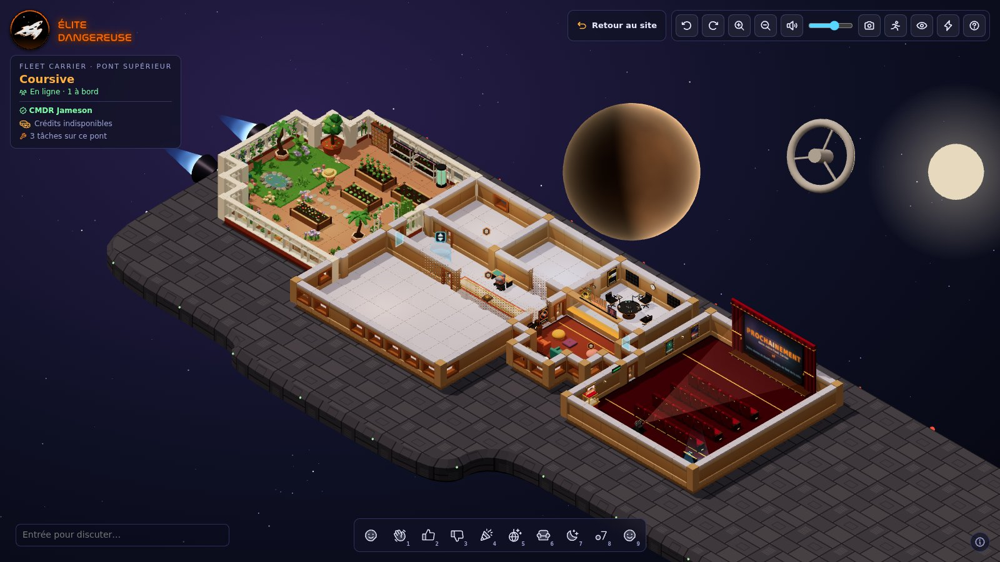
</p>

---

## Sommaire

- [En bref](#en-bref)
- [Le vaisseau](#le-vaisseau)
- [Holo-Me (garde-robe)](#holo-me-garde-robe)
- [Quartiers personnalisables](#quartiers-personnalisables)
- [Mobilier fait main](#mobilier-fait-main)
- [S'installer, jouer, danser](#sinstaller-jouer-danser)
- [Bornes d'arcade](#bornes-darcade)
- [Jukebox](#jukebox)
- [Mode photo](#mode-photo)
- [Crédits](#crédits)
- [Tâches de bord](#tâches-de-bord)
- [Lancer en local](#lancer-en-local)
- [Commandes](#commandes)
- [Langues](#langues)
- [Comptes Élite Dangereuse](#comptes-élite-dangereuse)
- [Sons](#sons)
- [Choix techniques](#choix-techniques)
- [Architecture](#architecture)
- [Assets](#assets-tous-en-cc0-ou-dans-le-domaine-public)
- [Limites connues / pistes](#limites-connues--pistes)

## En bref

Mini Interior est un POC : un vaisseau sur trois ponts, vu de dessus en isométrique. On y promène un personnage, on y croise les autres joueurs connectés et Comète, le chat du bord.

- **Trois ponts, trois ambiances** : des quartiers chaleureux, un pont principal aux couleurs d'Elite, une cale rouillée à l'éclairage sodium.
- **Multijoueur** : chaque onglet est un membre d'équipage, avec positions, emotes et chat en bulles, synchronisés par un petit relais socket.io.
- **Comptes Élite Dangereuse** : un CMDR connecté à [elitedangereuse.fr](https://elitedangereuse.fr) arrive sous son nom, avec un badge « vérifié ».
- **Holo-Me** : humain, combinaison spatiale, alien, robot ou créature, et chaque changement s'applique en direct.
- **Quartiers personnalisables** : chaque joueur a sa propre instance des quartiers du commandant. Un CMDR connecté les aménage (93 meubles et objets : lits, plantes, affiches, bornes d'arcade, piste de danse, boule à facettes, tasse de Hutton Orbital…), choisit le papier peint et le sol, et y invite qui il veut.
- **On s'installe** : s'asseoir sur les chaises, les canapés et les fauteuils, se coucher dans les lits (même la couchette du haut), prendre les commandes au poste de pilotage (et lancer un saut FSD), pédaler, courir, frapper le sac, mixer, jouer à la pince à peluches, danser en rythme. Les autres voient la pose.
- **Arcade** : quatre bornes se jouent pour de vrai, Cargaison (un Tetris de conteneurs), Viper (un Snake), Astéroïdes et Ruelle Fighter II (combat solo ou duel en ligne), avec le tableau des meilleurs scores gardé par le site.
- **Jukebox** : neuf morceaux libres de droits, que tout le pont (ou toute la cabine) entend ensemble ; la piste de danse suit leur tempo quand il est établi, sinon celui de la soirée.
- **Mode photo** : la scène sans l'interface, jusqu'en 4K, à télécharger.
- **Crédits** : comme dans Elite, le CR débloque les meubles des quartiers et les apparences du Holo-Me. Un meuble débloqué peut être posé autant de fois que souhaité. On gagne des crédits à bord : un revenu passif, lent, les tâches et les records aux bornes d'arcade. Le site tient les comptes.
- **Tâches de bord** : ordures, flaques, plantes à arroser, pannes, fuites, brèches dans la coque… douze sortes de petites tâches apparaissent un peu partout, les mêmes pour tous, et chacun peut les régler : une tâche réglée ne disparaît que pour celui qui l'a réglée.
- **Des dizaines de meubles animés** : hologrammes, bras robotisé qui soude, aquarium, cheminée, pince à peluches…
- **Son spatialisé** : pas, réacteur, bips des consoles, mélodies d'arcade, ronronnements, jukebox.

<p align="center">
  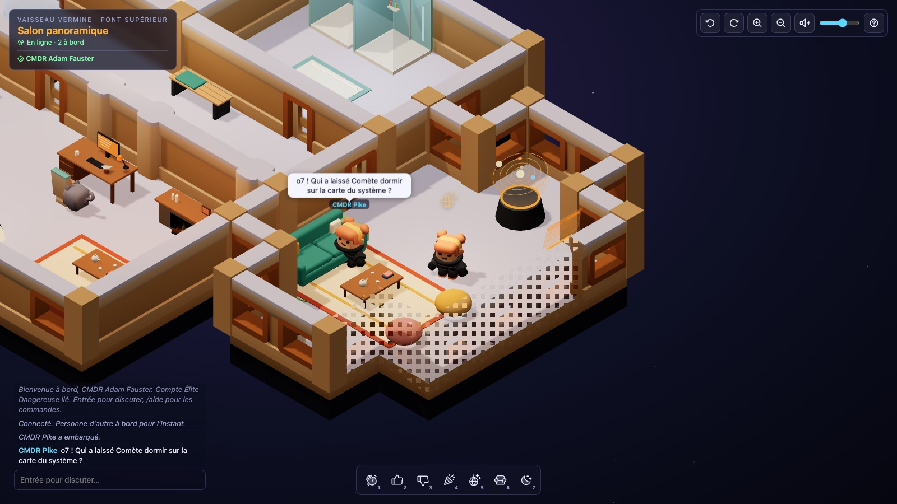
  <br><em>Deux membres d'équipage dans le salon panoramique : chat en bulle, emote « danse », et Comète qui fait la sieste près du bureau.</em>
</p>

## Le vaisseau

Trois ponts, trois ambiances. Chaque pont repeint à sa façon la même palette du kit (coque et mobilier, cf. `themes` dans `src/assets.ts`), et a son propre éclairage (ciel, soleil, lumières qui vacillent) et son propre bruit de pas. Le pont principal est de loin le plus grand (~210 tuiles). La cale et le pont supérieur sont deux fois plus petits (~90 et ~110 tuiles), autour de l'ascenseur.

On se réveille dans ses quartiers, sur le pont supérieur, à deux pas du Holo-Me. Dans le sélecteur de l’ascenseur, **Vous êtes ici** indique le pont actuel.

| Pont | Ambiance | Pièces |
|---|---|---|
| **Pont supérieur** · les quartiers | *cozy* : crème et bois miel, tissus, plantes, lumière chaude, pas feutrés | **quartiers du commandant**, [aménagés par chaque CMDR](#quartiers-personnalisables) (au départ : grand lit, cheminée holographique, canapé, aquarium, bureau, bibliothèque, casier à combinaisons, **Holo-Me**), cabines d'équipage (lits superposés), douches, serre hydroponique, salon panoramique (carte du système), coursive |
| **Pont principal** | la station d'origine, mobilier aux couleurs d'Elite | poste de pilotage (siège et HOTAS, scanner, panneaux holographiques, carte galactique), salle des machines (centrale, réacteur FSD, tuyères), **infirmerie** (lits médicaux, scanner corporel, quarantaine), **salle de sport**, **salon d'arcade** (quatre bornes jouables : Cargaison, Viper, Astéroïdes, Ruelle Fighter II ; une pince à peluches), mess (et son jukebox), coursive |
| **Cale** | *brute* : acier noirci et rouillé, jaune de chantier, lumière sodium, néons qui grésillent | **atelier** (établis, poste de soudure, établi d'ingénieur, ferraille), **baie de réparation** (SRV Scarab sur pont élévateur, bras robotisé qui soude, AFMU), **raffinerie** (fusion, tapis roulant de minerai, cristaux, drones collecteurs, laser minier), soute, palier de l'ascenseur |

### Pont supérieur · les quartiers

<p align="center">
  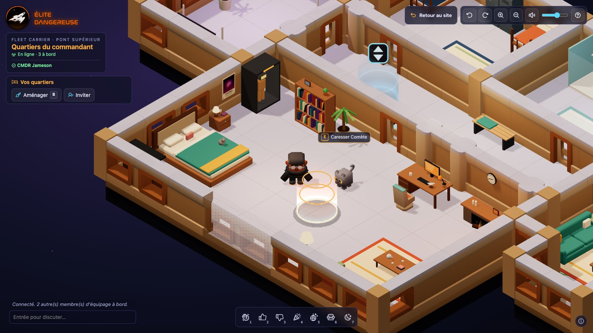
</p>

### Pont principal

<p align="center">
  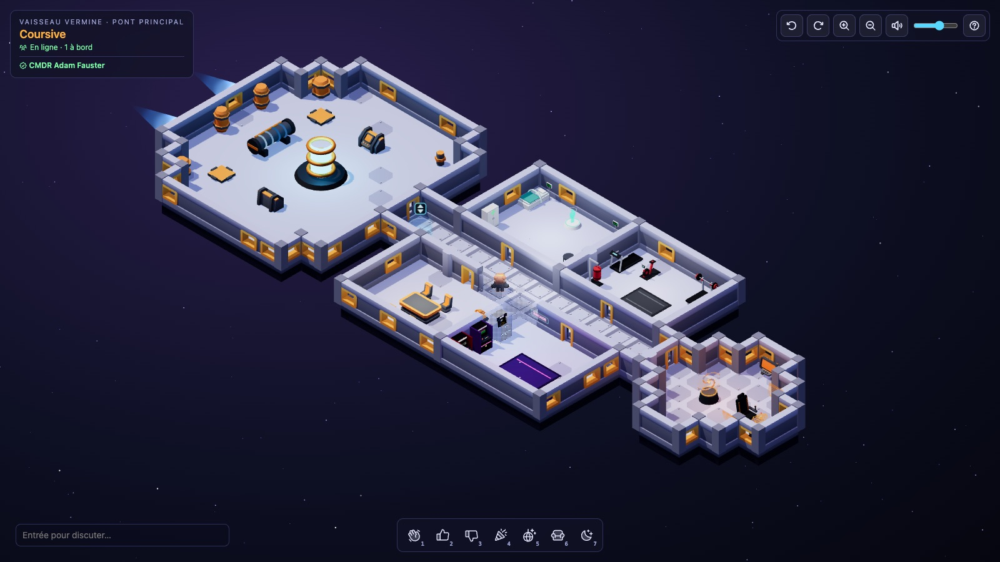
</p>

<table>
  <tr>
    <td width="50%">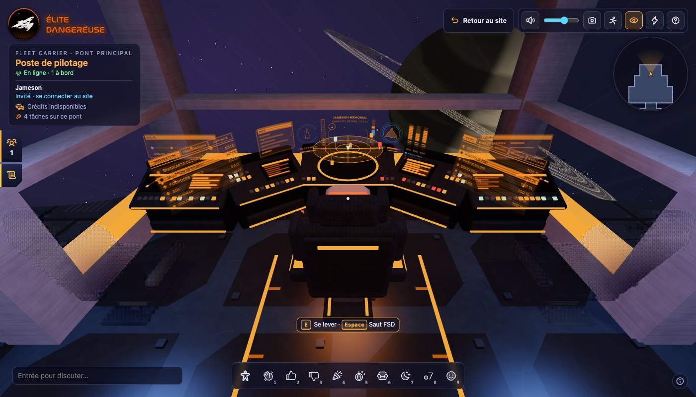<br><sub><b>Poste de pilotage</b> : siège et HOTAS, scanner, carte galactique holographique.</sub></td>
    <td width="50%">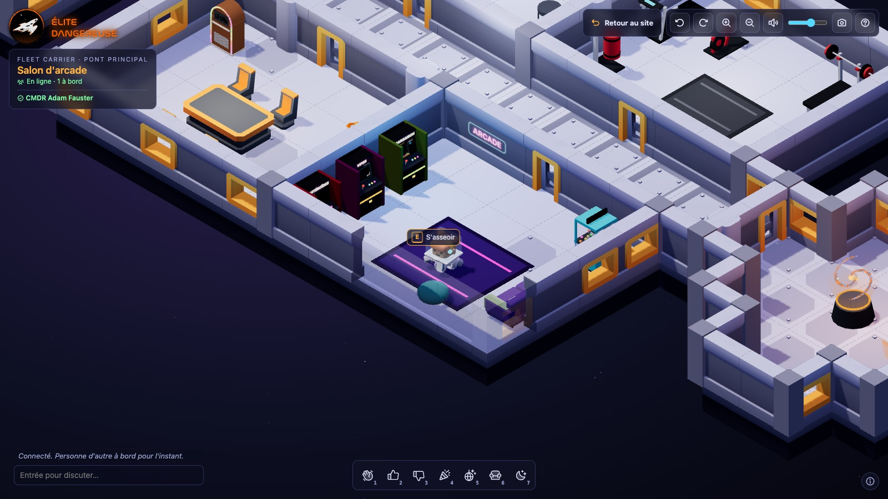<br><sub><b>Salon d'arcade</b> : quatre bornes jouables (Cargaison, Viper, Astéroïdes, Ruelle Fighter II) et une pince à peluches, à côté du mess et de son jukebox.</sub></td>
  </tr>
  <tr>
    <td width="50%">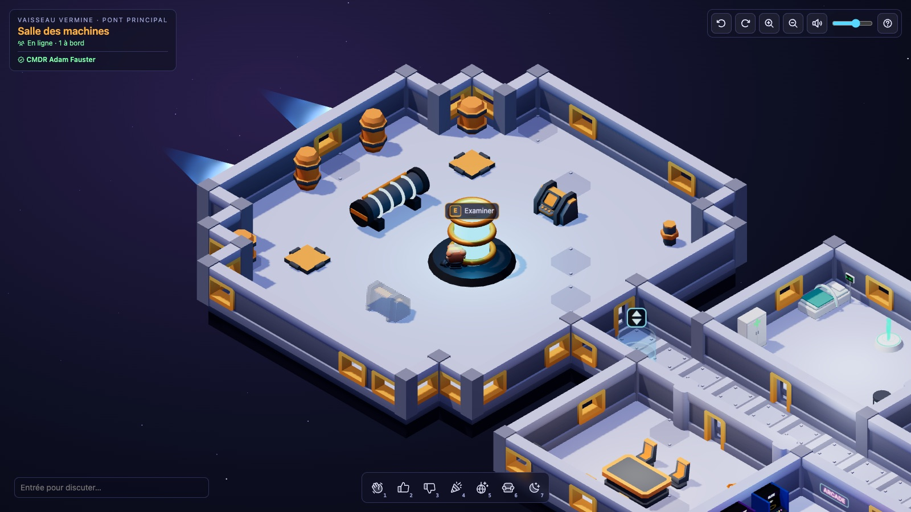<br><sub><b>Salle des machines</b> : centrale, réacteur FSD, et les tuyères à la poupe.</sub></td>
    <td width="50%">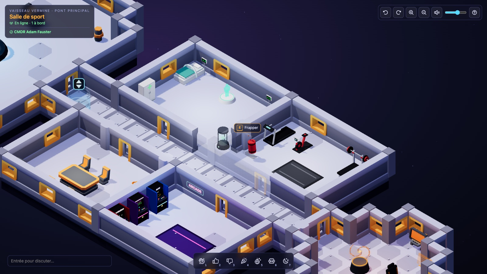<br><sub><b>Infirmerie et salle de sport</b> : lit médical, scanner corporel, tapis de course, sac de frappe.</sub></td>
  </tr>
</table>

### Cale

<p align="center">
  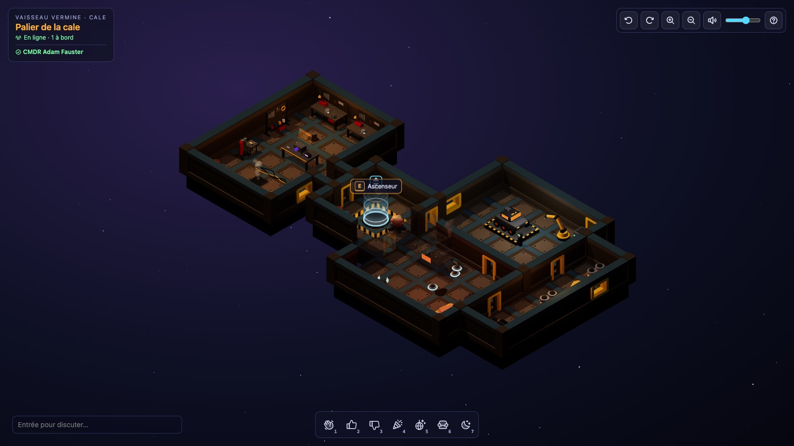
</p>

<table>
  <tr>
    <td width="50%">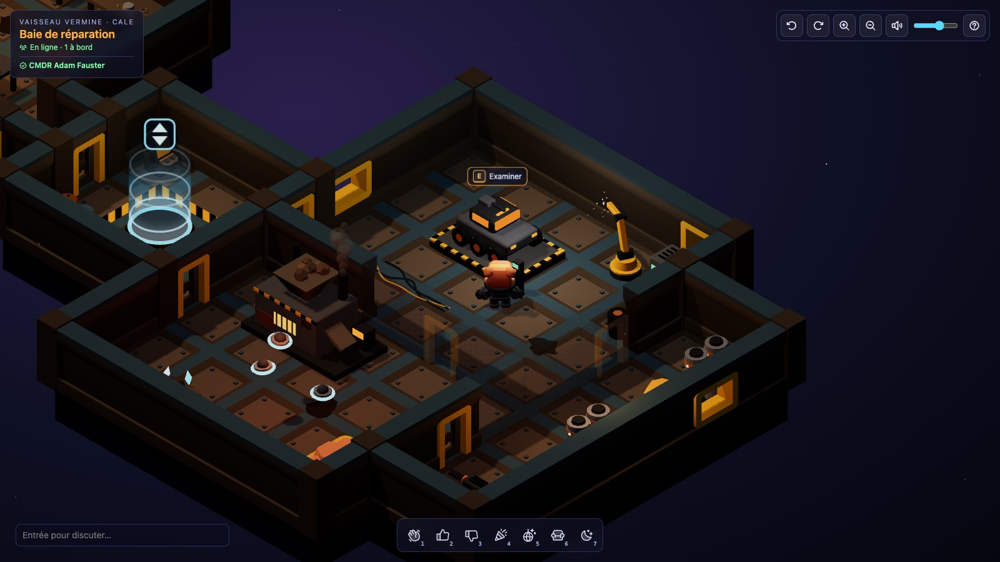<br><sub><b>Baie de réparation</b> : le SRV Scarab sur son pont élévateur, le bras robotisé qui soude.</sub></td>
    <td width="50%">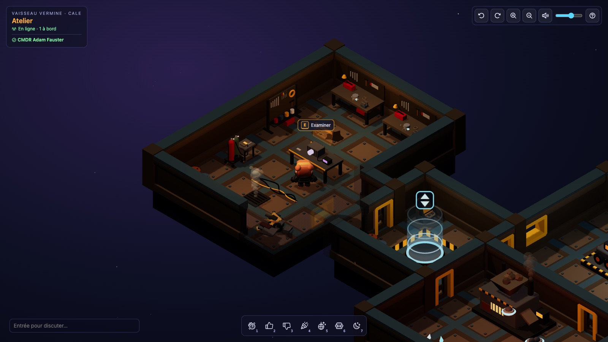<br><sub><b>Atelier</b> : établis, poste de soudure, établi d'ingénieur, ferraille.</sub></td>
  </tr>
</table>

## Holo-Me (garde-robe)

<p align="center">
  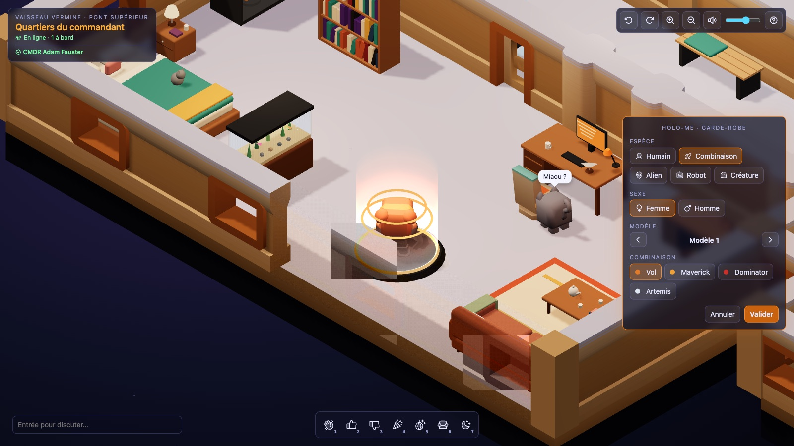
</p>

Dans les quartiers du commandant (pont supérieur), monte sur la plateforme orange du Holo-Me et appuie sur `E`. La caméra se rapproche, le personnage tourne sur lui-même (le bouton **Arrêter la rotation / Reprendre la rotation** permet de figer l’aperçu) et chaque choix s'applique en direct. **Valider** enregistre l'apparence et l'envoie aux autres joueurs. **Annuler** ou `Échap` revient à l'apparence d'avant.

| Espèce | Choix |
|---|---|
| Humain | sexe, 5 modèles (femme) ou 6 (homme) |
| Combinaison | les modèles humains en combinaison spatiale, 4 combinaisons d'après Elite Dangerous: Odyssey : **Vol** (sombre, liserés orange, sans casque), **Maverick** (orange, casque à visière dorée), **Dominator** (noire, visière rouge), **Artemis** (blanche, bulle de verre) |
| Alien | sexe, 5 ou 6 modèles, 3 teintes (Zorblien, Cryonien, Nébulien) : les humains avec une rotation de teinte et des antennes |
| Robot | Unité R-7, Unité V-3, Mannequin T-0 |
| Créature | Orque de Kepler, Troll des soutes, Zombie en costume |

Un nouveau joueur arrive dans une combinaison tirée au hasard. Les combinaisons recolorent le corps du modèle par « carte de dégradé » (la peau devient des gants), et le casque, le col et le sac dorsal sont accrochés aux os de la tête et du torse : ils suivent les animations. La femme « a » des Mini Characters (avec des béquilles) est retirée du catalogue. Une apparence enregistrée qui l'utilisait passe au premier modèle disponible.

Les robots ont des pas plus lourds. Pour ajouter une espèce ou un modèle, il suffit de compléter `RACES` dans `src/looks.ts` : les modèles sont remis à la même taille automatiquement, et une animation manquante est remplacée par une animation voisine.

**Comète** vit dans les quartiers (pont supérieur), près de son panier au coin du feu. Il vient se frotter aux jambes du joueur, fait sa toilette, pique des sprints, miaule, ronronne quand on le caresse (`E`) et danse quand on danse à côté de lui. S'il se retrouve coincé contre un meuble, il renonce à son trajet et repart ailleurs.

## Quartiers personnalisables

<p align="center">
  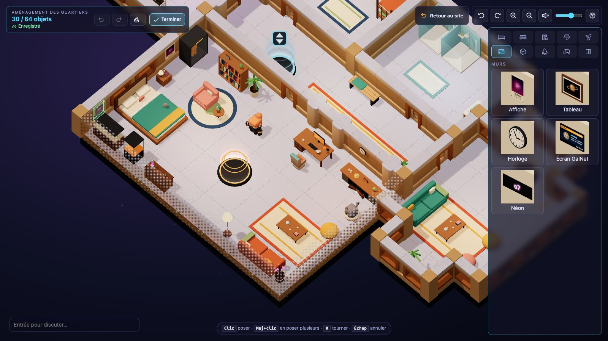
</p>

Les quartiers du commandant (40 tuiles, là où se trouve le Holo-Me) sont **instanciés** : chaque joueur a les siens, meublés selon son aménagement, et n'y voit que ceux qui s'y trouvent avec lui. Hors des quartiers, rien ne change : on croise tout l'équipage dans la coursive.

Un CMDR connecté au site les **aménage** : dans ses quartiers, `B` ou « Aménager » ouvre le mode aménagement. La caméra passe en vue plongeante sur la cabine, les murs côté caméra s'estompent, le catalogue s'ouvre à droite. Les objets payants se débloquent une fois, en crédits, puis peuvent être posés librement ; le mobilier d'origine est offert (cf. [Crédits](#crédits)).

| Action | Souris / clavier |
|---|---|
| Poser un objet | une carte du catalogue, puis un clic dans la cabine (ou glisser la carte jusqu'à sa place) ; `Maj`+clic pour en poser plusieurs |
| Déplacer | glisser l'objet (ce qui est posé dessus le suit) ; les flèches l'ajustent d'un vingtième de tuile (`Maj` : d'un quart) |
| Tourner | `R` / `Maj+R`, ou les boutons de la barre d'outils |
| Changer de variante | la barre d'outils de l'objet choisi : tissu, palette, affiche, planète du globe… |
| Retirer | `Suppr`, ou la corbeille (avec ce qui est posé dessus) |
| Annuler, rétablir | `Ctrl+Z`, `Ctrl+Y` (ou `Ctrl+Maj+Z`) |
| Terminer | `Échap`, « Terminer », ou `B` |

Le catalogue compte **93 objets** en douze catégories : le mobilier du vaisseau (lits, canapés, bureau, aquarium, cheminée, carte galactique…), et de quoi décorer : des affiches de voyage aux couleurs d'Elite (Colonia, Jameson Memorial, Hutton Orbital, Sagittarius A*, Beagle Point, les Gardiens…), des tableaux, une horloge qui donne l'heure de l'appareil, l'écran de GalNet, des néons (« o7 » et d'autres mots, en six couleurs ; planète à anneaux, Comète…), une étagère, des plantes (dont un spécimen exobiologique lumineux), des luminaires (guirlande, bandeau LED, lampadaire arc, lampe en papier, suspensions, boule plasma), et des petits objets à poser sur les meubles : tasse de Hutton Orbital, lampe à lave, lampe de bureau, globe, bougies, peluche de Comète, trophée Elite, capteur thargoïde, relique des Gardiens… L'**arcade** a ses bornes (six jeux, dont « Le Labyrinthe de Comète », « SRV Rally » et « Cargaison »), une borne cocktail, trois flippers, une borne de course « Canyon Run » et une pince à peluches, la **soirée** sa piste de danse et sa boule à facettes (cf. plus bas). La galerie `/gallery.html?catalogue` les montre tous (`&variantes` : toutes leurs variantes).

Les **règles de pose** (`src/cabin/rules.ts`) : un objet tient dans la cabine, ou sur un pan de mur libre (ni porte, ni hublot, ni pilier) ; il ne traverse pas un autre objet, mais un tapis passe sous les meubles, un petit objet se pose sur le dessus d'un meuble (bureau, table basse, commode, étagère…), et une affiche peut dépasser un peu derrière le dossier d'un canapé. Devant la porte, le passage reste libre (une suspension, au-dessus des têtes, peut y pendre), et le Holo-Me reste accessible depuis la porte : il se déplace, mais ne se retire pas. 64 objets au plus. L'objet en main se soulève, vert s'il peut aller là, rouge sinon avec la raison ; poussé contre un mur, il glisse le long ; tout près d'un mur, il s'y colle.

L'onglet **Murs et sol** du catalogue habille la cabine : douze revêtements de murs (peinture, rayures, damassé, écailles art déco, constellations, feuillage, lambris, briques, béton banché, panneaux de coque, capitonné, alvéoles) et onze de sol (parquet, point de Hongrie, moquette, carrelage, damier, marbre, terrazzo, tomettes, tôle larmée, béton ciré, tatamis), chacun dans les teintes de son nuancier ou dans n'importe quelle autre. Les motifs sont dessinés par le jeu (`src/cabin/finishes.ts`), sans image à télécharger : même motif, même couleur, même image chez l'hôte et chez ses invités. Le papier peint se pose sur le panneau en retrait des murs du kit, entre ses bandeaux, à côté des hublots et de la porte, et s'estompe avec son mur ; le revêtement de sol passe sous les tapis. La galerie `/gallery.html?revetements` les montre tous.

<p align="center">
  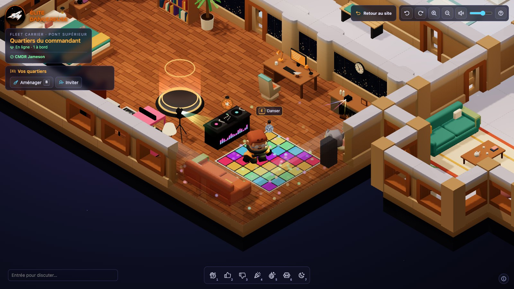
</p>

Pour les **soirées**, la catégorie « Soirée » bat au même tempo (120 BPM, ou celui du morceau que joue le jukebox) : une piste de danse lumineuse (ses dalles s'allument en vagues, en damier, en anneaux ; « Danser » y fait danser le personnage, et elle éclaire la pièce au rythme de la musique), une boule à facettes dont les reflets balaient le sol et les murs, des platines, un jukebox, des enceintes, un projecteur laser et une lyre. Le jukebox joue ses morceaux (cf. [Jukebox](#jukebox)) ; les platines, quelques mesures de disco, lancées sur un temps de la piste et à son tempo.

L'aménagement est **enregistré sur le site** (cf. [Comptes Élite Dangereuse](#comptes-élite-dangereuse)) un peu après chaque changement, avec ses revêtements, et suit le CMDR d'un appareil à l'autre. Un invité du site a les quartiers d'origine : il ne les aménage pas, mais peut être invité.

<p align="center">
  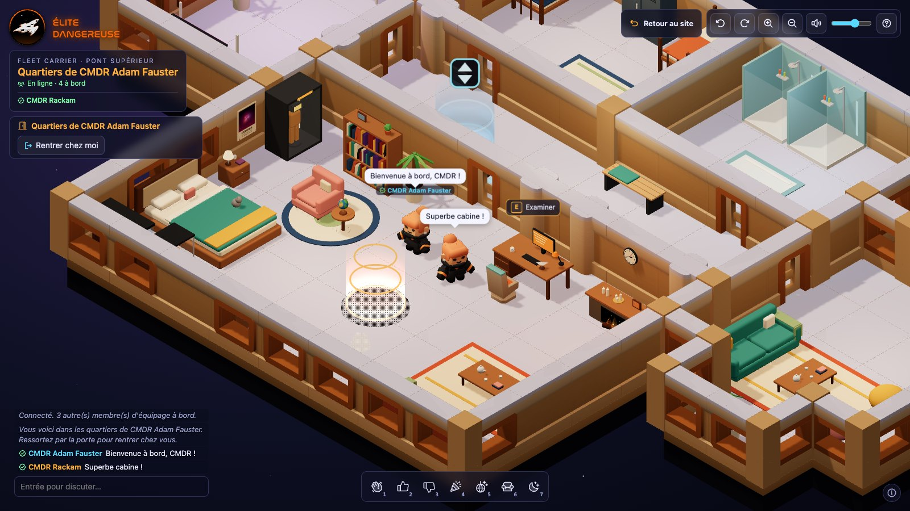
</p>

Un CMDR **invite** un membre d'équipage connecté : « Inviter » dans la barre de ses quartiers (la liste de l'équipage), ou `/inviter CMDR Nom`. L'invitation vaut une minute ; si l'invité la rejoint, où qu'il soit à bord, il est téléporté devant la porte, dans des quartiers meublés comme chez son hôte, et voit chacun de ses changements en direct. Il rentre chez lui en ressortant par la porte (ou « Rentrer chez moi »), quand l'hôte le raccompagne (depuis la liste de l'équipage), ou quand l'hôte quitte le vaisseau.

## Mobilier fait main

<p align="center">
  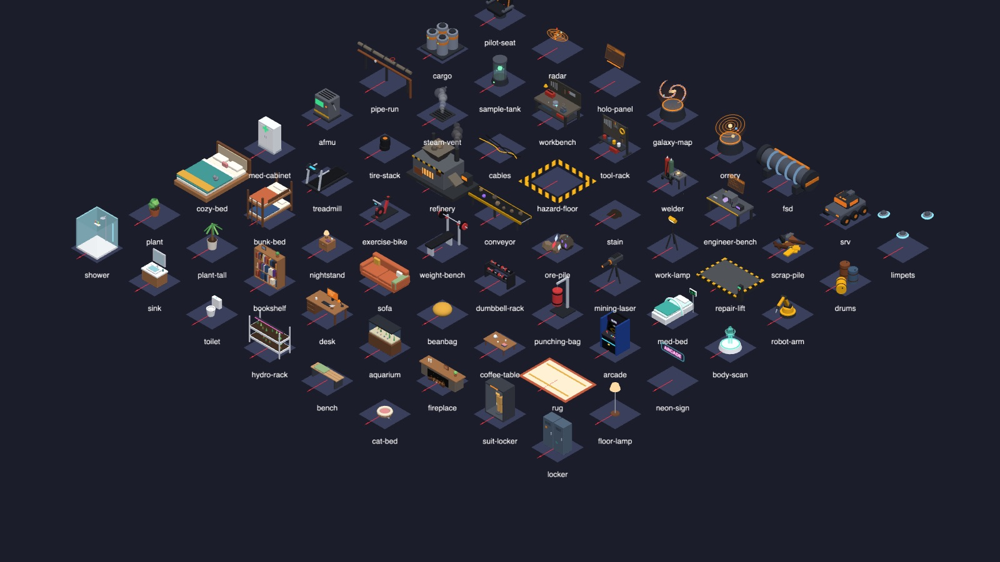
  <br><em>La galerie de debug <code>/gallery.html?mobilier</code> : tous les meubles construits à la main, animés.</em>
</p>

Les meubles qui ne sont pas dans le kit sont construits en primitives Three.js dans `src/furniture/`, rangés par zone : `elite.ts` (clins d'œil à Elite Dangerous, et le Holo-Me), `workshop.ts` (la cale), `leisure.ts` (infirmerie, sport), `arcade.ts` (les bornes et leurs jeux), `cozy.ts` (les quartiers), `decor.ts` (la décoration des cabines : affiches, cadres, plantes, petits objets), `lights.ts` (les luminaires des cabines), `party.ts` (la soirée : piste de danse, boule à facettes, platines…), `tasks.ts` (le décor des [tâches de bord](#tâches-de-bord) : ordures, flaques, brèches…). On les place dans `src/levels.ts` comme les modèles du kit : `{ model: 'fireplace', x, z, rot }`, et dans les quartiers depuis le catalogue du mode aménagement (`src/cabin/catalog.ts`, qui dit comment chacun se pose et ce qu'on peut en changer). Le nom du modèle est vérifié à la compilation.

- `label` passe un texte libre au meuble : le titre d'un panneau holographique (`'Titre|ligne|ligne'`), le jeu d'une borne (`elite`, `invaders`, `asteroids`, `comete`, `srv`, `cargo`), la couleur d'un tissu (`teal`, `terracotta`, `mustard`…), la palette et la taille d'un tapis (`warm:2.2x1.5`).
- `interact` accepte une liste de phrases : une au hasard à chaque interaction. `action` change le verbe de l'invite (« Jouer », « Se doucher », « Frapper »…).
- Certains meubles s'animent (hologrammes, flammes, poissons, étincelles, bras robotisé, tapis roulant) et ont un son d'ambiance (bornes d'arcade, soudure, grondement de la raffinerie).

La galerie de debug les montre tous, animés : `/gallery.html?mobilier` (avec `&only=arcade,fireplace`, `&label=…`).

Côté performances, chaque meuble est fusionné en deux maillages au plus (couleurs portées par les sommets), puis avec le reste du pont. Un meuble interactif se clique grâce à un volume invisible, qui ne coûte aucun appel de dessin. Les pièces mobiles répétées (contacts du scanner, poissons, étincelles…) sont instanciées. Les consoles racontent le lore d'Elite : Jameson Memorial, Hutton Orbital, Felicity Farseer, les étoiles KGBFOAM…

## S'installer, jouer, danser

<p align="center">
  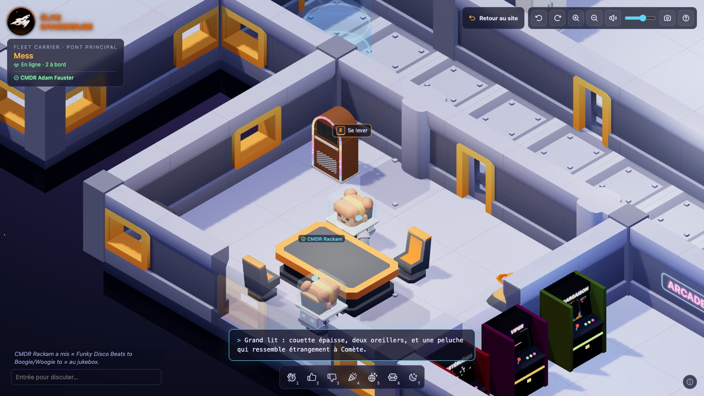
  <br><em>Au mess : deux CMDR attablés (chacun voit l'autre assis), le jukebox qui joue le morceau choisi par l'un d'eux.</em>
</p>

Les meubles ont des places (`src/seats.ts`). `E`, ou un clic sur le meuble, y emmène le personnage, qui s'y installe en douceur : il recule sur l'assise, monte sur le lit. Le moindre pas, `E` ou un clic ailleurs le relève. Les autres joueurs voient la pose et sa hauteur ; une place prise n'est pas proposée.

| Meuble | Ce qu'on y fait |
|---|---|
| Chaises, fauteuils, canapés (trois places), pouf, banc (des deux côtés), toilettes | s'asseoir |
| Grand lit (deux places), lits superposés (en haut aussi), lits médicaux, banc de musculation | s'allonger, et dormir (de petits « Zzz ») |
| Siège du pilote | prendre les commandes ; au poste de pilotage, `Espace` lance un **saut FSD** vers une destination d'Elite (Shinrarta Dezhra, Colonia, Beagle Point…) : charge du réacteur, compte à rebours, étoiles en traînées, secousse, éclair |
| Vélo, tapis de course, sac de frappe | pédaler, courir, frapper (le sac encaisse chaque coup) |
| Bornes d'arcade, borne cocktail (à deux), flipper, borne de course | jouer (cf. [Bornes d'arcade](#bornes-darcade)) |
| Pince à peluches (il y en a une au salon d'arcade) | la caméra passe derrière le joueur ; les flèches déplacent la pince, `Espace` la lâche. Bien visée, elle attrape la Comète assise sur le Thargoïde… qui peut encore glisser en remontant. Les peluches gagnées sont comptées |
| Platines, piste de danse | mixer, danser |

Une chaise poussée contre la table s'aborde par le côté, un lit contre un mur par l'autre bord (`src/seating.ts`). Le meuble où l'on est installé ne s'estompe pas quand il passe devant le personnage. La danse change de pas tous les deux temps, sur le tempo de la soirée (`src/tempo.ts`) : 120 BPM, ou celui du morceau que joue le jukebox. La piste, la boule à facettes et les lumières battent sur le même tempo.

<p align="center">
  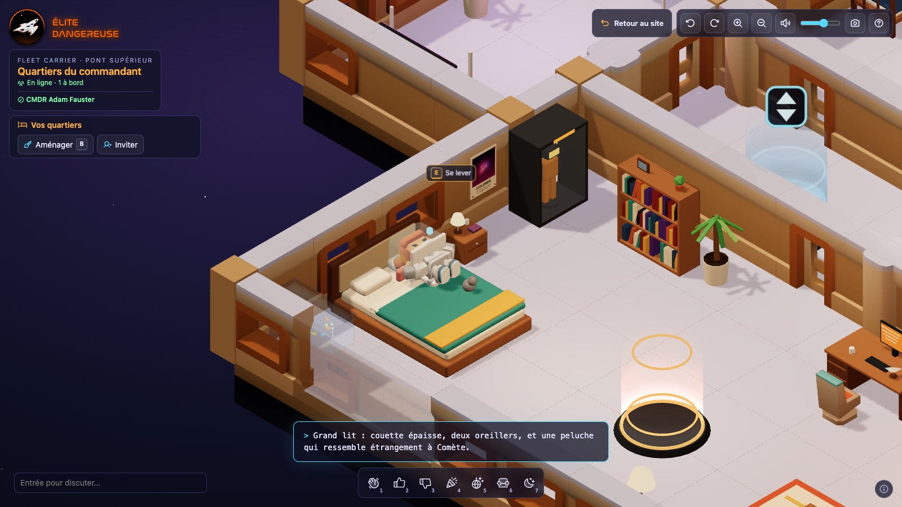
</p>

La galerie de debug montre chaque meuble avec un personnage à chacune de ses places : `/gallery.html?poses` (`&side` : de profil, `&cam=x,y,z` : d'où l'on regarde, `&pose=lie` : une pose seule, avec une règle graduée).

## Bornes d'arcade

<p align="center">
  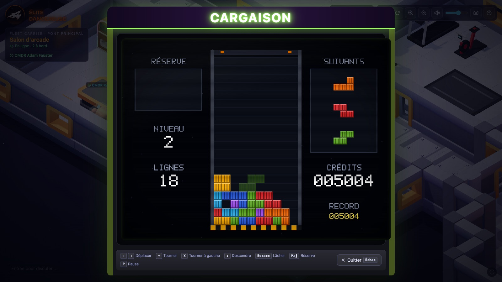
</p>

Quatre bornes se jouent (`src/arcade/`). Devant l'une d'elles, `E` ou un clic ouvre la borne en grand : fronton au néon, écran cathodique, pupitre. `Espace` lance la partie, `P` la met en pause, `E` ou `Échap` fait quitter la borne. L'écran titre fait tourner une démonstration, jouée par le pilote automatique du jeu, et alterne avec le tableau des meilleurs scores. Les bornes du vaisseau jouent aussi leur démonstration, record affiché (« HI 012340 »).

| Jeu | Commandes | En bref |
|---|---|---|
| **Cargaison** (un Tetris) | `←` `→` déplacer, `↑` tourner, `X` tourner à gauche, `↓` descendre, `Espace` lâcher, `Maj` réserve | des conteneurs de fret s'empilent dans la soute. Sept formes tirées par sacs de sept, rotation SRS et ses décalages contre les parois, réserve, trois suivants, fantôme, verrouillage différé, un niveau tous les dix lignes |
| **Viper** (un Snake) | flèches | le Viper remorque les conteneurs qu'il ramasse, au bout de son rayon tracteur ; Brandy de Lave doré en bonus, mines à partir du niveau 3 |
| **Astéroïdes** | `←` `→` tourner, `↑` poussée, `Espace` tirer, `↓` saut FSD d'urgence | en vecteurs lumineux : les roches se brisent, des Thargoïdes traversent en tirant (le petit vise juste), une vie tous les 10 000 points, un saut raté une fois sur douze, et le battement de cœur qui s'accélère |
| **Ruelle Fighter II** | `Z Q S D` (AZERTY) / `W A S D` (QWERTY) ou flèches ; `F` attaque rapide, `G` attaque lourde, `H` spécial ; reculer pour la garde, bas + recul pour la garde basse | combat 2D, six combattants aux styles distincts, quatre stages au décor animé ; solo contre l’IA ou duel entre deux joueurs connectés ; deux manches gagnantes, 60 secondes par manche |

**Ruelle Fighter II : sélection et ambiance.** Une introduction animée ouvre la borne, suivie du choix du personnage (`←` / `→`, boutons nommés ou croix tactile). `Espace` / A passe l’introduction et confirme le choix. Avant le premier round, les portraits apparaissent sur un écran versus ; cette animation est synchronisée par le relais en ligne. Les six combattants utilisent les sprites de **Fantasy Martial Characters 2**, par **LuizMelo** (CC0), importés depuis le pack fourni par le propriétaire du site. Chacun a huit animations : repos, course, saut, chute, deux attaques, impact et KO. Les frames d’attaque sont calées sur les impacts de la simulation ; les portraits de sélection et du versus utilisent les mêmes sprites. La garde est signalée par un arc lumineux et la posture basse adapte le sprite de repos, car le pack ne fournit pas ces poses. Le décor original représente une rue commerçante au crépuscule : « Chez KO », le « Dojo du Coin », néons, guirlandes, spectateurs et reflets sur les pavés. Le titre **Ruelle Fighter II — Championnat du Coin** parodie les bornes de versus des années 1990.

| Combattant | Forces | Faiblesses |
|---|---|---|
| Reno | Arsenal équilibré, bon point de départ | Aucune spécialité dominante |
| Violette | Vitesse et attaques rapides | Fragile, frappe légère |
| Big Ben | Frappe lourde et défense | Lent, récupération longue |
| Onyx | Vitesse, sauts hauts et allonge | Fragile, spécial coûteux |
| Maestro | Spécial puissant, énergie rapide | Faible au corps à corps |
| Lame | Défense et longue portée | Attaques lentes, mobilité réduite |

Ces profils changent la vitesse, les dégâts, la défense, la récupération, l’allonge, les sauts et le spécial dans la simulation commune au navigateur et au serveur. En solo, l’ordinateur utilise l’un des cinq autres personnages. En ligne, chacun choisit le sien avant de rejoindre ; les choix persistent au fil des manches et des revanches. Pour changer de personnage, revenez à la sélection avec le bouton de mode Solo ou 2 joueurs en ligne.

**Stages et musiques.** Au début de chaque match, un stage est tiré au sort en solo ou par le serveur en ligne. Les deux adversaires reçoivent le même identifiant de stage ; il reste fixe pendant les manches, et une revanche déclenche un nouveau tirage (qui peut retomber sur le même lieu). L’écran versus annonce le lieu. Chaque stage a sa **composition chiptune originale**, synthétisée localement sans samples externes :

| Stage | Décor animé | Musique |
|---|---|---|
| Dojo du Coin / Corner Dojo | Rue au crépuscule, public, néon et vapeur | Thème original en ré mineur, 144 BPM |
| Toits sous la pluie / Rainy Rooftops | Ville nocturne, train et pluie | Mélodie syncopée et pulsations nerveuses, 158 BPM |
| Port du Soleil / Sunset Harbor | Cargo, grues, reflets et mouettes | Thème lumineux aux accords majeurs, 126 BPM |
| Temple des Cimes / Mountain Temple | Sommets enneigés, lanternes et pétales | Mélodie espacée et arpèges ouverts, 112 BPM |

Le thème du Dojo accompagne l’introduction et la sélection ; la musique du stage commence au versus, avec un fondu entre les pistes. Le volume baisse à la sélection et à la fin du match, se tait en pause sans changer de piste, et la lecture s’arrête à la fermeture. Le volume général et `M` contrôlent aussi les musiques.

**Langues.** La borne suit la langue du site : français ou anglais, y compris les commandes, les profils, les messages en ligne, les annonces de combat et les inscriptions des stages. Le titre de la borne et les noms des personnages restent identiques dans les deux langues.

<p align="center">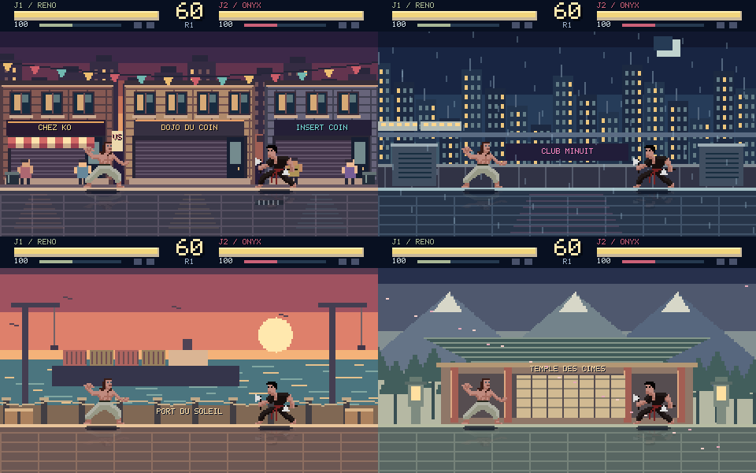</p>

<p align="center">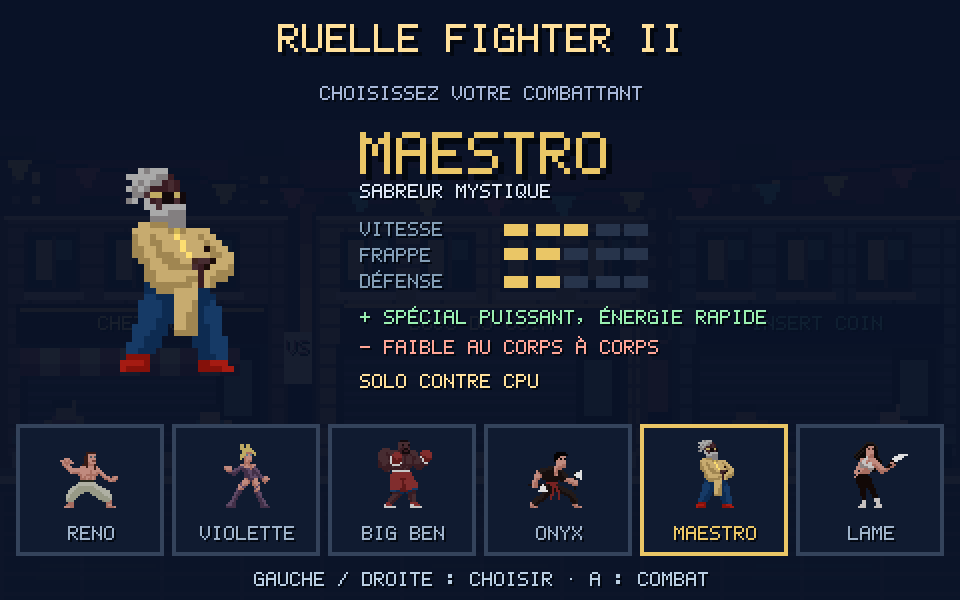</p>

**Duel en ligne.** Les deux joueurs s’installent à Ruelle Fighter II dans le salon d’arcade du pont principal (ou dans les mêmes quartiers), choisissent « 2 joueurs en ligne », puis « Combat ! ». Le premier attend le second. À l’écran titre, `1` sélectionne le solo et `2` le duel en ligne. Chacun utilise les mêmes commandes sur son ordinateur, ou les boutons tactiles A (rapide), B (lourde), C (spécial). Le relais simule les coups et transmet l’état du match à 30 Hz ; une perte de connexion libère la place et annule le duel. En fin de match, chacun doit demander la revanche pour qu’elle démarre. La pause est réservée au solo. Les duels n’ont pas de classement ni de récompense en crédits.

Sur mobile, une manette tactile s'affiche sous la borne. La borne est chargée à la première partie (~28 ko), et le vaisseau reste figé derrière elle. Les autres jeux (Elite, Thargoid Invaders, le Labyrinthe de Comète, SRV Rally) ne font que leur démonstration ; dans le catalogue du mode aménagement, les jeux jouables viennent en tête, marqués « jouable ».

**Crédits.** Les trois jeux à score ont huit paliers : un record personnel paie, une fois, chaque palier qu'il franchit (de 1 000 CR le premier à 40 000 CR le dernier), et prendre le record du vaisseau à un autre CMDR rapporte 10 000 CR de plus. L'écran titre annonce le prochain palier et ce qu'il rapporte ; l'écran de fin, ce que la partie a rapporté.

**Meilleurs scores.** Un CMDR connecté inscrit son score en fin de partie : le site garde le meilleur de chacun, par jeu (cf. [Fonctionnement](#fonctionnement)), et l'écran de fin montre son rang parmi les dix meilleurs. Un invité garde son record dans le navigateur. Les jeux tournent dans le navigateur : le site écarte seulement les scores impossibles (au-delà du plafond du jeu, plus de points que n'en permet le niveau atteint, ou plus de points par seconde que n'en donne Astéroïdes).

## Jukebox

<p align="center">
  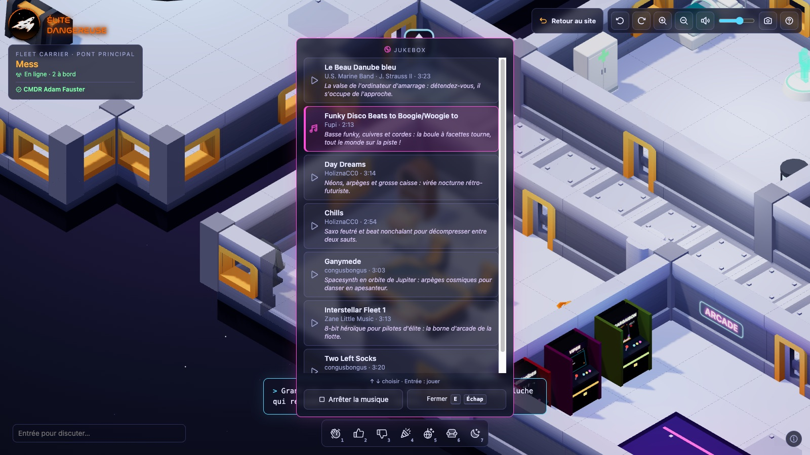
</p>

Le jukebox propose neuf morceaux libres de droits : celui du mess, au pont principal, et celui qu'on pose dans ses quartiers. On choisit au clavier (`↑` `↓`, `Entrée`) ou à la souris ; un morceau fini, le suivant enchaîne. Le son est spatialisé, et ne s'entend que sur le pont du jukebox. Le relais garde le morceau en cours, et depuis quand il joue, pour le pont principal et pour chaque instance des quartiers : ceux qui arrivent l'entendent au même endroit que les autres (chacun rattrape le temps de chargement du morceau), et la liste enchaîne à la même heure chez tous. Après une coupure, on retrouve le morceau du relais, ou son silence ; un hôte reconnecté lui rend celui de ses quartiers.

| Morceau | Artiste | Style | Licence |
|---|---|---|---|
| Le Beau Danube bleu (J. Strauss II) | U.S. Marine Band | la valse de l'ordinateur d'amarrage | domaine public |
| Funky Disco Beats to Boogie/Woogie to | Fupi | disco funk, 110 BPM | CC0 |
| Day Dreams | HoliznaCC0 | synthwave, 130 BPM | CC0 |
| Chills | HoliznaCC0 | lo-fi, 96 BPM | CC0 |
| Ganymede | congusbongus | spacesynth, 118 BPM | CC0 |
| Interstellar Fleet 1 | Zane Little Music | chiptune, 130 BPM | CC0 |
| Two Left Socks | congusbongus | bossa lounge, 135 BPM | CC0 |
| All The Fight Left! | HoliznaCC0 | synthwave cinématique | CC0 |
| Synesthesia | Zane Little Music | synthé pétillant et étrange | CC0 |

Les MP3 (environ 24 Mo en tout, normalisés autour de -16 LUFS) ne sont chargés qu'à la demande. Leurs sources, la preuve de chaque licence et les montages sont dans `public/assets/music/CREDITS.txt`. Les platines, elles, gardent leurs quelques mesures de disco synthétisées.

## Mode photo

<p align="center">
  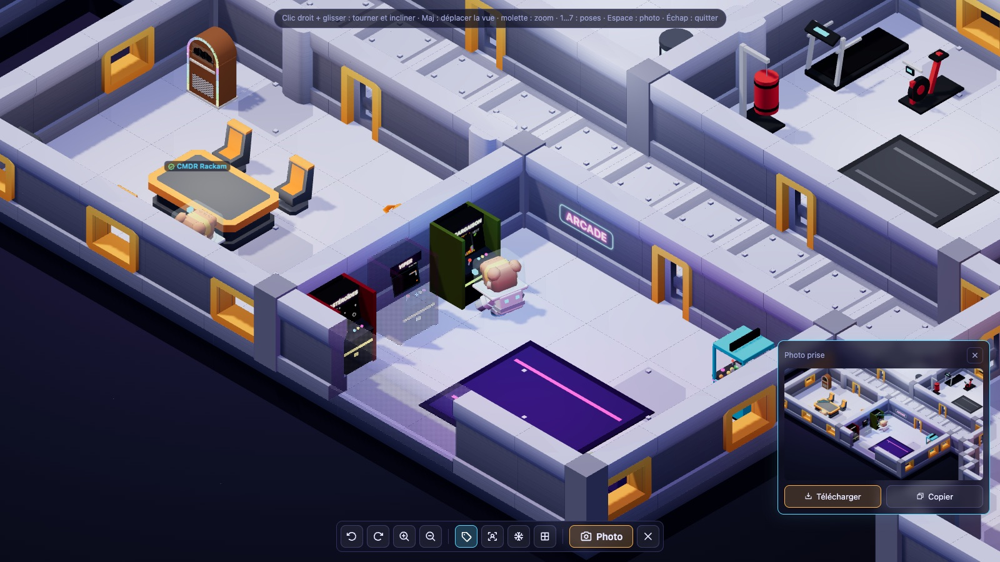
</p>

`P`, ou l'appareil photo de la barre du haut, efface l'interface. On cadre à la caméra libre (plus près et plus loin qu'en jeu), on prend la pose avec les emotes, puis `Espace` déclenche. La photo ne garde que la scène, rendue jusqu'en 4K (12 mégapixels au plus) sur le fond du jeu. L'aperçu propose de la télécharger (JPEG) ou de la copier, et les douze dernières de la séance restent dans la pellicule.

| Option | Touche |
|---|---|
| Noms des CMDR (dessinés dans la photo, badge vérifié compris) | `N` |
| Cacher son personnage | `C` |
| Figer l'instant (personnages, meubles, étoiles ; la caméra bouge toujours) | `F` |
| Grille des tiers, pour cadrer (jamais dans la photo) | `G` |
| Sortir | `Échap` ou `P` |

## Crédits

Le vaisseau a sa monnaie, le crédit (CR), comme dans Elite Dangerous. Un CMDR connecté au site a un compte : 30 000 CR de prime de bienvenue, puis ce qu'il gagne à bord. Son solde s'affiche sous son nom, en haut à gauche, et chaque gain s'en envole (au-dessus de sa tête aussi, pour une tâche ou un record). Un invité n'a pas de compte : il peut régler les tâches, mais il n'est pas payé.

| Gagner | Combien |
|---|---|
| Être à bord | 100 CR par minute : le revenu passif, versé chaque minute tant que la fenêtre est visible et qu'on a joué dans le dernier quart d'heure |
| [Tâches de bord](#tâches-de-bord) | de 300 à 1 500 CR la tâche, toujours la même somme pour une même tâche |
| Records aux bornes d'arcade | chaque palier de score franchi par un record personnel paie une fois (huit paliers par jeu, de 1 000 à 40 000 CR) ; prendre le record du vaisseau à un autre CMDR rapporte 10 000 CR de plus |

| Dépenser | Prix |
|---|---|
| Meubles et objets des quartiers | déblocage unique, de 1 500 CR (la tasse de Hutton Orbital) à 80 000 CR (la borne de course) ; ensuite, pose libre. Le mobilier d'origine des quartiers est offert |
| Apparences du Holo-Me | de 30 000 CR (la combinaison Maverick) à 200 000 CR (la Sentinelle des Gardiens) ; les humains et la combinaison de vol sont offerts |

Dans le mode aménagement, chaque carte montre « Débloqué » pour un objet acheté, ou son prix de déblocage, grisé si le solde ne suffit pas. Le mobilier d'origine reste offert en quantité limitée. Une carte payante ouvre le déblocage sous le catalogue ; l'objet passe alors en main et peut ensuite être posé autant de fois que souhaité. Les exemplaires déjà achetés sont convertis en déblocages permanents. La cabine conserve une limite de 64 objets posés. Au Holo-Me, tout s'essaie : une apparence qu'on n'a pas porte un cadenas et son prix, et « Acheter et porter » remplace « Valider ». Une apparence payante portée sans être achetée (choisie avant les crédits) redevient la combinaison de vol ; `/perso` ne tire que parmi celles qu'on a.

Tous les chiffres sont dans `src/economy/economy.json` : prix, tâches et leurs emplacements, paliers des bornes, revenu passif, prime de bienvenue. Le site les relit pour tenir les comptes (cf. [Fonctionnement](#fonctionnement)) : le prix affiché est celui qui est débité.

## Tâches de bord

Des incidents apparaissent aux quatre coins du vaisseau, hors des quartiers : un hexagone orange flotte au-dessus de chacun, visible à travers les murs, et le bloc du vaisseau, en haut à gauche, compte ceux du pont. `E` ou un clic, et le personnage s'y met : quelques secondes de geste, avec sa jauge au-dessus de la tâche, que le moindre pas interrompt. Réglée, la tâche disparaît pour soi seul : les autres la voient toujours, et peuvent la régler aussi.

| Tâche | Où | Crédits | Geste |
|---|---|---|---|
| Ramasser des ordures | coursives, cabines d'équipage, salle de sport, salon d'arcade, atelier, palier de la cale | 400 CR | 1,5 s |
| Éponger une flaque (huile, liquide de refroidissement, eau) | salle des machines, infirmerie, douches, atelier, raffinerie | 500 CR | 2 s |
| Arroser une plante | serre, coursive, salon panoramique | 450 CR | 2 s |
| Balayer les poils de Comète | coursives, salon panoramique | 300 CR | 1,2 s |
| Débarrasser la vaisselle | table du mess, table basse du salon panoramique | 450 CR | 1,8 s |
| Ranger des conteneurs renversés | soute | 700 CR | 2,5 s |
| Ranger des drones collecteurs | raffinerie | 700 CR | 2,2 s |
| Recalibrer une console | salle des machines, poste de pilotage | 800 CR | 2,5 s |
| Changer le filtre du support vital | salle des machines | 900 CR | 2,5 s |
| Resserrer une vanne qui fuit | baie de réparation, raffinerie, salle des machines, cabines d'équipage | 900 CR | 2,5 s |
| Réparer un panneau électrique | atelier, soute, coursive, douches | 1 100 CR | 3 s |
| Colmater une brèche dans la coque | baie de réparation, salle des machines, poste de pilotage | 1 500 CR | 3,5 s |

Leur calendrier ne dépend que de l'heure (`src/economy/schedule.ts`) : tous les joueurs voient les mêmes tâches aux mêmes endroits, sans que le relais ni le site aient à les annoncer. Chacun des 36 emplacements découpe le temps en apparitions de 8 à 30 minutes selon la tâche, décalées d'un emplacement à l'autre ; chaque apparition a une tâche avec la probabilité de sa sorte (de 30 à 50 %), tirée d'un hachage de l'emplacement et du numéro d'apparition. Une quinzaine de tâches attendent ainsi à bord à tout moment. Le site refait le même calcul (même hachage, testé des deux côtés) : il sait si une tâche qu'on lui dit réglée était bien là, et ne la paie qu'une fois par apparition et par CMDR. L'heure du site, donnée à chaque réponse, cale celle du jeu.

## Lancer en local

Prérequis : Node 20 ou plus.

```bash
npm install
npm run dev        # http://localhost:5173 — jeu + relais multijoueur
npm test           # tests du relais, des activités et des déplacements de Comète
```

Pour tester le multijoueur, ouvre deux onglets (ou un onglet et un autre navigateur). Chaque onglet est un membre d'équipage.

Serveur autonome (un seul port pour le jeu et le relais) :

```bash
npm run build
npm start          # http://localhost:8080 (variable PORT pour changer)
```

Sans `dist/`, `npm start` ne fait que le relais : c'est le cas sur elitedangereuse.fr, où le site sert lui-même le jeu. Le contenu de `dist/` peut aussi être déposé sur un hébergement purement statique. Dans ce cas, le jeu fonctionne en **solo** : sans relais, le chat reste local.

Une page de debug, `/gallery.html`, affiche chaque modèle du kit avec son nom et son orientation d'origine (`?only=wall,floor&zoom=4&cols=4&back`), ou le mobilier fait main avec `?mobilier` (`?poses` : les places des meubles). En dev, `window.__game` expose quelques fonctions (`goTo`, `ride`, `emote`, `say`, `sitOn`…).

## Commandes

### Manette

Les manettes reconnues par le navigateur avec la disposition [Gamepad « standard »](https://www.w3.org/TR/gamepad/#remapping) (Xbox, PlayStation et compatibles) sont détectées automatiquement : appuyer sur un bouton après avoir ouvert le jeu. L'API demande HTTPS, ou localhost en développement. Le clavier et la souris restent utilisables.

| Action | Manette (Xbox / PlayStation) |
|---|---|
| Marcher | Stick gauche, vitesse progressive ; croix directionnelle, vitesse normale |
| Courir | Maintenir L3 (clic du stick gauche) |
| Interagir, s'asseoir, se relever | A / Croix |
| Action du siège (saut FSD, pince) | X / Carré |
| Ascenseur / jukebox | Stick gauche ou croix haut-bas pour choisir (un cran par impulsion), A / Croix pour valider, B / Rond pour fermer |
| Fermer un panneau, arrêter une tâche, quitter la pince | B / Rond |
| Caméra libre | Stick droit |
| Pivoter d'un quart de tour | LB / L1 et RB / R1 |
| Zoom | LT / L2 : éloigner ; RT / R2 : rapprocher |
| Afficher / cacher l'aide | Start / Options |

Une zone morte évite la dérive des sticks. Les boutons d'action ne se répètent pas quand on les maintient. Les invites près des meubles affichent les boutons de la manette après son utilisation. Les commandes manette sont suspendues pendant la saisie, en mode aménagement, en mode photo, dans les jeux de table et les bornes d'arcade, ou lorsque la fenêtre n'a plus le focus. Pour activer le son, un premier clic ou une touche du clavier peut être nécessaire selon le navigateur.

### Clavier et souris

| Action | Clavier / souris |
|---|---|
| Se déplacer | `ZQSD` (AZERTY), `WASD` (QWERTY), flèches, ou clic sur le sol (pathfinding) |
| Courir | `Maj` ; ou le **sprint auto** (bouton du coureur en haut à droite, choix mémorisé sur cet appareil) : on court sans rien maintenir, et `Maj` fait alors marcher. Même vitesse, mêmes pas qu'en courant à la main |
| Interagir | `E` ou `Espace` près d'un objet, ou clic sur l'objet (le perso y va tout seul, du bon côté du mur : rien ne s'utilise à travers une cloison) ; sur un meuble où l'on s'installe (chaise, lit, borne…), le personnage y prend place, et le moindre pas, `E` ou un clic ailleurs le relève |
| Installé | `Espace` : saut FSD (siège du poste de pilotage), lâcher la pince (pince à peluches, que les flèches déplacent) |
| Tâches de bord | `E` ou un clic près d'une tâche (repère orange) : le personnage s'y met, le moindre pas l'interrompt |
| Bornes d'arcade | `Espace` jouer, `P` pause, `E` ou `Échap` quitter ; les commandes de chaque jeu sont sur le pupitre (cf. [Bornes d'arcade](#bornes-darcade)) |
| Jeux de plateau | `E` ou clic sur la table pour s'installer ; deux joueurs aux dames, à Puissance 4 ou aux échecs. Aux dames (8×8), choisir une pièce encadrée puis une destination marquée : les prises sont obligatoires, et une rafle continue avec la même pièce. Les pions avancent vers le camp adverse ; les dames se déplacent dans les deux sens. |
| Jukebox | `↑` `↓` choisir, `Entrée` jouer ; `E`, `Échap` ou un clic en dehors pour fermer |
| Mode photo | `P` ou l'appareil photo en haut à droite ; `Espace` photo, `N` noms, `C` cacher son personnage, `F` figer, `G` grille, `Échap` sortir |
| Changer de pont | interagir avec l'ascenseur (la plateforme cyan surmontée d'un panneau ▲▼, dans la coursive ou sur le palier), puis `↑` `↓` pour choisir l'étage et `Entrée` pour y aller, ou un clic ; `E`, `Échap` ou un clic en dehors pour fermer |
| Emotes | `1`…`7` ou la barre en bas : salut, oui, non, joie, danse, assis, dodo |
| Chat | `Entrée`, puis `Entrée` pour envoyer, `Échap` pour annuler |
| Commandes du chat | `/nom CMDR Pseudo` (invités), `/perso` (apparence au hasard, parmi les siennes), `/inviter CMDR Nom`, `/credits` (son solde), `/taches` (où sont les tâches de bord), `/danse`…, `/aide` ; en anglais, `/name`, `/random`, `/invite`, `/credits`, `/chores`, `/dance`…, `/help` |
| Changer d'apparence | le **Holo-Me** des quartiers du commandant (pont supérieur) |
| Aménager ses quartiers | `B`, ou « Aménager » dans la barre des quartiers (CMDR connectés au site, cf. [Quartiers personnalisables](#quartiers-personnalisables)) |
| Inviter dans ses quartiers | « Inviter » dans la barre des quartiers, ou `/inviter CMDR Nom` ; rejoindre ou décliner une invitation reçue en haut à gauche |
| Pivoter la caméra | `R` / `Maj+R`, ou les boutons en haut à droite (d'un quart de tour ; ramène aussi la vue isométrique après la caméra libre) |
| Caméra libre | maintenir le **clic droit** ou le **clic molette** et glisser : horizontalement on tourne autour du personnage, verticalement on incline la vue (de rasante à presque de dessus) ; avec `Maj`, on fait glisser la vue, qui revient sur le personnage dès qu'il bouge |
| Zoom | molette, ou les boutons loupe |
| Mode léger | bouton éclair en haut à droite : rendu moins coûteux, retour au rendu normal au second clic ; choix mémorisé sur cet appareil |
| Son | `M` ou le bouton haut-parleur, curseur de volume (le son démarre au premier clic ou à la première touche, contrainte des navigateurs) |

## Langues

Le jeu parle la langue du site : français si elitedangereuse.fr est en français, anglais dans toutes ses autres langues (il n'est traduit qu'en anglais). Le script de tête d'`index.html` lit la langue comme le fait le site (`?lang=`, sinon son cookie `LANG`, sinon le français) et la pose sur `<html lang>` avant le premier rendu : l'écran de démarrage s'affiche directement dans la bonne langue. Pour essayer l'anglais : `?lang=en_US` dans l'adresse.

- Dans le code, chaque texte visible s'écrit `tr('Texte français', 'English text')` (`src/i18n.ts`), y compris ceux dessinés dans les textures (affiches, bornes d'arcade, panneaux holo). La langue ne change pas en cours de partie : `tr()` s'emploie aussi dans les tables du catalogue et des ponts.
- Dans `index.html`, un texte existe en deux exemplaires, `<span lang="fr">…</span><span lang="en">…</span>`, et `style.css` masque celui de l'autre langue ; les infobulles anglaises sont dans `data-en-title`, `data-en-aria-label` et `data-en-placeholder`.
- Les identifiants (objets du catalogue, variantes, emotes, messages du relais) ne se traduisent pas : un aménagement enregistré est le même dans les deux langues, et deux joueurs de langues différentes se voient danser. Les commandes du chat marchent dans les deux langues, quelle que soit celle du jeu.

## Comptes Élite Dangereuse

Un joueur connecté à [elitedangereuse.fr](https://elitedangereuse.fr) arrive dans le jeu sous son **nom de CMDR**, avec un badge « vérifié » vert. Il ne peut pas en changer (`/nom` est refusé). Les autres jouent en **invités**, avec un nom tiré au sort parmi des figures de la science-fiction (« CMDR Ripley », « CMDR Albator », « CMDR Jameson »…), qu'ils peuvent changer avec `/nom`. Un invité ne peut pas prendre le nom d'un CMDR vérifié présent à bord : il devient « … (invité) ».

### Fonctionnement

Le jeu est servi sur le domaine du site (`https://elitedangereuse.fr/outils/mini-shipinteriors`, construit avec `--base=/outils/mini-shipinteriors/`), et son relais multijoueur derrière le même nginx, sur `/ws/mini-shipinteriors`. Le cookie `ED_LOGGED_CMDR_ID` du site accompagne donc toutes les requêtes du jeu. Il est `httponly` : le JavaScript ne le lit pas, et il n'en a pas besoin.

1. À la connexion socket.io, le relais lit le cookie dans la poignée de main. C'est un jeton opaque (`cmdr.cmdr_id` en base) : il le transmet, seul, à l'endpoint du site `outils/mini-shipinteriors-cmdr.php` (repo `elitedangereuselight`).
2. L'endpoint retrouve le CMDR avec `ed_endpoint_cmdr()`, le helper du site, et répond son nom visible (`ed_cmdr_display_name()`), ou `null` pour un invité.
3. Le relais impose ce nom et marque le joueur « vérifié ». Personne ne peut se faire passer pour un autre CMDR : le nom ne vient jamais du client, et **le serveur du jeu n'a jamais accès à la base**.

Le client appelle aussi l'endpoint au chargement, pour afficher son nom avant d'être en ligne (et en solo).

Les **quartiers aménagés** passent par un second endpoint, `outils/mini-shipinteriors-cabin.php`, que seul le client appelle, avec le même cookie : `GET` rend l'aménagement du CMDR (`null` s'il n'a jamais aménagé ses quartiers) et sa date, `POST` l'enregistre (table `mini_shipinteriors_cabin`). L'écriture est réservée aux CMDR, et doit venir du site : son en-tête `Origin` est vérifié, une page tierce ne réaménage pas une cabine. Le site vérifie les possessions des cartes, badges et posters exposés, puis la forme de l'aménagement (64 objets, identifiants courts, nombres finis dans le vaisseau) : le catalogue vit dans le jeu, qui écarte à la lecture ce qu'il ne connaît pas. Le relais n'y touche pas : c'est le client d'un CMDR vérifié qui lui envoie son aménagement, pour le montrer à ses invités.

Tant que le site n'a pas répondu, les quartiers ne s'aménagent pas : on écraserait ceux qu'il garde. S'il ne répond pas du tout, l'aménagement est gardé dans le navigateur, daté ; un envoi en échec y laisse aussi une copie, et il est réessayé. À la réponse suivante du site, cette copie l'emporte si elle est plus récente, et lui est envoyée. Chaque page du jeu numérote ses envois : un envoi plus ancien arrivé en retard (page fermée en plein enregistrement) n'écrase pas le plus récent.

La **progression du site** passe par `outils/mini-shipinteriors-site.php` : les cartes
possédées et les badges obtenus peuvent être encadrés, et chaque aventure terminée
(y compris avant cette mise à jour) débloque son poster. Ces trois décorations sont
gratuites dans « Murs » ; sélectionner l’objet posé ouvre le choix de son visuel.
Les identifiants compacts sont persistés dans la variante des objets ; les visiteurs
les voient même sans posséder les mêmes collections. Le site valide les possessions
avant enregistrement, et le relais avant diffusion aux invités.

Dans la salle des machines du pont principal, deux comptoirs distincts donnent les
gains en attente : **10 000 CR par Weekly entièrement terminée**, ou **10 000 CR par
cible de Chasse galactique validée**. Chaque comptoir permet de tout récupérer pour
son activité. Le site recherche les validations réelles ; une transaction verrouille
le compte et inscrit chaque récompense une seule fois. Les validations historiques
ne paient pas de crédits : seule la première installation de la migration fixe le
lancement. Dans la salle de sport, le panneau « Employés du mois » affiche les top 10
mensuel (30 jours), général, collectionneurs et podiums, avec les liens de profil.

Installation côté site : jouer **`docker/tables/mini_shipinteriors_site.sql`** après
`mini_shipinteriors.sql` et `system_hunts.sql`. La migration est idempotente ; la jouer
au lancement de cette fonctionnalité, car elle enregistre la frontière des nouvelles
récompenses. Les requêtes locales via Vite préservent le contrôle d’origine malgré
les hôtes distincts du navigateur et de Docker.

Les tests PHP de progression s’exécutent avec une vraie base MySQL et des tables
**temporaires propres à la connexion**, sans modifier les comptes :
`docker exec -w /var/www/html -e MSI_DB_TESTS=1 elitedangereuse php vendor/bin/phpunit phputils/tests/mini-shipinteriors`.

Les **meilleurs scores** des bornes d'arcade passent par un troisième endpoint, `outils/mini-shipinteriors-scores.php` : `GET ?game=cargo` rend les dix meilleurs et le rang du CMDR connecté, `GET` sans jeu le record de chaque jeu (pour les écrans des bornes), `POST` inscrit une partie (table `mini_shipinteriors_score`, le meilleur score de chaque CMDR à chaque jeu, et son nombre de parties). Lire est ouvert à tous ; inscrire est réservé aux CMDR, doit venir du site (en-tête `Origin`) et s'espace de 3 s. Le site écarte les scores impossibles : au-delà du plafond du jeu ; à Cargaison et à Viper, plus de points que n'en permet le niveau atteint (le score y grandit comme le carré du niveau), ou ce niveau atteint trop vite ; à Astéroïdes, plus de points par seconde que le jeu n'en donne. Deux inscriptions simultanées n'en font qu'une.

Les **crédits** passent par un quatrième endpoint, `outils/mini-shipinteriors-credits.php` : `GET` rend le compte du CMDR connecté (solde, objets et apparences débloqués, dernière apparition réglée de chaque emplacement de tâche) et l'heure du site, qui cale le calendrier des tâches (même pour un invité) ; `POST` fait une demande, que le site vérifie avant d'écrire (table `mini_shipinteriors_wallet` pour les comptes, `_owned` pour l'inventaire, `_task` pour les tâches réglées) :
- un battement du revenu passif : payé au temps écoulé depuis le précédent, rien après plus de deux minutes d'absence, et un seul à la fois pour tous les onglets d'un CMDR ;
- une tâche réglée : elle doit exister à ce moment d'après le calendrier (à une minute près après sa fin), et ne pas avoir déjà été réglée par ce CMDR ;
- un déblocage : le solde est débité une seule fois et le déblocage enregistré dans une même transaction, jamais en dessous de zéro.

Les records des bornes paient leurs paliers dans la réponse de l'endpoint des scores. Écrire est réservé aux CMDR et demande l'en-tête `Origin` du site. Les chiffres viennent de `src/economy/economy.json`, que le build copie dans `dist/` : le site le relit là en production, dans le sous-module en local (`phputils/mini_shipinteriors/credits.php`).

Les demandes de compte et de quartiers partent dès le chargement de la page, pendant celui des modèles, et on ne les attend au plus que 3 s une fois les modèles chargés.

Le cookie du site n'est pas `SameSite` : le relais n'accepte que les connexions de la même origine (en-tête `Origin` comparé au `Host`). Sinon, une page d'un autre site pourrait ouvrir une socket avec le cookie d'un visiteur et parler en son nom.

### Mise en production

Le jeu est un sous-module du repo `elitedangereuselight`, dans `outils/mini-shipinteriors`. Ce repo contient les endpoints, les tables des quartiers, des scores et des crédits (`docker/tables/mini_shipinteriors.sql`, à jouer en prod, idempotent), la conf nginx (`scripts/nginx/mini-shipinteriors-*.conf`), et ses scripts de déploiement envoient le jeu construit et le relais (cf. son README).

`dependencies` ne contient que ce que le relais charge (socket.io) : le client (three, icônes, socket.io-client) est intégré au build par Vite, d'où `devDependencies`.

Le relais : `npm ci --omit=dev && npm start`, avec ces variables :

| Variable | Rôle |
|---|---|
| `ED_CMDR_URL` | endpoint du site, par son **adresse publique** : `https://elitedangereuse.fr/outils/mini-shipinteriors-cmdr.php`. Sur `localhost` ou `127.0.0.1`, le site se croit en local et connecte d'office tout visiteur avec le CMDR de dev : avec `NODE_ENV=production`, le relais refuse alors de démarrer. Les redirections ne sont pas suivies (le cookie ne doit pas partir ailleurs) |
| `PORT`, `BIND_HOST` | écoute du relais (8080 et toutes les interfaces par défaut ; en prod, `127.0.0.1` derrière nginx) |
| `LOG_LABEL` | étiquette ajoutée à chaque ligne de log, horodatée (ex. `prod`, `preprod`). Les erreurs (site injoignable, plantage) vont sur la sortie d'erreur, le reste (arrivées, départs) sur la sortie standard |
| `WS_PATH` | chemin de la socket (défaut `/ws/mini-shipinteriors`). S'il change, rebâtir le client avec `VITE_WS_PATH` et adapter nginx |

Au build : `VITE_WS_PATH` (chemin de la socket), `VITE_ED_CMDR_URL` (endpoint du compte, défaut `/outils/mini-shipinteriors-cmdr.php`), `VITE_ED_CABIN_URL` (endpoint des quartiers, défaut `/outils/mini-shipinteriors-cabin.php`), `VITE_ED_SCORES_URL` (endpoint des scores, défaut `/outils/mini-shipinteriors-scores.php`) et `VITE_ED_CREDITS_URL` (endpoint des crédits, défaut `/outils/mini-shipinteriors-credits.php`). Le build copie aussi `src/economy/economy.json` dans `dist/`, où le site le lit.

Sans `ED_CMDR_URL`, ou si le site ne répond pas, le jeu fonctionne quand même : tout le monde est invité.

### En local

Avec le site en local (Docker, `http://localhost:8080`), `npm run dev` suffit : les cookies ne dépendent pas du port, et le site local connecte d'office son CMDR de dev. Le relais de dev interroge `http://localhost:8080/outils/mini-shipinteriors-cmdr.php`, et le serveur de dev y renvoie aussi les requêtes du client, quartiers compris (variable `ED_SITE_URL` pour une autre adresse). La table des quartiers se crée à la main dans le conteneur : `docker exec -i elitedangereuse mysql -u root -proot lavermv500 < docker/tables/mini_shipinteriors.sql`.

Sans le site, `http://localhost:5173/?cmdr=Adam%20Fauster` simule un CMDR connecté (serveur de dev uniquement) ; ses quartiers sont alors gardés dans le navigateur. Pour essayer les visites, ouvrir deux onglets sous deux noms différents.

## Sons

Tous les sons sont spatialisés (HRTF), avec l'auditeur au-dessus du joueur, orienté comme la caméra. Ils passent par un filtre passe-bas doux et un compresseur léger, qui évitent les sons qui claquent. Le volume par défaut est à 60 % :

- bruits de pas du joueur, des autres joueurs et du chat ;
- grondement des tuyères à la poupe et bourdonnement du réacteur, qui s'atténuent en s'éloignant vers la proue ;
- « bip bip » aléatoires et bruits d'ordinateur autour des consoles du cockpit ;
- mélodies des bornes d'arcade, crépitements de soudure dans la cale, grondement de la raffinerie (qu'on n'entend que dans la cale) ;
- pas feutrés sur les sols des quartiers ;
- portes coulissantes, ascenseur, notifications du chat ;
- le jukebox (cf. [Jukebox](#jukebox)), qu'on n'entend que sur son pont ;
- coups dans le sac, moteur et jingles de la pince, charge et saut du FSD, déclencheur du mode photo ;
- le geste des tâches de bord (frotter, une clé sur du métal, le sifflement de la vapeur, de l'eau, des étincelles), et les clochettes des crédits encaissés.

Les bips, les mélodies d'arcade, les étincelles, le miaulement, le ronronnement et tous les bruitages des bornes (tirs, explosions, lignes, battement de cœur d'Astéroïdes) sont synthétisés en direct (Web Audio). Le reste vient des packs audio de Kenney, et la musique du jukebox de ses auteurs.

## Choix techniques

- **Three.js + TypeScript + Vite.** Le rendu est en « 2D isométrique » : une caméra **orthographique** placée au vrai angle isométrique (35,26° d'élévation, 45° d'azimut) filme des modèles 3D low-poly. On garde l'aspect iso 2D sans avoir à gérer l'ordre d'affichage des sprites, avec des animations dans toutes les directions, des ombres, de l'éclairage et la rotation de la caméra par quarts de tour.
- **Performances.** Les packs Kenney sont entièrement mats, donc ils sont rendus en **Lambert** au lieu du PBR : même aspect, bien moins de calcul par pixel. Toute la géométrie immobile d'un pont (sols, coque, murs, poteaux, meubles) est fusionnée en quelques maillages : on fait **~105 appels de dessin par image sur le pont principal (ombres comprises), au lieu de ~420**. Les meubles des quartiers sont fusionnés à part, et refusionnés à chaque changement d'aménagement (un meuble déplacé n'est pas reconstruit) : ~6 appels de dessin de plus sur le pont supérieur, 2 de plus avec des revêtements (qui se redessinent sur place, sans refusion), et un par pièce animée (écrans, platines, dalles de la piste…). Les murs à rendre transparents devant le joueur restent individualisables grâce à un index par sommet et une petite texture de fondu. Les étoiles sont animées entièrement dans le GPU. Une réserve de 8 lumières ponctuelles, de taille fixe, évite toute recompilation de shader, et tous les shaders sont compilés avant la première image. La densité de pixels démarre à 1,5. Elle baisse si l'image passe sous ~50 i/s, et remonte jusqu'à 2 s'il reste de la marge. Le survol à la souris est traité une fois par image, et la boucle n'alloue presque plus rien (moins de pauses du ramasse-miettes).
- **Anti-clignotement.** Le fondu des murs est **tramé** (matrice de Bayer) au lieu d'être en vraie transparence. Il n'y a donc plus de tri d'objets transparents ni de bascule opaque/transparent. Les **poteaux d'angle** sont un peu plus larges et plus hauts que les murs : les dessus de murs qui se chevauchaient au même niveau causaient un z-fighting en dents de scie. L'ombre du soleil est fixe et couvre tout le vaisseau, elle ne « nage » plus quand la caméra bouge. Enfin, les faces confondues (panneaux de portes, dalles au sol) ont été décalées.
- **Multijoueur.** Un relais socket.io minimal (`server/relay.js`) reçoit positions, messages et emotes, les valide et les rediffuse. socket.io apporte la reconnexion automatique et le repli en long polling quand le WebSocket ne passe pas. Le relais est branché sur le serveur de dev de Vite et sur `server/index.js` en production. Ce n'est pas un serveur qui fait autorité : pour un POC, chaque client fait confiance aux autres. Comète (l'animal) est simulé séparément sur chaque client. Pour les combats en ligne, le relais calcule les contacts, les dégâts et les manches ; les clients envoient uniquement leurs commandes. Pour les quartiers, le relais tranche : il garde l'aménagement de chaque CMDR vérifié (forme vérifiée par `server/cabin.js`), n'ouvre des quartiers que sur invitation, transmet leurs changements aux seuls visiteurs, et renvoie ceux-ci chez eux quand leur hôte part. Chaque joueur porte l'instance des quartiers où il se trouve (`cabin`, l'id de son hôte) ; chaque client en déduit qui il voit.
- **Chargement à la demande.** Le mode aménagement (éditeur, règles de pose, vignettes du catalogue, ~25 ko) n'est téléchargé qu'à sa première ouverture, la borne d'arcade en grand (~28 ko) à la première partie, un morceau du jukebox quand il joue. Les vignettes sont rendues à la demande dans un petit contexte WebGL hors écran, libéré une fois la file vidée.

## Architecture

| Fichier | Rôle |
|---|---|
| `src/levels.ts` | **Les trois ponts** : plans ASCII (une lettre par pièce, `+` pour une porte), noms des pièces, ambiance (peinture, éclairage, pas), meubles, lumières, position de l'ascenseur, pièce des quartiers personnalisables. C'est ici qu'on modifie le vaisseau. |
| `shared/ship-map.js` · `shared/ship-layouts.js` | Plans des ponts et leur lecture : pièces, portes, arêtes (mur / porte / ouvert) ; partagés avec le relais (`src/map.ts` les réexporte). |
| `shared/sight.js` | Ligne de vue sur un plan : l'invite, `E` et le relais (tables de jeux, jukebox) refusent un objet derrière un mur ; tests dans `server/sight.test.js`. |
| `src/deck.ts` · `src/merge.ts` | Construit un pont : sols, murs sur les arêtes, hublots, poteaux, portes automatiques, meubles, ascenseur, réacteur, tuyères. Fusion de géométrie et fondu tramé (`merge.ts`, partagé avec les quartiers). |
| `src/cabin/` | **Quartiers personnalisables** : catalogue des objets (`catalog.ts`), revêtements des murs et du sol (`finishes.ts`), aménagement et sa normalisation (`layout.ts`), construction et fusion dans le pont (`view.ts`), règles de pose (`rules.ts`), mode aménagement (`editor.ts`), vignettes (`thumbs.ts`), barre des quartiers et invitations (`hud.ts`), enregistrement sur le site (`storage.ts`). |
| `src/fade.ts` | Shaders de transparence tramée (par objet ou indexée pour la géométrie fusionnée). |
| `src/avatar.ts` | Personnage animé : locomotion, emotes, poses sur les meubles, danse au tempo. Partagé par le joueur local et les joueurs distants. |
| `src/seats.ts` · `src/seating.ts` | Les places de chaque meuble (pose, hauteur, orientation) ; s'y installer (choix d'une place libre, abord, trajet) et s'en relever. |
| `src/tempo.ts` | Tempo de la soirée, que suivent la piste de danse, les lumières et les danseurs, calé sur le morceau du jukebox. |
| `src/arcade/` | **Bornes d'arcade** : les jeux et leur pilote automatique (`cargo.ts`, `viper.ts`, `asteroids.ts`, `fight.ts`), socle et police pixel (`game.ts`), la borne en grand (`cabinet.ts`), bruitages (`sfx.ts`), meilleurs scores (`scores.ts`). |
| `shared/fight.js` · `server/fights.js` | Simulation du combat partagée et profils des six personnages (`shared/fight-roster.js` ; solo et IA dans le navigateur, duel en ligne calculé par le serveur), attente d’un adversaire, commandes, revanches ; tests dans `server/fights.test.js`. |
| `src/arcade/fight-sprites.ts` · `shared/fight-animation.js` | Atlas des six personnages, chargement, poses et synchronisation des attaques. `scripts/import-fight-sprites.py` (Python + Pillow) reconstruit les atlas à partir du pack décompressé dans `.sprite-imports/` ; ce dossier reste local. Sources, licence originale et crédits dans `src/arcade/assets/fighters/`. |
| `shared/fight-stages.js` · `src/arcade/fight-stages.ts` | Catalogue bilingue des quatre stages, tirage partagé dans les snapshots et décors animés. La rue reste dessinée dans `fight.ts`. |
| `src/arcade/fight-music.ts` · `shared/fight-music.js` | Quatre musiques chiptune originales, synthèse, cache, fondus entre stages, pause et arrêt à la fermeture. |
| `src/music.ts` | Le jukebox : ses morceaux, leur lecture spatialisée, son panneau. |
| `src/economy/` | **Crédits** : les chiffres (`economy.json`, relu par le site) et leur lecture (`data.ts`), le compte tenu par le site (`wallet.ts`), le calendrier des tâches (`schedule.ts`), les tâches à bord et leurs marqueurs (`tasks.ts`), les apparences payantes (`skins.ts`), le solde dans le HUD (`hud.ts`). |
| `src/photo.ts` | Le mode photo : options, prise de vue en haute définition, aperçu, pellicule. |
| `src/looks.ts` | Catalogue des apparences (espèces, sexe, modèles, teintes, combinaisons) et fabrication des modèles correspondants (casques, sacs dorsaux). |
| `src/furniture/` | Mobilier fait main, par zone (`elite`, `workshop`, `leisure`, `cozy`, `decor`…), le décor des tâches de bord (`tasks.ts`), et sa boîte à outils commune (`kit.ts` : fusion, instanciation, hologrammes, écrans animés). |
| `src/recolor.ts` | Recoloration de texture pixel par pixel (aliens, combinaisons, mobilier repeint). |
| `src/icons.ts` | Icônes de l'interface (Phosphor Icons). |
| `src/player.ts` | Joueur local : clavier, suivi de chemin lissé, collisions, rythme des pas. |
| `src/remote.ts` | Joueurs distants : interpolation, animations et emotes rejouées. |
| `src/cat.ts` | Comète, le chat (petite machine à états). |
| `src/audio.ts` | Sons spatialisés ; bips, mélodies d'arcade, étincelles, miaulement et ronronnement synthétisés. |
| `src/net.ts` · `server/` | Client et relais multijoueur (socket.io) : positions et poses, chat, emotes, jukebox ; reconnaissance du CMDR par le site (`server/cmdr.js`), aménagements des quartiers (`server/cabin.js`), serveur de production, tests (`server/relay.test.js`). |
| `src/cmdr.ts` | Identité : CMDR connecté au site, noms d'invités tirés de la SF. |
| `src/ui.ts` | Bulles au-dessus des têtes, chat, panneaux d'ascenseur et du Holo-Me, dialogues. |
| `src/i18n.ts` | Langue du jeu (celle du site) et `tr()`, cf. [Langues](#langues). |
| `src/pathfinding.ts` · `src/physics.ts` | A* 8 directions, dont chaque passage entre deux tuiles est validé contre les meubles (plus de chemin à travers une chaise) ; collisions cercle contre rectangles. |
| `src/camera.ts` · `src/starfield.ts` | Caméra isométrique et caméra libre (rotation, inclinaison, glissement) ; étoiles (shader). |
| `src/main.ts` | Assemblage, entrées, boucle de jeu. |
| `docs/images/` | Captures d'écran de ce README. |

## Assets (tous en CC0 ou dans le domaine public)

Modèles et sons par [Kenney](https://www.kenney.nl) :

- [Space Station Kit](https://kenney.nl/assets/space-station-kit) — `public/assets/station/`
- [Mini Characters](https://kenney.nl/assets/mini-characters) — `public/assets/characters/` (12 personnages, ~30 animations)
- [Blocky Characters](https://kenney.nl/assets/blocky-characters) — `public/assets/blocky/` (robots, troll, zombie)
- [Mini Dungeon](https://kenney.nl/assets/mini-dungeon) — `public/assets/creatures/` (orque)
- [Cube Pets](https://kenney.nl/assets/cube-pets) — `public/assets/pets/` (le chat)
- [Impact Sounds](https://kenney.nl/assets/impact-sounds), [Sci-fi Sounds](https://kenney.nl/assets/sci-fi-sounds), [Interface Sounds](https://kenney.nl/assets/interface-sounds) — `public/assets/sounds/`

Musiques du jukebox, `public/assets/music/` (détail dans `CREDITS.txt`) : Le Beau Danube bleu par l'[U.S. Marine Band](https://commons.wikimedia.org/wiki/File:%22An_der_sch%C3%B6nen,_blauen_Donau%22_performed_by_the_U.S._Marine_Band.flac) (domaine public) ; en CC0 sur OpenGameArt, [Fupi](https://opengameart.org/content/funky-disco-beats-to-boogiewoogie-to), [HoliznaCC0](https://opengameart.org/content/retro-wave-collection) ([Chills](https://opengameart.org/content/chills), [All The Fight Left!](https://opengameart.org/content/all-the-fight-left)), [congusbongus](https://opengameart.org/content/ganymede) ([Two Left Socks](https://opengameart.org/content/two-left-socks)) et [Zane Little Music](https://opengameart.org/content/interstellar-fleet-1) ([Synesthesia](https://opengameart.org/content/synesthesia)).

Sprites de Ruelle Fighter II : **Fantasy Martial Characters 2**, par [LuizMelo](https://luizmelo.itch.io/fantasy-martial-characters-2), sous **CC0 1.0**. Le pack a été acheté pour soutenir l’auteur. La licence originale est conservée avec les atlas ; les dessins ne sont pas repeints.

Les licences d'origine sont copiées à côté des fichiers.

Les icônes de l'interface viennent de [Phosphor Icons](https://phosphoricons.com) (licence MIT, paquet `@phosphor-icons/core`). Seules les icônes importées dans `src/icons.ts` sont embarquées dans le build. Pour en ajouter une, il suffit de l'importer là (`@phosphor-icons/core/<graisse>/<nom>-<graisse>.svg?raw`), puis de l'utiliser avec `icon('nom')`, ou `<i data-icon="nom"></i>` dans le HTML.

## Limites connues / pistes

- Le relais ne fait pas autorité (pas de validation des déplacements), et Comète est simulé séparément sur chaque client (chacun voit « son » chat, qui le suit aussi en visite).
- Deux onglets d'un même CMDR aménagent les mêmes quartiers : le dernier enregistrement l'emporte, et l'autre onglet ne voit le changement qu'au rechargement.
- Une visite ne survit pas à une reconnexion au relais : le visiteur rentre chez lui.
- Le suffixe « (invité) » que le relais ajoute au nom d'un invité homonyme d'un CMDR présent reste en français, dans les deux langues.
- Les sons sont en Ogg Vorbis : c'est parfait sur Chrome et Firefox, mais un ancien Safari peut rester muet. Une conversion en `.m4a` réglerait ça (la musique du jukebox, elle, est en MP3).
- Les scores des bornes sont calculés dans le navigateur : le site écarte l'impossible, pas la triche fine. Un score suspect se retrouve au nom de son CMDR (et se retire en base).
- Le site tient les comptes (solde, achats, tâches), mais ne vérifie pas un aménagement contre l'inventaire, ni le relais une apparence contre la garde-robe : un aménagement ou une apparence forgés à la main passent. Les gains, eux, restent bornés par le calendrier des tâches et le temps passé à bord. La pause du revenu passif après un quart d'heure sans rien toucher est décidée par le navigateur.
- Une partie de borne ou de pince ne se voit que chez celui qui joue : les autres le voient à la borne, qui fait sa démonstration.
- Pistes : pseudo et choix du personnage dans un écran d'accueil, PNJ d'équipage avec routines, escaliers du kit en plus de l'ascenseur, plans édités dans [Tiled](https://www.mapeditor.org/), objets gagnés en jeu à ajouter au catalogue (la peluche de Comète gagnée à la pince…), parties d'arcade à deux sur la borne cocktail.

<p align="center"><sub>o7, CMDR.</sub></p>
